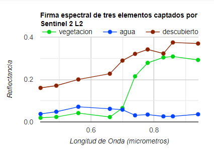
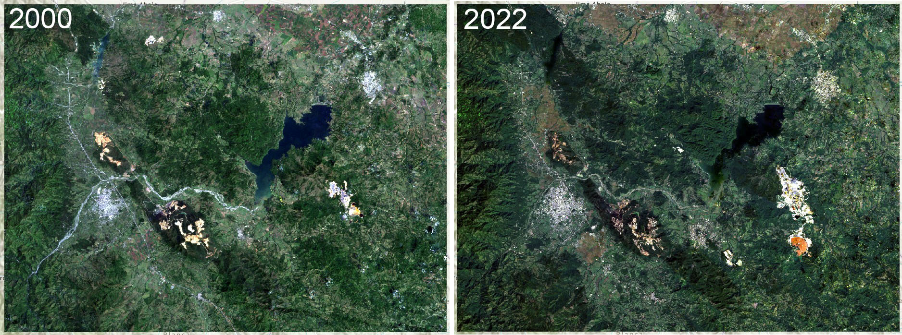
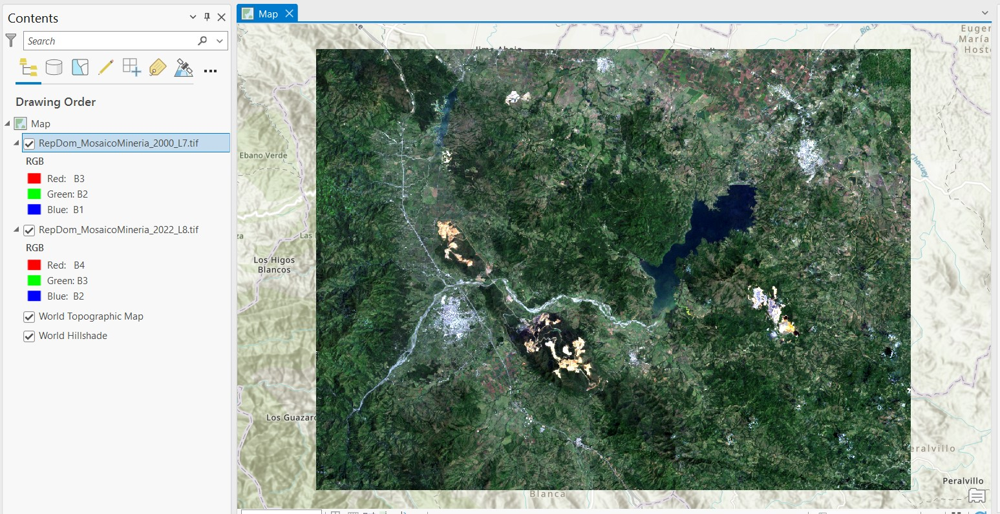
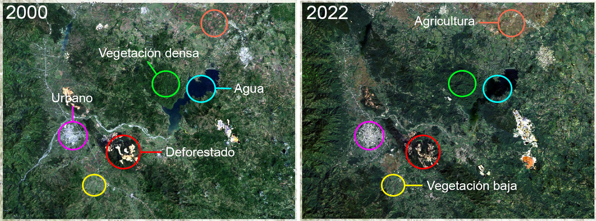
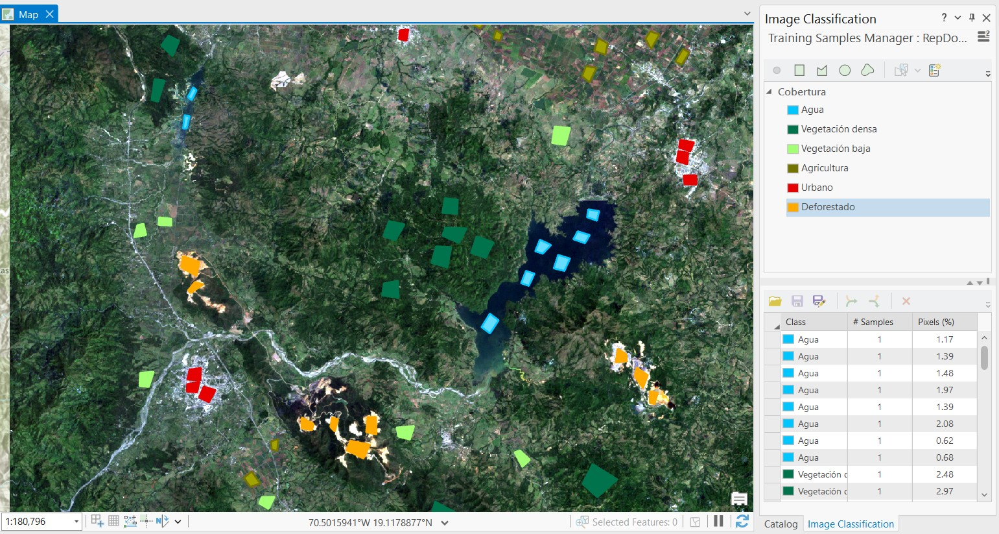

# Clasificación de cobertura terrestre

Este material de enseñanza está basado en ArcGIS Pro 3.1.

La clasificación de cobertura terrestre se procesa de manera similar a la aprendidada en la lección de Mapeo de Manglares. La diferencia con esta clasificación es el número de objetos a clasificar o clases. El número de clases depende de la imagen o localidad a clasificar. Algunos lugares pueden ser muy homogéneos, por ejemplo un bosque puede ser clasificado como solamente vegetación, o pueden incluirse clases más específicas como vegetación primaria y vegetación primaria, o palmas y manglares, todo depende del nivel de detalle que se desea obtener. Sin embargo, pueden existir limitaciones que dependen de la resolución espacial y espectral de las imágenes a usar. Las imágenes multiespectrales de amplio uso público vienen resoluciones espaciales que pueden ir desde los 500 m a 10 m por píxel (MODIS, Landsat, Sentinel-2). Las imágenes hiperespectrales pueden ayudar a obtener clasificaciones más detalladas pero normalmente estos datos suelen ser comerciales, limitados, o de difícil acceso.

Para esta lección usaremos dos imágenes multiespectrales de dos años y sensores diferentes. Una imagen compuesta del año 2000 construida con Landsat-7 y otra del año 2022 construida con Landsat-8. Estos dos sensores tienen resolución espacial de 30 m por píxel y tienen similares bandas espectrales, a excepción de la banda adicional de Landsa-8 en la región azul, también llamada banda ultra azul o aerosol. En estra lección nos enfocaremos en únicamente producir mapas de cobertura terrestre en estas dos imágenes con 20 años de diferencia.

### Datos requeridos:
* Mosaico compuesto de Landsat-8 año 2022 (*RepDom_MosaicoMineria_2022_L8.tif*)
* Mosaico compuesto de Landsat-7 año 2000 (*RepDom_MosaicoMineria_2000_L7.tif*)

Descargar material [AQUÍ](https://drive.google.com/drive/u/1/folders/1x6qXRMHdH3iVh2Fc1znJyarl101YlDvC).

Tiempo estimado: 50 min.

## Pasos
1. Importar datos
2. Establecer categorías de cobertura
3. Recolectar datos de entrenamiento
4. Clasificar imágenes

## 1. Importar datos

Creamos un nuevo proyecto e importamos las dos imágenes de interés. La combinación de bandas RGB para Landsat-7 es B3/B2/B1 y para Landsat-8 es B4/B3/B2.

## 2. Categorías de cobertura

Las categorías las estableceremos de acuerdo a las clases de fondos que podamos interpretar en ambas imágenes. Idealmente, estas clases deben ser las mismas en ambas imágenes.

Las clases comunes que podemos identificar son seis:

* Agua
* Vegetación densa
* Vegetación baja
* Agricultura
* Urbano
* Deforestado

## 3. Datos de entrenamiento

Seleccionamos la imagen de interés, por ejemplo podemos empezar con la imagen del año 2000. En la pestaña **Imagery** de la barra de herramientas desplegamos **Classification Tools** y seleccionamos **Training Samples Manager**. En el nuevo panel que se abrirá procederemos a crear un nuevo esquema de clasificación, el caul puede ser llamado *Cobertura*, y adicionamos cada una de las clases individualmente. Con click derecho sobre el esquema creado podemos seleccionar **Add New Class**, luego podemos específicar el nombre de la clase, color, y valor númerico. El valor de cada clase debe ser único. Por ejemplo, podemos organizar las clases con estos valores:

* 1: Agua
* 2: Vegetación densa
* 3: Vegetación baja
* 4: Agricultura
* 5: Urbano
* 6: Deforestado

Para cada clase podemos agregar polígonos que dibujamos sobre la imagen de referencia. Cada polígono creado será añadido a la ventana inferior del panel de ***Training Samples Manager**. Cuando hayamos terminado podremos guardar estos plígonos en el botón de guardado disponible en la barra superior de la ventana inferior del panel. Se guardará como un archivo *shapefile*.

NOTA: El método más apropiado para clasificar ambas imágenes es tomar polígonos o muestras independientes, es decir tendriamos que hacer el proceso de dibujar los polígonos de entrenamiento para cada imágen por separado, y así tener dos conjuntos de datos específicos. Sin embargo, para esta práctica se ha creado un solo conjunto de polígonos que representaran las clases en ambas imágenes. Los polígonos fueron cuidadosamente colocados en lugares comunes de ambas imágenes para reducir el error debido a cambios espectrales en los píxeles.

## 4.Clasificación

Seleccionamos la imagen a clasificar, en la pestaña **Imagery** de la barra de herramientas desplegamos **Classification Tools** y seleccionamos **Classify**. En el nuevo panel que se abrirá seleccionamos el clasificador **Random Trees** en **Classifier**, cargamos los polígonos de muestreo en **Training Samples**. Las demas opciones se pueden dejar predeterminadas. En **Output Classified Dataset** se puede cambiar el nombre de la imagen clasificada, y en el **Output Classifier Definition File** el nombre del archivo con las muestras de entrenamiento. Hacemos click en **Run**. Esto puede tomar algunos segundos en completar. Repetimos el proceso con la siguiente imagen.

## Conclusión
* A simple vista se ven algunas diferencias entre las imágenes clasificadas.
* Las clasificaciones no son perfectas, pueden existir errores, y por eso requieren ser ajustadas.
* Estos procedimientos son ahora más fáciles de lograr en plataformas como GEE.
* ¿Cómo se podría mejorar la clasificación?
* ¿Que paso podriamos agregar después de clasificar las imágenes?
* Podemos cuantificar áreas en la siguiente lección, y además detectar cambios por píxel en alguna clase específica.

## Continuar con la detección de cambios....
