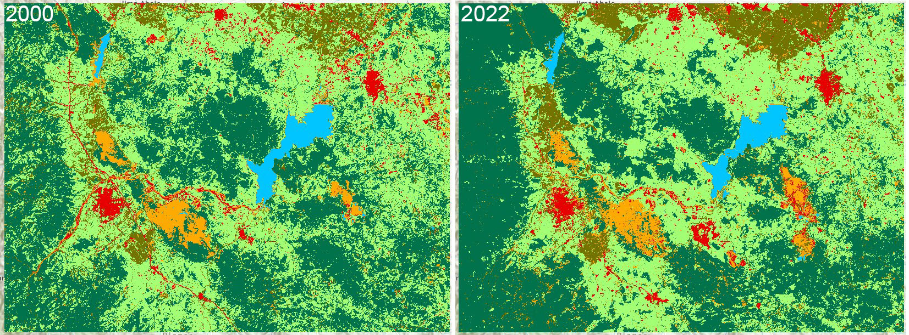
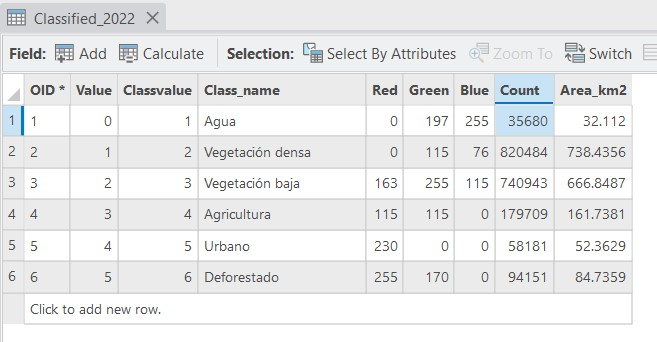
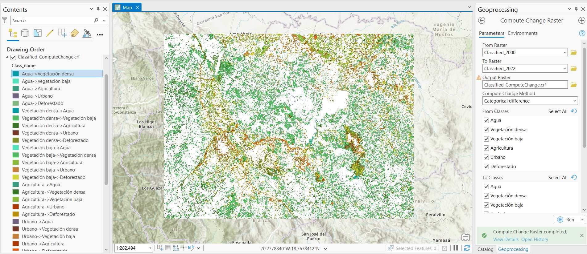
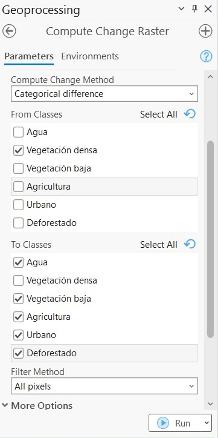
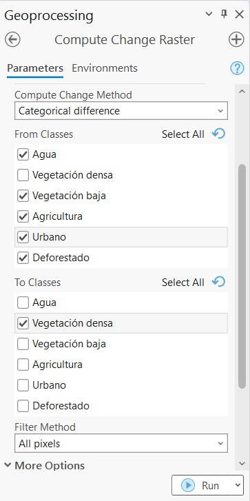
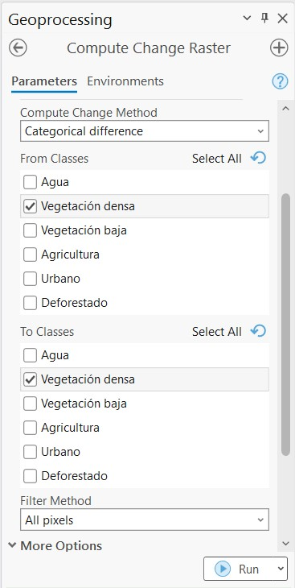
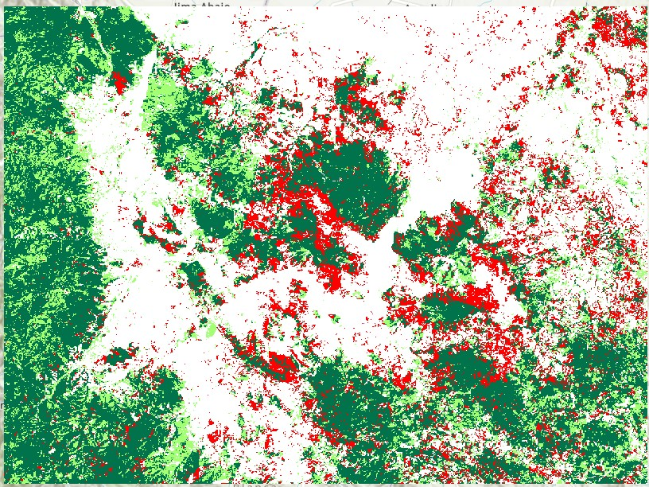

# Detección de Cambios

Este material de enseñanza está basado en ArcGIS Pro 3.1.

Esta es la continuación de la lección anterior sobre clasificación de coberturas. **Tanto esta como la anterior práctica son superficiales y sin el rigor científico requerido como para considerar los datos presentados como válidos.**

Para esta lección se cuantificarán las áreas por clase de cada imagen clasificada, y se detectarán los cambios por píxel de una de las clases entre las dos imágenes.

## Análisis de cambios

Este es un procedimiento que toma en cuenta el número de píxeles por clase y el área de cada píxel. En este caso la imagen clasificada debe tener una resolución de píxel de 30 x 30 m, esto quiere decir que el área de cada píxel es 900 m2.

Para contar el número de píxels por clase podemos buscar la herramienta **Build Raster Attribute Table** en el panel de **Toolboxes**. En el panel que se abrirá escogemos el ráster clasificado en **Input Raster** y hacemos click en **Run**. Posteriormente, al hacer click derecho sobre el ráster procesado en el panel **Contents**, y seleccionamos la opción **Attribute Table**. En la tabla de atributos encontramos una columna llamada **Count** que indica el número de píxeles por clase.

Para calcular el área de cada clase (en kilometros cuadrados) debemos hacer el respectivo cálculo. Para esto hacemos click en el botón **Calculate** de la tabla de atributos, seleccionamos la imagen correspondiente en **Input Table**, ponemos un nombre para la columna donde se alojarán los nuevos datos en **Field Name (Existing or New)**, y en **Field Type** escogemos *Float*. En el campo que tendrá el nombre de la nueva columna, en este caso *Area_km2* (encima de **Code Block**) escribimos la expresión `(!Count!*900)/1000000`, la cual multiplica el número de píxeles de cada clase por 900 m2, y lo convierte a km2 al dividir por 1,000,000. Click en **OK**. Esto creará la nueva columna con los datos de área en la unidad correspondiente.

Realizamos el mismo procedimiento para la otra imagen y comparamos. Los resultados son:

|    Clase         |  Área (km2) 2000  |  Área (km2) 2022  |  Diferencia  |
|:----------------:|:-----------------:|:-----------------:|:------------:|
| Agua             |  33.7             |  32.1             |  -1.6        |
| Vegetación densa |  710.7            |  738.4            |  +27.7       |
| Vegetación baja  |  733.3            |  666.9            |  -66.4       |
| Agricultura      |  143.4            |  161.7            |  +18.3       |
| Urbano           |  57.0             |  52.4             |  -4.6        |
| Deforestado      |  58.2             |  84.7             |  +26.5       |

Después de una análisis general de cambios, podremos hacer un análisis aún más detallado cuantificando las áreas que cambiaron de una clase a otra. Inicialmente, podemos ir al **Toolbox** en el panel de **Compute Change Raster** seleccionamos la imagen inicial la cual es la del año 2000 en el campo **From Raster**, en el siguiente campo **To Raster** seleccionamos la imagen clasificada del año 2022. Podemos establecer un nombre a la imagen que se generará en **Ouput Raster**. En **Compute Change Method** seleccionamos la opción *Categorical difference*. Nos aseguramos que todas las casillas de las clases estén seleccionadas. En **Filter Method** usamos la opción *Changed pixels only* y en **Transition Class Colors** escogemos *Average From and To colors*. Click en **Run**.

Luegeo de tener este nuevo ráster que nos muestra de manera gráfica con colores las áreas de cambio de una clase a otra, podemos estimar el área de cada una aplicando el mismo procedimiento usado anteriormente. Nota: Es posible que el ráster de cambios haya sido generado con las columnas *Count* y *Area* dentro de su tabla de atributos, y es posible que sea necesario verificar estos datos.

|    Clases              |  Agua  |  Vegetación densa  |  Vegetación baja  |  Agricultura  |  Urbano  |  Deforestado  |
|:----------------------:|:------:|:------------------:|:-----------------:|:-------------:|:--------:|:-------------:|
| Agua - 2000            |  -     |  0.3               |  0.9              |  0.9          |  0.1     |  1.3          |
| Vegetación densa -2000 |  0.3   |  -                 |  149.2            |  12.0         |  3.2     |  21.8         |
| Vegetación baja - 2000 |  0.2   |  172.9             |  -                |  70.0         |  21.5    |  18.6         |
| Agricultura - 2000     |  0.1   |  33.1              |  35.4             |  -            |  3.8     |  10.0         |
| Urbano - 2000          |  <0.1  |  1.4               |  21.0             |  8.6          |  -       |  5.4          |
| Deforestado - 2000     |  1.6   |  6.5               |  10.1             |  9.1          |  3.1     |  -            |

Una forma correcta de interpretar estos datos es por ejemplo: "149.2 km2 de vegetación densa en el 2000 pasaron a ser vegetación baja en el 2022".

Ahora, si deseamos observar cambios espaciales de una clase específica durante el periodo 2000-2022, se pueden obtener los píxeles que representaron ganancias, pérdidas, o sin cambio. Para esto aplicamos el mismo procedimiento usado anteriormente con la herramienta **Compute Change Method**, pero esta vez la corremos tres veces. En este ejemplo usaremos la clase *Vegetación densa*.

Para obtener los píxeles que representan pérdidas seleccionamos el método *Categorical difference*, seleccionamos únicamente *Vegetación densa* de la lista *From Classes* y seleccionamos todas las demás clases, excepto *Vegetación densa*, de la lista *To Classes*. El método de filtrado es *All pixels*.

Para obtener los píxeles que representan ganancias repetimos el proceso asegurandose de crear una nueva imagen con nuevo nombre para no sobreescribir la última que se generó. Seleccionamos todas las clases, excepto *Vegetación densa*, de la lista *From Classes*, y seleccionamos únicamente *Vegetación densa* de la lista *To Classes*.

Por último obtenes los píxeles de *Vegetación densa* que no cambiaron durante el periodo 2000-2022. Repetimos el proceso seleccionando uúnicamente *Vegetación densa* en ambas listas *From Classes* y *To Classes*.

Al organizar las capas obtendremos un mapa de cambios espaciales de vegetacipon densa para el periodo 2000-2022. Los píxeles de color verde oscuro representan vegetación densa sin cambios, los de color verde claro representan ganancias en vegetación densa, y los de color rojo son pérdidas en vegetación densa.

## Conclusiones
* Para este ejemplo específico, podemos concluir que los mayores cambios de vegetación densa fueron relacionados con la vegetación baja, ya sean ganancias o pérdidas.
* Los cambios espaciales y temporales son muy útiles para detectar patrones y ayuda a tomar inciciativas para actuar.
* ¿Cuáles otras conclusiones podríamos obtener de estos datos? ¿Qué pasó con la minería y deforestación? ¿Las zonas urbanas crecieron o decrecieron en este periodo?
