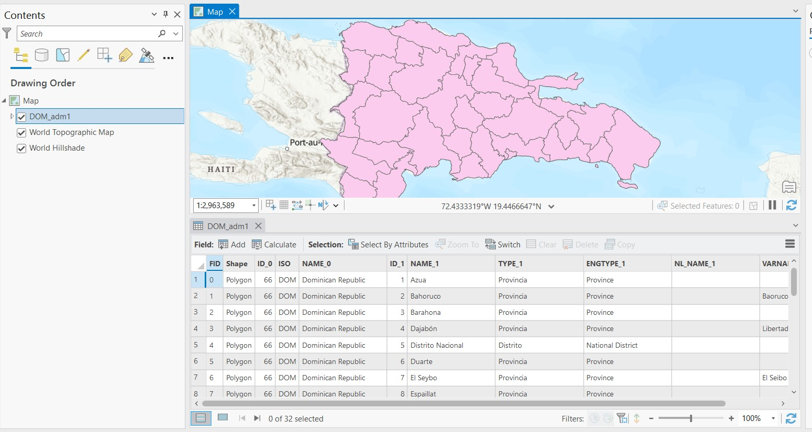
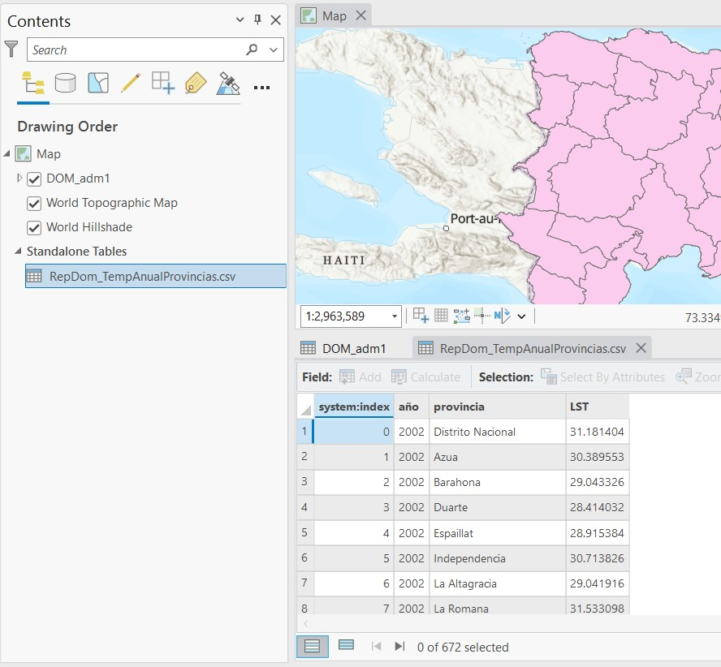
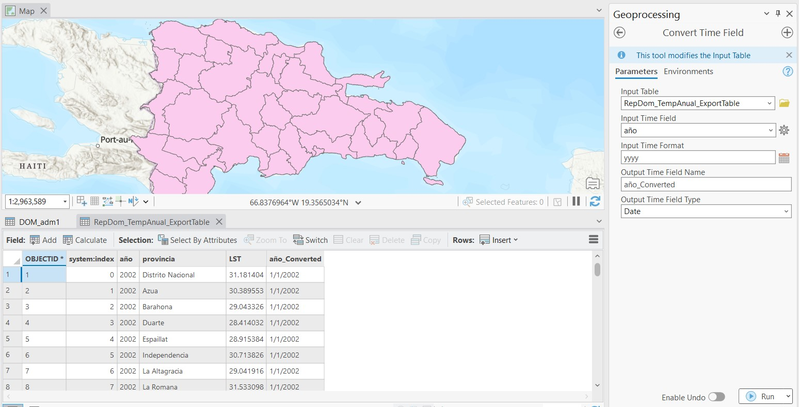
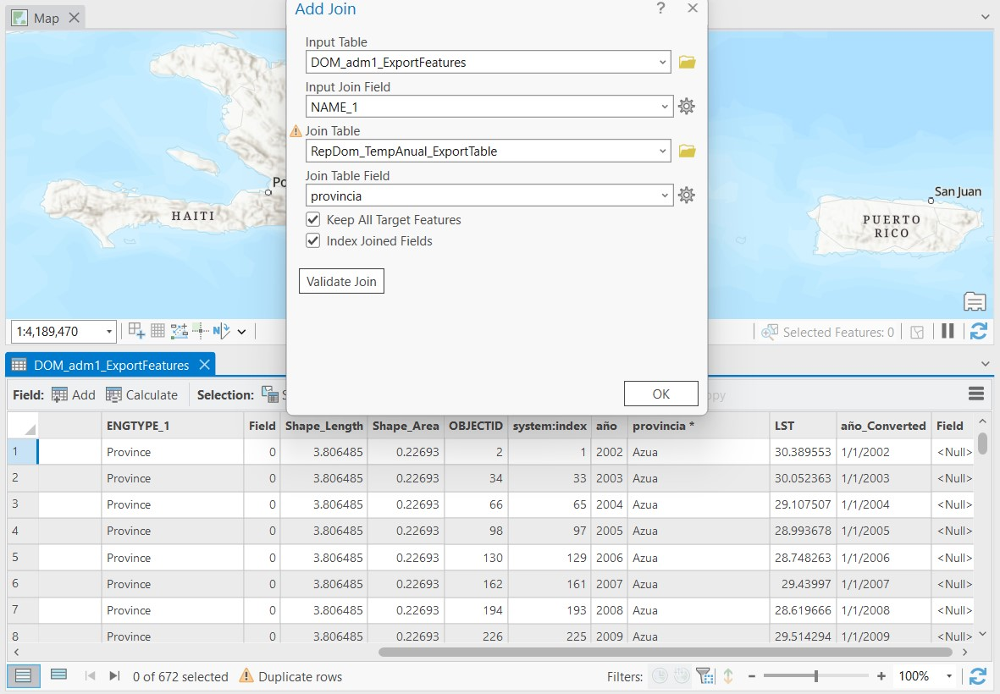
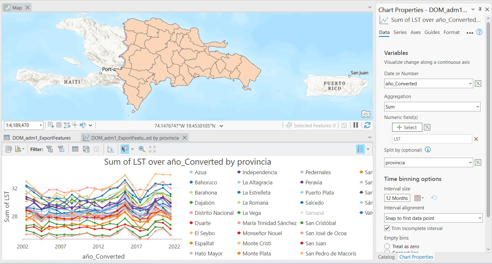
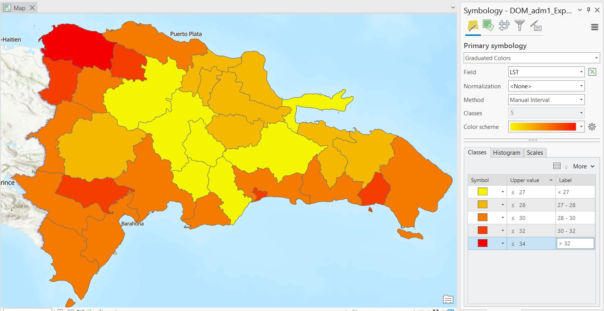
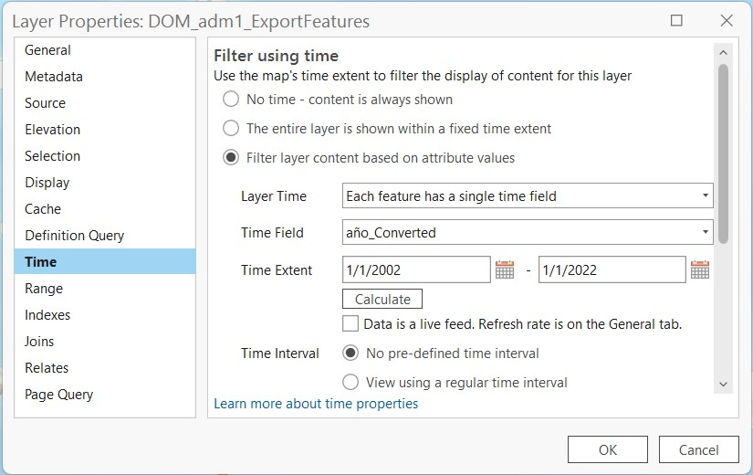
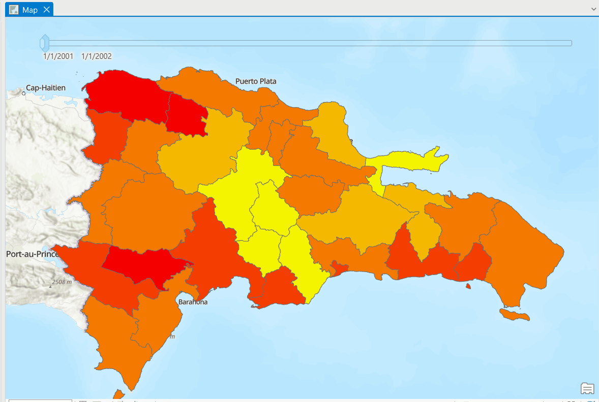

# Análisis Espacio-Temporal

Este material de enseñanza está basado en ArcGIS Pro 3.1.

Crear nuevo proyecto e importar datos administrativos a nivel de provincia (*DOM_adm1*). En la tabla de atributos podremos observar que la columna que tienen el nombre de las provincias es llamada *NAME_1*. Debrían encontrarse 32 polígonos de provincias.

Procedemos a importar los datos con los promedios mensuales de temperatura por provincia durante 2002-2022, derivados de datos satelitales (*RepDom_TempAnualProvincias.csv*). Estos datos no tienen coordenadas, así que se cargaran como una tabla dentro de ArcGIS Pro. Al explorar sus tabla de atributos podremos observar el tipo de datos y su estructura.

Estos datos tiene una columna que indica el año correspondiente de cada dato, sin embargo es necesario convertir ese año numerico en un año tipo fecha que pueda ser legible más fácilmente por la aplicación. Para editar la tabla es necesario exportarla, ya que la tabla original no se puede sobreescribir. Hacer click derecho sobre la tabla original en el panel **Contents**, seleccionamos **Data**, luego **Export Table**, ponemos un nombre y hacemos click en **OK**. Ahora, vamos a editar la fecha de la nueva tabla. Vamos al panel de **Toolbox** y búscamos la herramienta **Convert Time Field**. En el nuevo panel que se abrirá seleccionamos la tabla respectiva en el campo **Input Table**, seleccionamos la columna con el año en **Input Time Field**, el formato de fecha deseado en **Input Time Format** será *yyyy*, el nombre de la columna nueva donde se alojarán las fechas puede renombrarse si se desea, y nos aseguramos que el formato de la columna sea *Date* en **Output Time Field Type**. La nueva columna mostrará fechas como *1/1/2002*.

En el siguiente paso, vamos a unir las dos tablas de atributos, es decir la tabla de atributos de las entidades administrativas y la de los datos temporales de temperatura. Estas dos tablas tiene en común una columna con los nombres de las provincias, la cual podremos usar para combinarlas. Es necesario que los nombres de las provincias tengan un mismo formato y coincidan. Para evitar algún daño a los atributos del shapefile original vamos a exportarlo para tener un duplicado, haciemos click derecho sobre la capa, luego seleccionamos **Data**, y luego **Export Features**. Lo guardamos con las opciones predeterminadas. Este archivo se almacenará en el *Geodatabase* del proyecto. 

Ahora, hacemos click derecho en la capa duplicada *DOM_adm1_ExportFeatures*, seleccionamos **Join and Relates** y luego **Add Join**. En el panel de **Add Join** seleccionamos *DOM_adm1_ExportFeatures* en **Input Table**, en **Input Join Field** seleccionamos la columna con los nombres de provincias *NAME_1*, en **Join Table** escogemos la tabla con los datos de temperatura, y en **Join Table Field** escogemos la columna con los nombres de provincias. Nos aseguramos de seleccionar las dos casillas de **Keep All Target Features** y **Index Joined Fields**. Podemos hacer click en **Validate Join** para verificar que no hay errores antes de unir tablas. Hacemos click en **OK**. Cuando abramos la tabla de atributos veremos que los datos fueron añadidos y ahora existirán 672 filas, en lugar de las 32 que habían originalmente.

Ahora que hemos unido las tablas podremos examinar las tendencias temporales de los datos de temperatura. Haciendo click derecho sobre la capa administrativa, seleccionamos **Create Chart** y luego **Line Chart**. En el panel que se abrirá escogemos la columna *año_Converted* en el campo **Date or Number**, añadimos un nuevo campo en **Numeric field(s)** y escogemos la columna *LST* con los datos de temperatura. La gráfica mostrará la temperatura de cada provincia entre 2002 y 2022. La gráfica no es de la mejor calidad debido al alto número de provincias.

Ahora procedemos a cambiar la coloración de las provincias de manera graduada de acuerdo a los datos de temperatura.

Ahora activamos una opción que nos permitirá visualizar estos datos de forma temporal. Hacer click derecho en la capa administrativa y seleccionar **Properties**. Dentro de las propiedades de capa seleccionamos la pestaña **Time**, y seleccionamos la opción **Filter layer content based on attribute values**. Hacer click en **OK**.

Esto activará una barra de tiempo deslizante que nos permitirá visualizar los datos de temperatura por provincia en cada año respectivo. Esto es muy útil para encontrar patrones espaciales.

