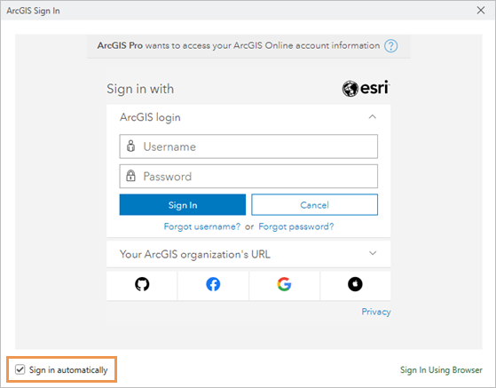
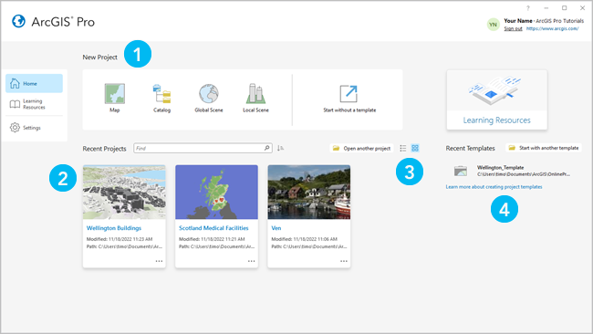
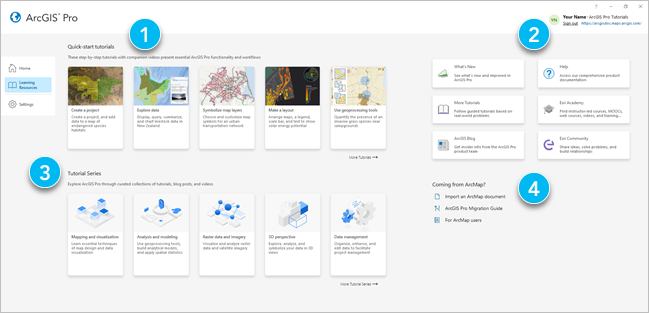
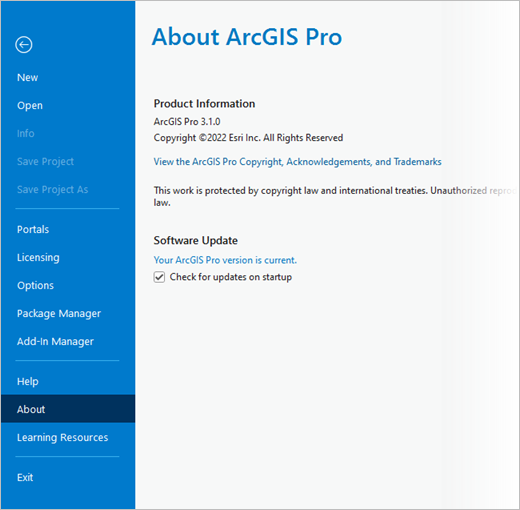
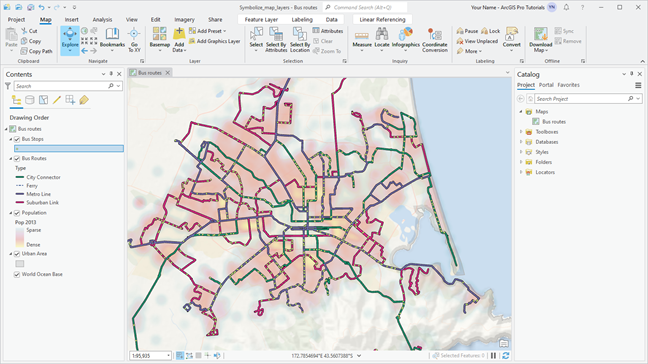
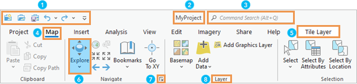
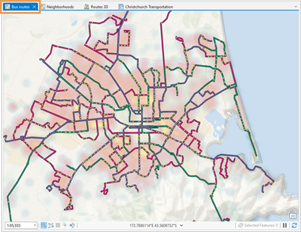
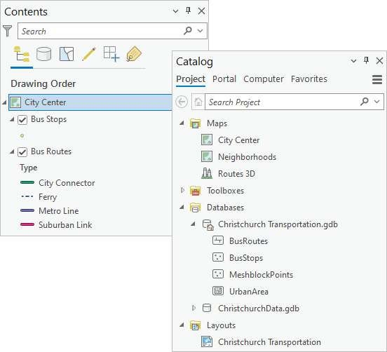
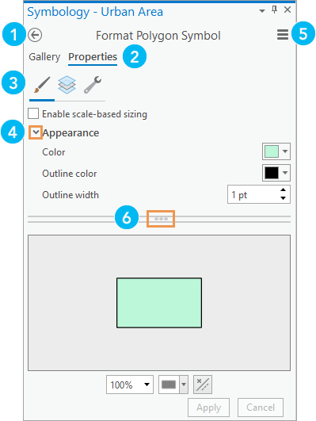
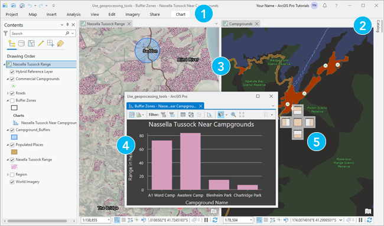

# Introducción

Este material está basado en ArcGIS Pro 3.1 y usa algunos recursos de la [guía rápida](https://pro.arcgis.com/en/pro-app/latest/get-started/get-started.htm) a ArcGIS Pro de ESRI.

ArcGIS Pro es una aplicación profesional de SIG (Sistemas de Información Geográfica) propiedad de ESRI. Con ArcGIS Pro se puede explorar, visualizar, analizar datos, crear mapas 2D y 3D, compartir proyectos con ArcGIS Online
o su portal de ArcGIS Enterprise. En las siguientes secciones se introducirá el proceso de ingreso, la página de inicio, ArcGIS Pro projects, y la interfaz de usuario.

## Ingresar / Registro

La primera vez que use ArcGIS Pro, se requerirá ingresar con su credencial de ArcGIS Online, ArcGIS Enterprise, o ESRI. Si aún no tiene una cuenta puede crear una [aquí](https://goto.arcgis.com/production-esri-signup) gratuitamente usando la opción de prueba de 21 días. Si posee una licencia de uso puede registrarla al momento de usar el programa por primera vez.

## Página de inicio

### Pestaña Home

Por defecto, ArcGIS Pro abre en la página de inicio. La página de inicio tiene una pestaña de "**Home**", una pestaña de "**Learning Resources**", y una pestaña de "**Settings**". En la pestaña **Home** se pueden encontrar las siguientes opciones para empezar un nuevo proyecto:

|    Elemento   |                       Descripción                                                                  |
|:-------------:|:--------------------------------------------------------------------------------------------------:|
| 1             | Plantillas predeterminadas para empezar un nuevo proyecto                                          |
| 2             | Proyectos recientes. Para abrir un proyecto que no esta en la lista, haga click en "**Open another project**" |
| 3             | Haga click en vista tipo **List** o **Tile** para mostrar proyectos de acuerdo a sus preferencias  |
| 4             | Haga click para cargar una plantilla reciente y empezar un nuevo proyecto desde esa plantilla predeterminada. Para empezar un proyecto desde una plantilla que no este en la lista, haga click en **Start with another template** |

### Recursos de aprendizaje

En la pestaña de **Learning Resources** puede encontrar recursos que le ayudaran a desarrollar habilidades, resolver problemas, y responder preguntas. Los recursos de aprendizaje también se pueden acceder desde una pestaña lateral en la página de **Settings** o desde el botón **Learning Resources** en la pestaña de **Help** en la barra de herramientas.

|    Elemento   |                       Descripción                                                                  |
|:-------------:|:--------------------------------------------------------------------------------------------------:|
| 1             | Tutoriales rápidos para aprender las funciones y procesos básicos de ArcGIS Pro                    |
| 2             | Acceder a la documentación del producto, materiales de aprendizaje, entrenamientos, noticias, y el sitio de la *Comunidad Esri* |
| 3             | Serie de tutoriales que presentan materiales de aprendizaje relacionados con un área de práctica  |
| 4             | Recursos disponibles para ayudar los usuarios de ArcMap a aprender ArcGIS Pro |

### Configuraciones

En la pestaña **Settings** se puede configurar y manejar la aplicación. En un proyecto abierto, las configuraciones son accesibles desde la pestaña **Project** en la barra de herramientas.

|    Pestaña        |                       Descripción                                                                  |
|:-----------------:|:--------------------------------------------------------------------------------------------------:|
| New               | Crea un proyecto                    |
| Open              | Abre un proyecto existente |
| Info              | Ver información del proyecto actual  |
| Save Project      | Guardar proyecto actual |
| Save Project As   | Guardar una copia del archivo de proyecto actual (.aprx) |
| Portals           | Manejar la conexión a un portal y activar portal |
| Licensing         | Ver información de licencia, autorizar a ArcGIS Pro trabajar offline, y cambiar tipo de licencia |
| Options           | Acceder a un proyecto y opciones para configurar ArcGIS Pro |
| Package Manager   | Manejar paquetes y ambientes de Python, R, y librerías del sistema |
| Add-In Manager    | Instalar "add-ins" o complementos para personalizar la aplicación |
| Help              | Abrir la ayuda online u offline del sistema |
| About             | Ver información sobre su versión de ArcGIS Pro y actualizar a la última versión |
| Learning Resources| Acceder a los tutoriales rápidos, series de tutoriales, y otros recursos de aprendizaje |
| Exit              | Cerrar la aplicación |

## Proyectos

En ArcGIS Pro , un proyecto es una estructura de trabajo relacionada con mapas, escenas, capas, y otros recursos conectados como bases de datos y carpetas de sistema. Los archivos de proyecto tiene la extension **.aprx**. Por defecto, un proyecto es almacenado en su propia carpeta junto con archivos de geodatabase asociados y barras de herramientas. 

## Interfaz de Usuario

Las partes principales de la interfaz de ArcGIS Pro son la barra de herramientas (o Ribbon), vistas, y paneles. A continuación veremos una descripción de cada una de estas partes.

### Barra de Herramientas (*Ribbon*)

Esta es una cinta horizontal en la parte superior de la ventana de trabajo dentro de la aplicación, la cual presenta una serie de pestañas con diferentes opciones y funciones. Algunas pestañas (pestañas base) estan siempre presentes. Otras (pestañas contextuales) aparecen cuando la aplicación esta en un estado particular. Por ejemplo, la pestaña contextual **Feature Layer** aparece cuando una capa es seleccionada en los contenidos del panel de un mapa. 

|    Elemento       |                       Descripción                                                                  |
|:-----------------:|:--------------------------------------------------------------------------------------------------:|
| 1                 | La *barra de acceso rápido* tiene comandos que se usan a menudo.         |
| 2                 | Nombre de proyecto en la parte superior de la aplicación       |
| 3                 | El comando de búsqueda *Search* ayuda a encontrar y correr comandos  |
| 4                 | Pestañas base, tales como la pestaña **Map**. Cuando es seleccionada muestra sus botones y funciones asociados |
| 5                 | Pestañas contextuales, como la pestaña **Tile Layer**, las cuales aparecen en momentos apropiados para su uso |
| 6                 | Botones y herramientas para correr comandos. Por ejemplo, la herramienta **Explore** sirve para navegar en mapas e identificar objetos en mapas.  |
| 7                 | Caja de diálogo que abre paneles o cajas de diálogos con más funciones |
| 8                 | Agrupación de comandos relacionados y organizados en la barra  |

### Vistas

Vistas (o *Views*) son ventanas para trabajar con mapas, escenas, capas, tablas, gráficos, el catálogo, y otras representaciones de sus datos. Varias vistas pueden ser abiertas al mismo tiempo. Al hacer click en alguna de las pestañas disponibles en vistas se puede activar, arrastrar a otra posición, o cerrar.

### Paneles

Un panel (o *Pane*) es una ventana que muestra los contenidos de una vista (Panel de Contenidos - *Contents*), los elementos de un proyecto o portal activo (Panel de Catálogo - *Catalog*), o comandos y configuraciones para ciertas funciones (panel de **Symbology**, panel de **Geoprocessing**, etc.).

El panel provee cierta funcionalidad que puede no estar disponible en la barra de herramientas. Los paneles tiene filas de pestañas de texto y pestañas gráficas (o *íconos*) que organiza la funcionalidad. Algunos paneles tiene multiples páginas.

|    Elemento       |                       Descripción                                                                  |
|:-----------------:|:--------------------------------------------------------------------------------------------------:|
| 1                 | Algunos paneles tienen multiples páginas de funcionalidad         |
| 2                 | Pestañas de texto primarias, como **Gallery** y **Properties**, con funcionalidad separada       |
| 3                 | Pestañas gráficas secundarias (*íconos*) que tienen funcionalidad separada de una pestaña primaria  |
| 4                 | Los expansores son pequeñas flechas que al dar click muestran o esconden opciones |
| 5                 | El botón **Menu** posee comandos adicionales |
| 6                 | "Manija" o barra deslizable que permite cambiar el tamaño de las áreas de un panel  |

Los paneles de *Contenido* y *Catálago* estan usualmente abiertos en un proyecto. Otros paneles se hacen visibles en respuesta a comandos o acciones. Por ejemplo, cuando se da click en **Locate** en la pestaña **Map**, el panel **Locate** aparecerá.

Se puede cerrar los paneles o dejarlos abiertos. Si un panel queda abierto cuando se cierra ArcGIS Pro, éste se abrirá cuando reinicie la aplicación. Se puede manjar algunos paneles en la pestaña **View** de la barra de herramientas. Por ejemplo, se puede dar click en **Reset Panes** para escoger una configuración específica de paneles.

## Organización de la Interfaz de Usuario

Los elementos de la interfaz de usuario ueden organizarse de varias formas:

* Arrastrar paneles y vistas a sitios de anclaje.
* Agrupar paneles y vistas uno encima de otro.
* Soltar paneles y vistas sobre o lejos de la ventana de la aplicación.
* Dividir la vista en grupos de pestañas horizontales o verticales para mostrar mas vistas.

|    Elemento       |   Acción                   |   Descripción                                                                  |
|:-----------------:|:--------------------------:|:------------------------------------------------------------------------------:|
| 1                 | Minimizar la barra         | Presionar Ctrl+F1         |
| 2                 | Automáticamente esconder un panel cuando no esté en uso | Click **Auto-Hide** in barra de titulo del panel. Alternativamente, presione Alt+Signo Menos para opciones.       |
| 3                 | Crear un nuevo grupo de pestañas para dividir espacio  | Presionar click derecho en una pestaña o Alt+Guión para opciones.  |
| 4                 | Separar o soltar vista     | Arrastre una vista por su pestaña y sueltela lejos de los sitios de anclaje. Alternativamente, haga click derecho en la pestaña de vista o presione Alt+Guión para opciones.
| 5                 | Anclar una vista           | Arrastre una vista por su pestaña y sueltela en uno de los sitios de anclaje que aparecen. Alternativamente, haga click derecho en la pestaña de vista o presione Alt+Guión para opciones.

