# Práctica de Introducción

Este material de enseñanza está basado en ArcGIS Pro 3.1, y usa algunos recursos de la [guía rápida](https://pro.arcgis.com/en/pro-app/latest/get-started/introducing-arcgis-pro.htm) a ArcGIS Pro de ESRITM.

En esta práctica se explorarán los componentes principales de la interfaz de ArcGIS Pro: la barra de herramientas, vistas, y paneles.

Se requiere descargar el proyecto **Introducing_ArcGIS_Pro.ppkx** disponible en este [enlace](https://www.arcgis.com/home/item.html?id=c25cf7226e3a48d48f0de9ac5a5a9122) (pestaña *Download*), y guardarlo en una carpeta específica de trabajo en su computador personal. Este proyecto contiene mapas 2D y 3D de Wellington, Nueva Zelanda.

Previamente, verifique que tiene ArcGIS Pro debidamente licenciado y listo para trabajar.

Tiempo estimado: 30 min.

## Abrir Proyecto

1. Inicie ArcGIS Pro. Si es necesario, haga click en **Sign in** en la esquina superior derecha, escriba su usuario y contraseña, y click en Sign in.
2. En la página de inicio, junto a la lista de proyectos recientes, haga click en **Open another project**. Si ya tiene un proyecto abierto, haga click en la pestaña **Project** de la barra de herramientas, haga click en **Open**, y posteriormente en **Open another project**.

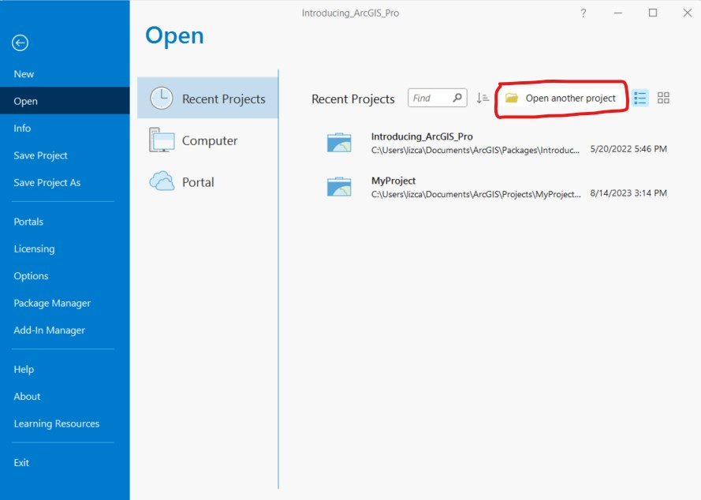

3. Aquí usted puede escoger si desea cargar un archivo o proyecto desde un portal o desde su computador local. En este caso vamos a cargar el proyecto previamente descargado en nuestro computador, buscamos la ubicación del archivo y lo cargamos. Alternativamente, si usa la opción portal, deberá conectar su cuenta con ArcGIS Online y activar este portal para tener acceso a los archivos tutoriales de Esri. Luego deberá usar la barra de búsqueda, buscar y cargar el proyecto *Introducing ArcGIS Pro*.

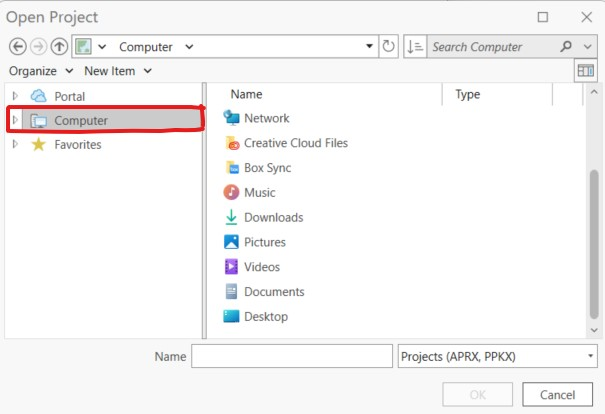

4. Cuando el proyecto esté abierto, usted verá un mapa de Wellington, Nueva Zelanda. La ventana que contiene el mapa es la *vista de mapa*. La pestaña coloreada en la vista de mapa indica que esa pestaña está activa. El nombre de la vista es *Wellington City*.

    Hay otras vistas abiertas en el proyecto: el mapa de *Central Wellington*, la escena de *Central Wellington_3D*, y la capa *Central Wellington Layout*.

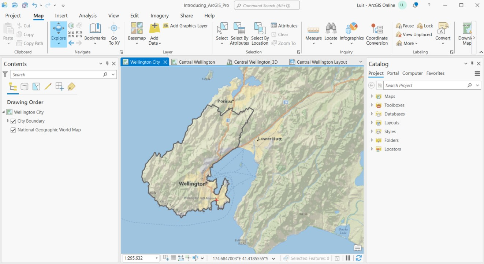

## Barra de herramientas

Arriba de la vista de mapa se encuentra la barra o cinta de herramientas (o *Ribbon*). Esta barra tiene un conjunto de pestañas base: **Maps**, **Insert**, **Analysis**, **View**, **Edit**, **Imagery**, **Share**, y **Help**, las cuales están siempre presentes cuando una vista de mapa esta activa. Cada pestaña tien su propio conjunto de herramientas, organizadas en grupos. La pestaña **Map** tiene herramientas para interactuar con el mapa. En la pestaña **Map**, la herrmienta **Explore** esta seleccionada dentro del grupo **Navigate**. 

En esta sección se usarán herramientas del grupo **Navigate**. La herramienta **Explore** permite mover y desplazarnos por el mapa, y leer información sobre los objectos de interés en el mapa.

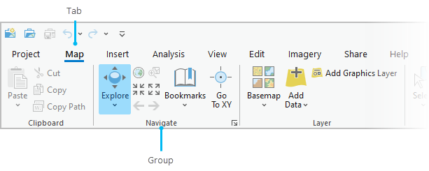

1. Seleccione la herramienta **Explore** y arrastre el mapa a un sitio diferente.

    Si arrastra el mapa muy rápido puede perder el sitio de partida. 

2. En la barra de herramientas, en la pestaña **Map**, haga click en **Bookmarks**. En la parte de **Wellington City Bookmarks** haga click en *Wellington*. Este le ayudará a volver a la vista de mapa inicial. Adicionalmente, puede crear un nuevo *bookmark* en otra posición del mapa si lo desea.

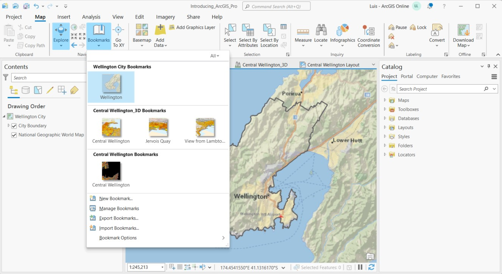

3. En el mapa, haga click dentro del área (*City Boundary*) de *Wellington* para obtener mas información acerca de este objeto. El área de la ciudad parpadeará y aparacerá una ventana con la información sobre la población de la ciudad.

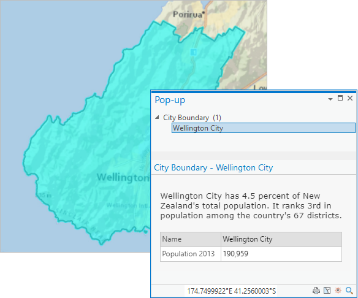

## Abrir y anclar paneles

A medida que se vaya trabajando en un proyecto veremos que a menudo se abriran y cerraran paneles que se necesitan para tareas específicas. Los paneles también se pueden minimizar con tal de dejar espacio disponible para trabajar con los mapas y otras vistas.

1. En la barra de herramientas, haga click en la pestaña **View**. En el grupo **Windows** haga click en **Reset Panes** y luego en **Reset Panes for Mapping (Default)**.

   Los paneles **Contents** y **Catalog** se abrirán (en caso de que hayan sido cerrados antes). Cualquier otro tipo de panel abierto será cerrado. Estos dos paneles pueden estar anclados en sitios opuestos de la ventana de la aplicación, lo cual es el diseño predeterminado.

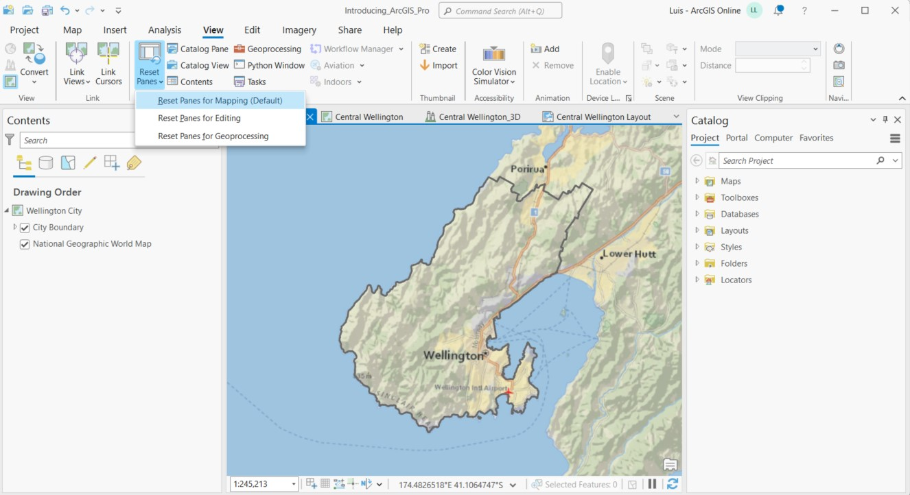

Estos paneles pueden incluso ser colocados uno encima del otro, cada uno con una pestaña respectiva.
    

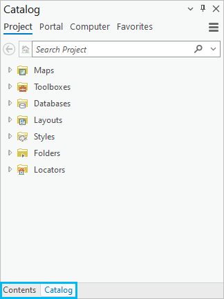

2. Arrastre el panel **Catalog** de su barra sobre la vista de mapa. A medida que arrastre el panel (representado por una sombra azul), sitios de anclaje apareceran en el centro de la vista de mapa y en las orillas de la ventana de la aplicación. Cada sitio representa un area donde el panel puede ser posicionado.

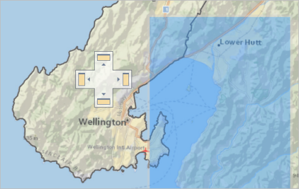

3. Posicione el panel en un sitio de anclaje sin soltar el click. Podrá observar como quedaría el panel posicionado, ya sea de manera horizontal o vertical, lo cual es representado con una sombra azul.

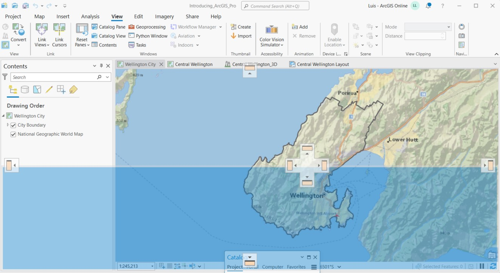

4. Suelte el panel en el sitio de anclaje. El panel mostrará su nueva posición. Si los paneles **Catalog** y **Contents** estaban agrupados antes, se mantendrán agrupados al intentar organizar o mover el panel a otro sitio.

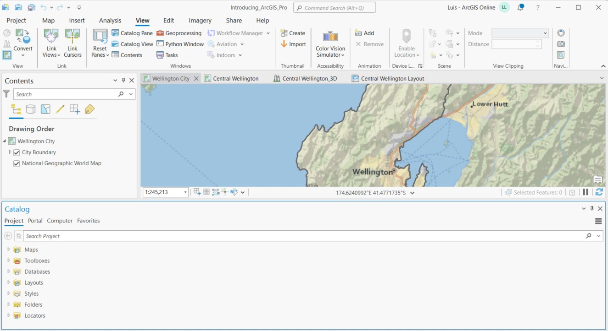

5. Arrastre el panel **Catalog** a una nueva posición y sueltelo en cualquier otra parte de su pantalla que no sea una sitio de anclaje. Esto hará que el panel quede flotando. Puede re-ajustar su tamaño estirando una esquina o un lado del panel.

6. Si los paneles **Catalog** y **Contents** estan agrupados, haga click en la pestaña **Catalog** en la parte inferior del panel y arrastre el panel por su pestaña hacía una nueva posición. Ahora los paneles quedaran separados.

7. Suelte el panel **Contents** sobre el sitio de anclaje izquierdo. Suelte el panel **Catalog** sobre el sitio de anclaje derecho. Con esto los paneles estarán en posiciones opuestas. De manera predeterminada los paneles permanecerán abiertos mientras trabaja. Pero, se puede auto-esconder un panel para que no ocupe espacio en el area de trabajo que se este usando.

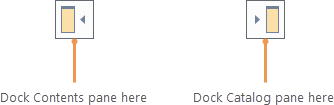

8. Haga click en el panel **Contents** para tenerlo activo. Ahora, en la esquina superior derecha del panel, haga click en **Auto-Hide**. El panel se esconderá en el borde de la ventana de ArcGIS Pro donde el panel esta anclado.

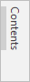

9. Haga click en el panel **Contents** que se encuentra escondido para restaurarlo. El panel se quedará abierto meintras usted est interactuando con él. Cuando seleccione otro panel, otra vista, o haga una acción diferente hará que el panel **Contents** se esconda nuevamente.

10. Haga click en **Auto-Hide** nuevamente para que el panel permanezca abierto.

## Explorar vistas

El mapa de la ciudad de Wellington es una de las cuatro vistas disponibles en el proyecto. Un proyecto puede contener multiples mapas, escenas, diseños, u otras vistas como tablas y gráficos.

1. Haga click en la pestaña del mapa **Central Wellington** para activar esta vista. En el mapa se puede observar los edificios del distrito central de negocios alrededor de Lambton Harbour.

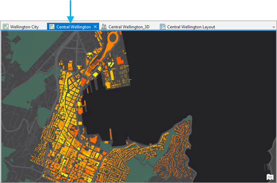

2. En el panel de **Contents**, haga click en la flecha al lado de la capa **Buildings** para expandir la capa. Los colores amarillo y naranja indican la cantidad de radiación solar recibida por los edificios.

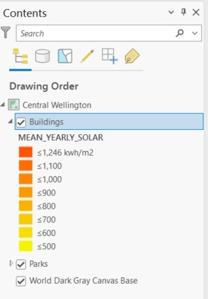

3. Active la escena **Central Wellington_3D**. Los mismos edificios se podrán observar ahora en un modelo 3D.

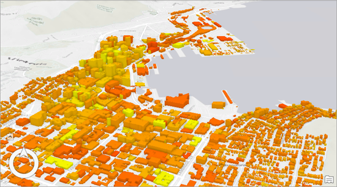

4. Haga click en la pestaña **Map** de la barra de herramientas.

5. En el grupo **Navigate**, haga click en **Bookmarks**. En **Central Wellington_3D Bookmarks** haga click en **Jervois Quay**. Ahora podrá ver los edificios desde otra perspectiva.

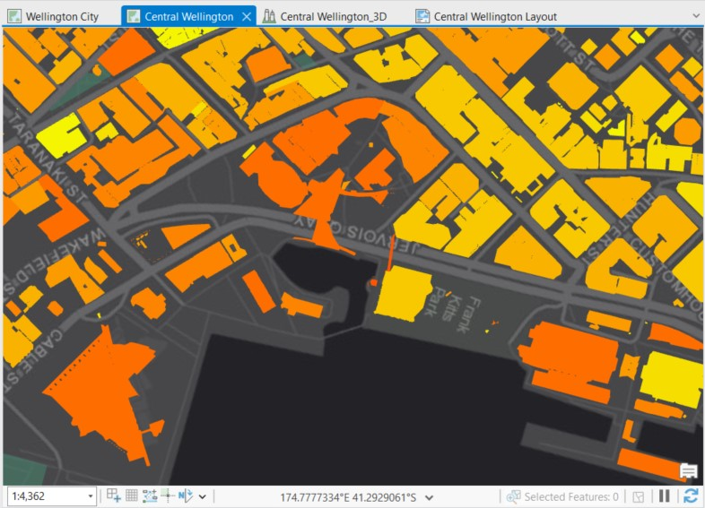

6. Haga click en el *bookmark* **View from Lambton Harbour** para ver la escena desde otra perspectiva.

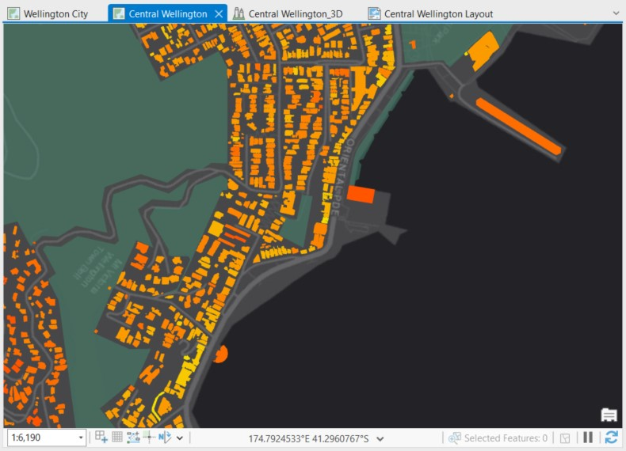

7.  Active la vista **Central Wellington Layout**. La barra de herramientas cambiará para mostrar pestañas y herramientas asociadas al diseño de mapas. La pestaña **Map** también ha sido reemplazada por la pestaña **Layout**. La pestaña **Edit** desaparece.

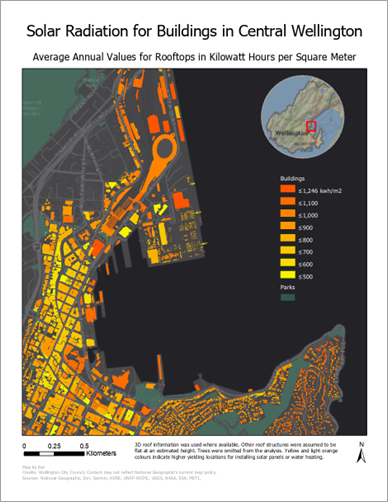

El panel **Contents** mostrará todos los elementos usados en este diseño de mapa: leyenda, marcos, texto, etc. Los elementos se mostrarán en el orden en que fueron creados, pero se pueden usar las pestañas (iconos) en la parte superior del panel para cambiar este orden.

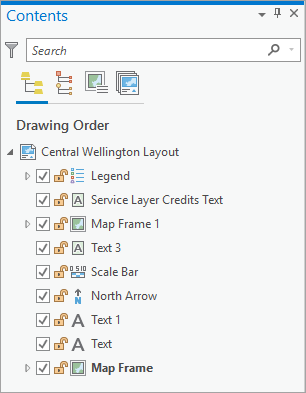

8. En el panel **Contents**, haga click en la pestaña (icono) **List By Element Type**. Los elementos ahora son agrupados por tipo, en vez de orden de creación.

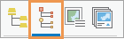

9. Cierre la vista de **Central Wellington Layout** haciendo click en el botón de cerrar de la respectiva pestaña. Aunque la vista se ha cerrado, el diseño de mapa aún existe en el proyecto.

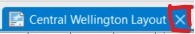

10. En el panel **Catalog**, seleccione la pestaña **Project** y expanda **Layouts**.

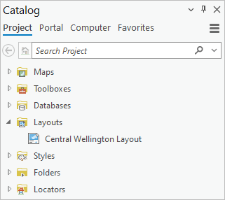

11. Haga click derecho en **Central Wellington Layout** y haga click en **Open**. El diseño de mapa se abrirá.

12. En el panel **Catalog**, expanda **Maps**. Los mapas y escenas del proyecto se observaran en una lista. (Para remover un diseño permanentemente de un proyecto haga click derecho en el objecto y haga click en **Delete**).

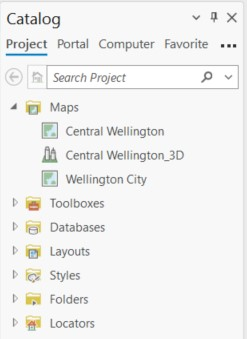

## Trabajando con pestañas contextuales

Las pestañas en la barra de herramientas varían de acuerdo al tipo de vista que esté activa. Dentro de una vista, las pestañas se habilitan dependiendo del tipo de datos o capas con los que se esta trabajando.

1. Active la vista del mapa **Central Wellington**.

2. En el panel **Contents**, seleccione la capa **Buildings**. Una vez es seleccionado, se habilitarán tres pestañas en la barra de herramientas: **Feature Layer**, **Labeling**, and **Data**.

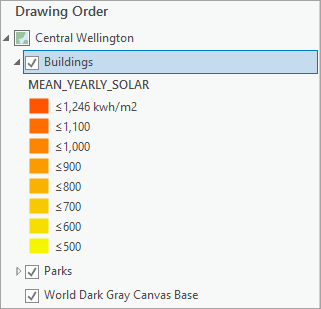

3. En el panel **Contents**, haga click en **Central Wellington**, el nombre del mapa. Verá que las pestañas contextuales como **Feature Layer** desaparecen debido a que ningún objecto de la capa es seleccionado.

4. En el panel **Contents**, haga click en la capa **Parks** para seleccionarla.

5. En la barra de herramientas, haga click en la pestaña **Data**. Esta pestaña tiene herramientas para trabajar con los atributos del objecto seleccionado.

6. En la pestaña **Data**, dentro del grupo **Table**, haga click en **Attribute Table**. Una vista o ventana de tabla se abrirá mostrando los atributos de la capa **Parks**. Cada parque tiene nombre y dirección. En la barra de herramientas, la pestaña contextual **Feature Layer** seguirá presente. En adición, la pestaña **Table** aparecerá. La pestaña tiene herramientas para añadir o borrar campos, cambiar las propiedades de los campos, calcular valores de tabla, y más. Sin embargo, no hay necesidad de hacer cambios a la tabla de **Parks**.

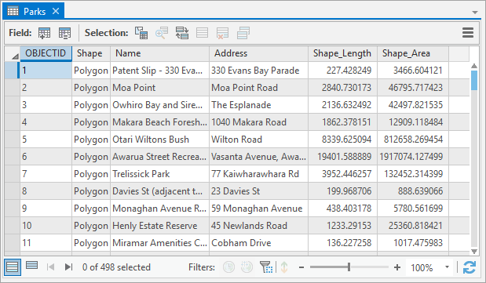

7. Cierre la tabla de **Parks**. La pestaña contextual **Table** se quitará de la barra de herramientas.

8. En la barra de herramientas, haga click en la pestaña **Feature Layer**.Establezca un rango de visibilidad para una capa, ajuste su transparencia,y cambie la simbología. Cuando escoja un metodo de simbología, se abrirá un nuevo panel.

9. En la pestaña **Feature Layer**, dentro del grupo **Drawing**, haga click en en el botón **Simbology** (NO en la flecha desplegable). El panel **Simbology** aparecerá.

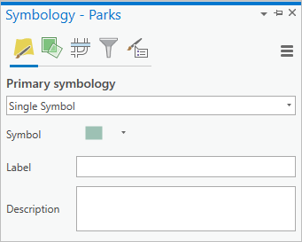

10. En el panel **Simbology**, junto a **Symbol**, haga click en el simbolo verde. El panel presentará opciones para dar formato a simbolos poligonales. En la parte superior del panel se encuentran las pestañas **Gallery** y **Properties**. En la pestaña **Gallery**, se puede escoger un simbolo prederteminado. E nla pestaña **Properties** puede modificar las propiedades del simbolo, tales como el color y ancho de línea.

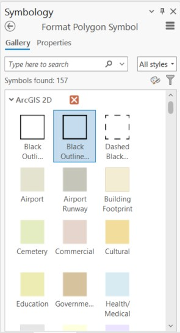

11. Haga click en la pestaña **Gallery**.

12. Junto a la caja de búsqueda, haga click en la flecha desplegable del botón **All styles** y haga click en **Project styles**. La configuración **Project styles** se incluyen todos los estilos predeterminados del proyecto y los estilos añadidos por usted. La opción **All styles** incluye todos los estilos instalados con ArcGIS PRo. Al escoger **Project styles** se reduce la cantidad de estilos a buscar/usar.

13. En la caja de búsqueda escriba **park** y presione *Enter*. Podrá observar los simbolos y estilos realacionados con parques y cementerios. Se puede posicionar el puntero del mouse sobre cada uno para obtener más información.

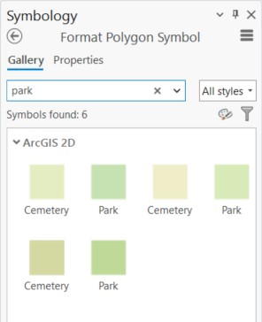

14. Selecione uno de los simbolos **Park**. Inmediatamente verá que los parques del mapa son dibujados con el nuevo simbolo. 

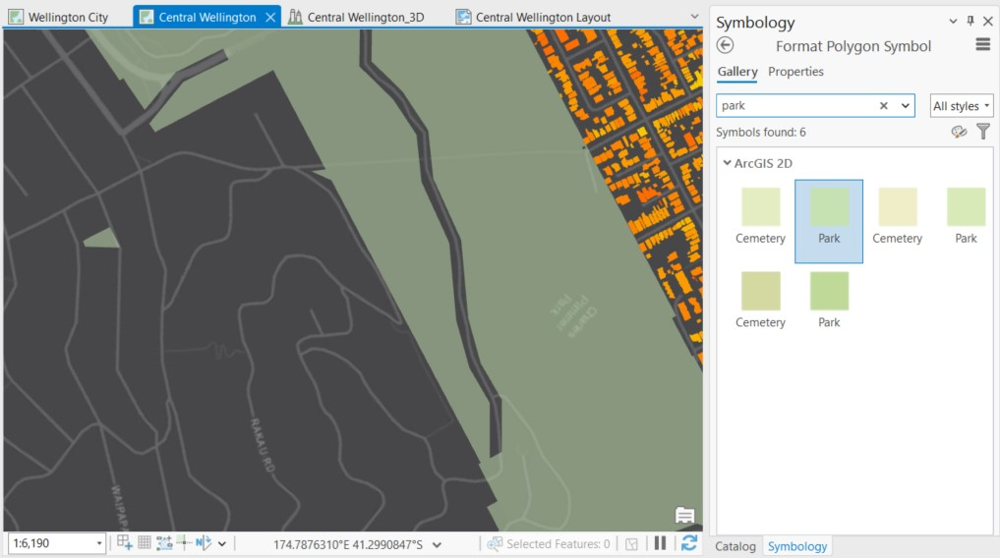

15. Si desea deshacer este cambio, lo puede hacer con los botones disponibles en **Quick Access Toolbar** en la esquina superior izquierda de la aplicación y haga click en **Undo** (o Ctrl+Z).

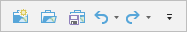

16. Cierre el panel **Simbology**

17. En la barra **Quick Access Toolbar** haga click en **Save** para guardar el proyecto y continuar trabajando.

