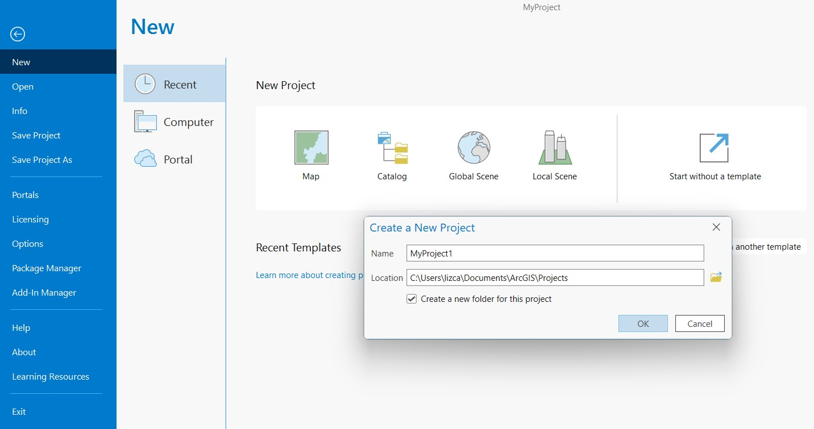

# Crear Mapa

Para compartir algún proyecto ya sea mapa, poster, o archivo PDF, se requiere saber crear un diseño. El diseño es una composición de uno o más mapas, junto con los elementos que lo componen como título, leyenda, y texto. Algunos diseños pueden incluir más de un mapa. Para esta sección se creará un nuevo proyecto, se descargarán y utilizaran algunos datos vectoriales, se creará un mapa, y se exportará.

Este material de enseñanza está basado en ArcGIS Pro 3.1, y usa algunos recursos de la [guía rápida](https://pro.arcgis.com/en/pro-app/latest/get-started/add-maps-to-a-layout.htm) a ArcGIS Pro de ESRITM.

Tiempo estimado: 60 min.

## Material

Se usará material descargado del portal [Diva-GIS](http://www.diva-gis.org/gdata), correspondiente a República Dominicana, tanto en formatos vectorial como ráster:
* Administrative areas
* Inland water
* Roads
* Elevation
* Land cover
* Population

## 1. Nuevo Proyecto

1.1. Abra ArcGIS Pro y cree un nuevo proyecto. Si ha estado trabajando en otro proyecto puede ir a la pestaña **Project**, seleccionar **New**, y dar click en **Map**. Para esta práctica es recomendable que el proyecto se guarde en su computador local. Posteriormente aparecerá una ventana donde puede ingresar un nombre a su proyecto y decidir en donde lo va guardar.

1.2. A continuación usted verá que crea un proyecto y se observara una vista de mapa. En el panel **Contents** se mostrarán dos capas predeterminadas que muestran el mapa mundial con detalles topográficos y administrativos. Estás capas nos ayudan a orientarnos espacialmente. Si usted no las desea utilizar en su proyecto las puede deseleccionar o remover.

## 2. Importar datos vectoriales

2.1. Podemos importar o añadir datos al proyecto de dos formas: podemos arrastrar el archivo y soltarlo en el panel **Contents** o podemos ir a la pestaña **Map**, dentro del grupo **Layer**, dar click en **Add Data**. Se va a desplegar una lista con diversas acciones, vamos a dar click en **Data**.

2.2. En la ventana que aparece vamos a buscar el directorio donde hemos guardado nuestros archivos. Vamos a cargar las capas administrativas de República Dominicana en la carpeta llamada *DOM_adm*. Dentro de esta carpeta veremos archivos en formato *.shp* y *.csv*, ambos formatos se pueden importar, pero en este caso vamos a trabajar con archivos .shp. Seleccionamos los tres archivos .shp disponibles, los cuales indican el nivel administrativo.

2.3. Los archivos que importemos los veremos en el panel **Contents**. El nivel administrativo 0 es unicamente un polígono del área nacional, el nivel administrativo 1 son varios polígonos de las áreas provinciales, y el nivel administrativo 2 son más polígonos de las áreas municipales. Cada capa es cargada con un color de manera predeterminada, pero puede ser editada expandiendo las capas y dando click en el recuadro coloreado. Esto abrirá el panel **Symbology** donde se puede editar el color de relleno, color de línea, y ancho de línea desde la pestaña **Properties**. Recuerde que para ver las otras capas en la vista de mapa debe deseleccionar otras que se encuentran por encima de la que desea visualizar.

2.4. Es importante verificar la información asociada a nuestros datos, especialmente el sistema de coordenadas que maneja. Si damos click derecho sobre una de las capas y damos clcik en **Properties** se abrirá la ventana de propiedades. En la pestaña **Source** podremos observar información sobre qué tipo de datos son, en este caso es uns hapefile que contiene geometrías de tipo polígono en la pestaña **Data Source**. La pestaña **Spatial Reference** nos da la información detallada sobre el tipo de coordenadas, en este caso es WGS84 EPSG:4326, la cual esta en un sistema ampliamente usado y deseado. Si usamos datos con otro tipo de coordenas tendriamos que hacer una conversión para trabajar todos los datos en un solo sistema. La pestaña **Extent** nos muestra los limites geográficos de nuestros datos y **Domain, Resolution, and Tolerance** nos brinda información sobre las extensiones máximas y mínimas que puede tener, junto con las resoluciones.

## 3. Insertar plantilla de diseño (*Layout*)

3.1. Vamos a la barra de herramientas, en la pestaña **Insert**, dentro del grupo **Project**, damos click en **New Layout**. Se desplegará una lista de formatos de hoja y orientaciones. Usaremos el tamaño carta estandar en sentido horizontal, para ello seleccionamos el formato **Letter** dentro del grupo **ANSI - Landscape**.

3.2. Ahora tendremos otra vista o pestaña disponible llamada *Layout*. Si no tenemos disponibles la regla y las guías, podemos activarlas dando click derecho en *Layout* dentro del panel **Contents**, y activamos las opciones **Guides** y **Rulers**. Estas serán de ayuda para ubicar correctamente los objetos y mapas en nuestro diseño.

3.3. Podremos agregar las guías dando click derecho sobre la regla que está visible dentro de la vista *Layout*. La opción **Add Guide** colocará una guía sobre la posición que hicimos click. Sin embargo, vamos poner diversas guías horizontales y verticales espaciadas equitativamente. Damos click en **Add Guides...**. En el panel que se abrirá seleccionamos la orientación **Both**, la colocación será **Evenly spaced**, y el intervalo de separación será **1 in**. Hacemos click en OK y veremos que ahora tenemos una grilla en nuestra plantilla de diseño que nos ayudará a posicionar los objetos. Si se desea remover las guías, damos click derecho sobre la regla 

## 4. Insertar mapa

4.1. En la pestaña **Insert** de la barra de herramientas, damos click en **Map Frame**, ubicado dentro del grupo **Map Frames**. Se abrirá un vista desplegable, y seleccionamos el mapa que tiene nuestars capas visibles.

4.2. Ahora podremos crear un recuadro hacinedo click sobre la plantilla y arrastrandolo hasta el tamaño que deseamos tener. Este marco se puede cambiar de tamaño posteriormente.

4.3. Sin embargo puede notar que la extensión del mapa puede no mostrarse como se desea, e incluso no se muestra la capa que deseamos. Primero nos aseguramos de seleccionar unicamente la capa que nos interesa mostrar en este marco, la cual será la capa *DOM_adm0*. Ahora, para cambiar la escala o extension del mapa dentro del marco, debemos seleccionar el marco haciendo click dentro de él. Nos dirigimos a la pestaña **Layout** de la barra de herramientas, y dentro del grupo **Map** damos click en **Activate**. Podremos observar que el marco se seleccionará y podremos cambiar la escala del mapa dentro del marco. Para cerrar la activación, nos dirigimos a la pestaña **Layout** de la barra de herramientas, y damos click en **Close Activation**.

4.4. En este primer marco vamos a seleccionar también la capa *DOM_adm1* que muestra las provincias de República Dominicana. Nos enfocaremos en la provincia de Santo Domingo y Distrito Nacional. Vamos a filtrarla para dejar que estas sean las unicas visibles y se superpongan a la capa *DOM_adm0*.

4.5. Al explorar la tabla de atributos de la capa *DOM_adm1*, veremos que los nombres de las provincias están dentro del atributo o columna llamada *NAME_1*. Este atributo será el que usaremos para filtrar las provincias de interés. Con la capa *DOM_adm1* seleccionada, damos click en la pestaña **Feature Layer** de la barra de herramientas, desplegamos la flecha de **Symbology**, y escogemos la opción **Unique Values**. En el panel **Symbology**, seleccionas el campo *NAME_1* en la opción **Field 1**. Veremos una clasificación de colores automática para cada Provincia. Dentro del subpanel **Classes** veremos la lista de provincias, seleccionamos todas las que no nos interesan y presionamos la tecla *Supr* para eliminarlos de esta clasificación. Al final la lista deberá mostrar solo tres clases: Distrito Nacional, Santo Domingo, y otro clases que incluye todos los demas valores o provincias en **all other values**. Por ahora, vamos a editar la clase *all other values* dejandola invisible. Para ello damos click en el recuadro de color correspondiente, se abrirá otro panel de **Symbology**, en la pestaña **Properties**, damos click en el botón **Layers**. Deseleccionamos las opciones de **Solid stroke** y **Solid fill** para ocultar estos objetos, y damos click en **Apply**.

4.6. Para añadir un segundo marco con capas independientes del primer marco es necesario añadir un nuevo mapa. Vamos a la pestaña **Insert**, damos click en **New Map**, y agregamos en este mapa los datos que vamos a usar para el segundo marco. Por ahora vamos a añadir solo la capa *DOM_adm2* que contiene los municipios. Si agregamos un segundo marco usando la misma vista de mapa, estos no van a ser independientes y los cambios que hagamos en las capas se verán reflejados en los otros marcos.

4.7. Ahora agregamos un nuevo marco en la vista **Layout** o plantilla donde estamos creando el mapa. Nos aseguramos de seleccionar la vista del mapa correspondiente. Seleccionamos la capa *DOM_adm2* que contiene municipios y hacemos un procedimiento similar al del paso 4.5. Vamos a dejar únicamente visibles los municipios que estén en las provincias de Santo Domingo y Distrito Nacional. Es necesario usar dos campos para filtrar los municipios en el panel **Symbology**. En **Field 1** usamos el campo *NAME_1*, luego damos click en **Add field** para añadir nuevo campo, y en **Field 2** seleccionamos el campo *NAME_2*. Veremos que ahora las clases serán independientes por municipio y provincia (apróximadamente 159 clases), debemos únicamente remover las clases de los municipios que no pertenecen a Santo Domingo y Distrito Nacional. Otra forma de filtrar es hacerlo únicamente por el campo *NAME_1*, y obtendremos todos los municipios agrupados por provincia. Este segundo marco será nuesto mapa principal.

## 5. Complementar y personalizar datos del mapa

5.1. Vamos a añadir datos de carreteras (*DOM_rds*), ríos (*DOM_water_lines_dcw*), aeropuertos (*ne_10m_airports*), y puertos (*ne_10m_ports*), a la más reciente vista de mapa creada. Activamos también la capa *DOM_adm0* en el segundo marco de mapa. En este momento tenemos datos vectoriales de todo tipo: polígonos, líneas, y puntos.

5.2. En este paso vamos a cambiar los colores de cada una de las capas y objetos del mapa, cambiar grosor y tipos de lineas, y asignaremos símbolos a los aeropuertos y puertos. Todo esto lo haremos desde el panel **Symbology**. En el marco 1, pondremos los colores que nos parezcan para distinguir las provincias de interés e identificar su ubicación dentro de República Dominicana. El grosor de líneas puede ser de *1 pt*. En el marco 2, damos énfasis a los municipios de las provincias de interés asignando un color más oscuro y aumentando el grosor de líneas a *2 pt*. Las carreteras y ríos se han cambiado a líneas rayadas, de color rojo y azul respectivamente, y grosor de línea de *1.5 pt*. A los símbolos para aeropuertos y puertos se les aumento el símbolo a *20 pt* y el área circular a *22 pt*, y se les cambio el solo al símbolo.

5.3. Adicionalmente, añadiremos un nuevo mapa y añadiremos un tercer marco que indicará la posición regional de República Dominicana, usando las capas predeterminadas 

## Descargar datos geoespaciales

* [The open data portal based on ArcGIS Hub technology](https://hub.arcgis.com/search): Portal con datos compartidos por usuarios Esri.
* [The Esri Living Atlas of the World](https://livingatlas.arcgis.com/en/home/): Portal con cientos de datos y mapas de diversos temas.
* [Protected Planet](https://www.protectedplanet.net/en): provee datos sobre las áreas terrestres y marinas protegidas a nivel global, y está en constante actualización. 
* [The European Space Agency’s Sentinel Online data portal](https://sentinel.esa.int/web/sentinel/sentinel-data-access): incluye información relacionada con temas relacionados a la tierra, oceano, atmófera, emergencia, y seguridad.
* [CIESIN](http://www.ciesin.org/sub_guide.html) de la Universidad de Columbia que durante más de 20 años ha proveído datos sobre clima, población, suelo, economía, uso del suelo, biodiversidad y otros temas.
* [Atlas of the Biosphere](https://sage.nelson.wisc.edu/) provee datos globales de impacto humano, uso del suelo, ecosistemas, y recursos acuáticos.
* [Natural Earth](https://www.naturalearthdata.com/) provee datos a escala pequeña de manera global, tanto en formato vectorial o ráster.
* [The World Resources Institute](https://www.wri.org/): datos geospaciales para sitios muy específicos como Kenya y Uganda.
* [The FAO GeoNetwork](https://data.apps.fao.org/map/catalog/srv/eng/catalog.search#/home): provee datos globales y regionales de las divisiones politico-administrativas, población, recursos acuáticos, uso del suelo.
* [OpenTopography](https://opentopography.org/): Datos relacionados con ciencias de la tierra, topográficos y batimétricos.
* [Diva-GIS](http://www.diva-gis.org/gdata): portal que ofrece datos de areas administrativas, fuentes de agua, elevación, carreteras, población, clima, entre otros, organizados por país.
* [TerraPopulus](https://terra.ipums.org/): Datos ambientales y poblacionales.
