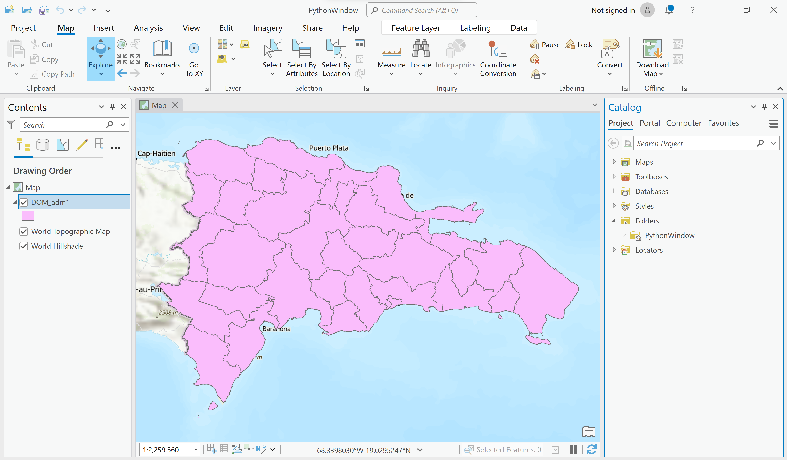

# Introducción

¡Bienvenido a Python en ArcGIS Pro! Este taller demostrará como trabajar con Python en ArcGIS Pro y como automatizar flujos de trabajos. Vamos hacer una breve introducción a Python, después vamos utilizar un Notebook para detección de inundaciones a partir de imágenes Sentinel-2. Y finalmente, vamos crear uma herramienta a partir de nuestro código para que la detección pueda ser automatizada y utilizada con qualquier imagen óptica y en cualquier área de interés. 

## Objetivos

1. Comprender como Python está conectado a ArcGIS Pro y para que puedes utilizarlo
2. Familiarizarse con Python utilizando el Python Window
3. Correr un Notebook para detección de inundaciones a partir de la clasificación de imágenes Sentinel-2
4. Crear una herramienta a partir del código de Python para automatizar el flujo de trabajo de detección de inundaciones

# Python en ArcGIS Pro

*Este material fue basado en páginas oficiales de ESRI*

Python es un lenguaje de programación libre, multiplataforma y de código abierto. Su uso y soporte están muy extendidos. Para obtener más información sobre Python, visite el sitio web de Python.

Python se introdujo en la comunidad de ArcGIS con ArcGIS 9.0. Desde entonces, se ha aceptado como lenguaje de programación de secuencias de comandos. Desde entonces, ha sido aceptado como el lenguaje de scripting preferido por los usuarios de geoprocesamiento y sigue creciendo.

## Como Python es manejado en ArcGIS Pro

Python es el lenguaje principal para la automatización en ArcGIS Pro, debido en gran parte a su versatilidad y extensibilidad. Es en parte debido a estas cualidades que Python también se está convirtiendo en uno de los lenguajes de programación más utilizados en general. Python cuenta con una gran variedad de paquetes preexistentes que pueden utilizarse en ArcGIS. Sin embargo, gestionar qué paquetes están instalados en un sistema puede ser una tarea compleja y laboriosa, especialmente cuando se trabaja en varios proyectos o se intenta compartir código con otras personas.

Para aprovechar esta versatilidad, la comunidad de Python ha creado métodos para crear proyectos en varias versiones de Python y simplificar el proceso de instalación de casi todos los paquetes de Python disponibles públicamente. **Conda** es un gestor de paquetes de Python popular y ampliamente utilizado.

<p align="center">

</p>

La funcionalidad de conda se integra en ArcGIS Pro a través del Gestor de paquetes ([Package Manager](https://pro.arcgis.com/en/pro-app/latest/arcpy/get-started/what-is-conda.htm)). El gestor de paquetes elimina muchos de los retos a los que se enfrenta la escritura de código Python. Admite la instalación de bibliotecas de código abierto y de terceros asociadas a un proyecto individual, en lugar de a la instalación base de Python. Esto simplifica el proceso de compartir con éxito herramientas Python complejas en varios ordenadores.

## Como correr Python en ArcGIS Pro

Puedes ejecutar Python de forma interactiva en ArcGIS Pro utilizando el **Python Window** o **ArcGIS Notebooks**. El Python Window proporciona un indicador desde el que se pueden ejecutar breves fragmentos de código Python. Los ArcGIS Notebooks se basan en la arquitectura Jupyter Notebook y ofrecen una experiencia en la que el código, las visualizaciones y el texto narrativo pueden ejecutarse y almacenarse juntos en un documento.

<p align="center">

</p>

Puedes también ejecutar scripts de Python (archivos con extensión .py) fuera de ArcGIS Pro. Pero, para esta sesión, vamos hacer una breve introducción al Python Window y enfocar en los Notebooks. 

### Python Window

Este tutorial fue desarrollado originalmente por el equipo Learn de Esri. 
Puede encontrar la versión oficial actualizada en esta ubicación [https://learn.arcgis.com/en/projects/get-started-with-python-in-arcgis-pro/](https://learn.arcgis.com/en/projects/get-started-with-python-in-arcgis-pro/).
Puede encontrar otros tutoriales en la galería de tutoriales [https://learn.arcgis.com/en/gallery/](https://learn.arcgis.com/en/gallery/).

1. Abra ArcGIS Pro, en New Project, haga click en Map.

2. En la ventana **Create a New Project**, en **Name**, escriba **PythonWindow**. En **Location**, vaya a la carpeta de su interés. Haga click en **OK**. El proyecto se abre con un mapa en blanco.

2. Vamos utilizar las áreas administrativas ```DOM_adm1.shp``` utilizadas anteriormente. Vaya a la carpeta en la que tiene guardado este shapefile y añadalo al mapa.

<p align="center">

</p>

3. Sabemos que hay 32 estados en la Reública Dominicana. Podemos checkear el la tabla de atributos de ```DOM_admi1.shp```.

<p align="center">

</p>

4. Otra forma de hacerlo es ejecutando un Geoprocessing Tool. En la cinta de Options, en la pestaña Analysis, en el grupo Geoprocessing, haga clic en Tools. En la barra de búsqueda del panel Geoprocesamiento, escriba "count" y pulse Enter. Haga clic en la herramienta Get Count. En el panel de herramientas Get Count, para el parámetro Input Rows, seleccione ```DOM_admi1```. Haga clic en Ejecutar.

5. Haga clic en Ver detalles. Aparece la ventana Get Count (Data Management Tools) con la pestaña Messages abierta. El mensaje dice Row Count = 32, que es el mismo recuento que determinó manualmente abriendo la tabla de atributos. Puede repetir estos pasos para determinar el recuento de todos los shapefiles, pero eso llevaría mucho tiempo si tuviera muchos conjuntos de datos. En su lugar, desarrollará un script de Python para realizar esta tarea.

6.