# Detección de inundación con Python

Este tutorial fue desarrollado originalmente por el equipo Learn de Esri. 
Puede encontrar la versión oficial actualizada en esta ubicación [https://learngis.maps.arcgis.com/home/item.html?id=24e13f2f4fe8453b9d1107e1f5b1d3cf](https://learngis.maps.arcgis.com/home/item.html?id=24e13f2f4fe8453b9d1107e1f5b1d3cf).
Puede encontrar otros tutoriales en la galería de tutoriales [https://learn.arcgis.com/en/gallery/](https://learn.arcgis.com/en/gallery/).

## Datos

Para ese ejercício vamos a utilizar un ArcGIS Pro Project Package (.ppkx)  que es un archivo con dos notebooks. El primero notebook tenemos el código Python para clasificar el agua y detectar inundaciones en imágenes de Antes y Después. El segundo notebook es para convertir el primero código en una herramienta de script para su uso en ArcGIS Pro.

También vamos utilizar dos imágenes de Sentinel-2 del Oriente Medio. Por favor baje los datos en [esta carpeta](https://drive.google.com/drive/folders/1I7pC6RgyEy7x7tUcVUAgSH2ErAPVqUCN?usp=sharing):

- ArcGIS Pro Project Package
- Imágenes de Sentinel-2

## Requisitos

- Debe tener una licencia de ArcGIS Spatial Analyst para utilizar este cuaderno.

### Datos de Sentinel-2

Las imágenes que vas a utilizar son un par de escenas recortadas del programa de satélites [Sentinel](https://sentinels.copernicus.eu/web/sentinel/home), del programa de observación de la Tierra [Copernicus](https://www.copernicus.eu/en/about-copernicus) de la Unión Europea. Una escena muestra la zona de interés antes de la inundación y la otra escena muestra la zona después de la inundación.

El archivo Sentinel_2_Clipped.zip contiene una carpeta llamada Sentinel_2_Clipped.  
1. En el explorador de archivos, cree una carpeta en su unidad C:\ llamada **ArcGIS_Python**.
2. En la carpeta **ArcGIS_Python**, crea una carpeta llamada **Deteccion_Inundacion**.
3. Extraiga la carpeta **Sentinel_2_Clipped** del archivo zip a **C:\ArcGIS_Python\Deteccion_Inundacion\Sentinel_2_Clipped**. Si utiliza otra ubicación deberá ajustar las rutas en el código de este cuaderno.  
La carpeta **Sentinel_2_Clipped** contiene carpetas llamadas **Antes**, **Despues** y **Salidas**.

### Importar módulos y paquetes Python necesarios

Importarás los siguientes módulos y paquetes utilizados en el proceso.
- os: Un [módulo estándar de Python](https://docs.python.org/3/library/os.html) para funciones dependientes del sistema operativo, como la manipulación de rutas.
- glob: Un [módulo estándar de Python](https://docs.python.org/3/library/glob.html) que permite la comparación simple de rutas y la generación de listas.
- arcpy: Un [paquete de sitio de Python](https://pro.arcgis.com/en/pro-app/latest/arcpy/main/arcgis-pro-arcpy-reference.htm) que se instala con ArcGIS Pro para realizar análisis de datos geográficos, conversión de datos, gestión de datos y automatización de mapas.
- arcpy.sa: Un módulo de Python dentro del paquete arcpy para analizar datos ráster y vectoriales con la extensión [Spatial Analyst](https://pro.arcgis.com/en/pro-app/2.8/arcpy/spatial-analyst/what-is-the-spatial-analyst-module.htm) de ArcGIS. Debe tener una licencia de Spatial Analyst para utilizar este módulo.  

Este flujo de trabajo utiliza paquetes que se instalan con la distribución de Python 3 de ArcGIS Pro, por lo que no necesitará instalar paquetes adicionales.

1. Abra un nuevo Python Notebook en ArcGIS y ejecute la siguiente celda para importar los módulos y paquetes necesarios.

```python
# Importar
import os
from glob import glob
import arcpy
from arcpy.sa import *
```

Los módulos y paquetes ya están disponibles para que los utilice su código.

### Establecer rutas a las carpetas de entrada y salida

Para ejecutar el código, debe establecer tres variables para almacenar las rutas a las imágenes de entrada y a la ubicación donde se guardarán los resultados.  
Las variables son
- carpeta_img_antes: Es la ruta a la carpeta de su disco duro donde se encuentran las imágenes previas a la inundación.
- carpeta_img_despues: Es la ruta a la carpeta del disco duro donde se encuentran las imágenes posteriores a la inundación.
- carpeta_salida_final: Ruta a la carpeta del disco duro en la que se guardarán los archivos de salida finales.

1. Si utilizó una ruta diferente a **C:\ArcGIS_Python\Deteccion_Inundacion\Sentinel_2_Clipped** para los datos, debe editar las tres rutas en la celda de abajo antes de ejecutar la celda.  

Si edita las rutas, asegúrese de que las nuevas rutas incluyen los nombres de las carpetas **Antes**, **Despues** y **Salidas**.

2. Ejecute la siguiente celda para crear las variables y configurarlas para que contengan las rutas de datos de entrada y salida. 

```python
# Set the input and output folder location variables.
# Establece las variables de ubicación de las carpetas de entrada y salida.
# Estas deben apuntar a las ubicaciones de las carpetas en la carpeta Sentinel_2_Clipped que extrajiste.
# Los prefijos "r" en las cadenas de ruta indican que estas son cadenas "raw" en Python, y 
# los caracteres \ no deben ser tratados como un carácter de escape. Si edita estas rutas, recuerde
# mantener los nombres de las carpetas \Antes, \Después y \Salida en las rutas.

# Esta es la carpeta que contiene las imágenes previas a la inundación
carpeta_img_antes = r"C:\ArcGIS_Python\Deteccion_Inundacion\Sentinel_2_Clipped\Antes"

# Esta es la carpeta que contiene las imágenes posteriores a la inundación
carpeta_img_despues = r"C:\ArcGIS_Python\Deteccion_Inundacion\Sentinel_2_Clipped\Despues"

# Esta es la carpeta donde se escribirán los archivos de resultados finales
carpeta_salida_final = r"C:\ArcGIS_Python\Deteccion_Inundacion\Sentinel_2_Clipped\Salidas"
```

### Crear una función para identificar datos de bandas de imágenes.  

Su análisis utilizará imágenes multiespectrales Sentinel-2. Estas imágenes se componen de [13 bandas espectrales](https://sentinels.copernicus.eu/web/sentinel/technical-guides/sentinel-2-msi/msi-instrument), pero en este flujo de trabajo sólo utilizará 6 bandas específicas: Azul, Verde, Rojo, Rojo Cercano 1 (Red-Edge 1), Infrarrojo Cercano 2 (NIR-2), e Infrarrojo de Onda Corta 2 (SWIR-2). Las bandas se almacenan como archivos separados.

Antes de comenzar el análisis, debe crear una función para identificar los archivos de las bandas espectrales de las imágenes y almacenar las rutas a esos archivos en variables. Esto le permitirá referirse a las bandas utilizando nombres de variables cortos, en lugar de las largas rutas de los archivos. Las imágenes de Sentinel-2 se entregan normalmente con cada una de las bandas almacenadas en un archivo JPEG 2000 (.jp2) separado. Cada archivo de banda termina con el número de banda como parte del nombre del archivo. Por ejemplo, los nombres de archivo de la banda roja, banda 4, terminan con "B04.jp2". Con este formato en mente, creará una función Python que tomará la carpeta que contiene las imágenes de banda como parámetro de entrada y devolverá una variable que hace referencia a la ruta absoluta de cada banda en su ordenador.

Para el análisis utilizarás cuatro bandas específicas, Red-Edge-1, SWIR-2, Green e Near-Infrared-2. También utilizará las bandas roja y azul para generar una imagen compuesta con la que inspeccionar visualmente las imágenes. Este proceso puede utilizarse para acceder a cualquiera de las bandas y crear otros índices de análisis de imágenes.

Para ello, se definirá una función `crear_sen2_variables_bandas` para hacer lo siguiente:  
- Obtener una lista de todos los archivos de imagen .jp2 en la carpeta de entrada utilizando el módulo glob y almacenar esa lista en una variable llamada `lista_bandas`.
- Utilizar [list comprehension](https://docs.python.org/3/tutorial/datastructures.html#list-comprehensions) para encontrar los archivos correspondientes a las distintas bandas de Sentinel-2, y almacenar sus rutas en variables con sus respectivos nombres como `Blue`, `Green`, `Red`, o `NIR`.
- Devuelve las variables de banda que contienen las rutas a los archivos de imagen.

1. Ejecute la celda siguiente para definir la función de creación de las variables de trayectoria de la banda.

```python
def crear_sen2_variables_bandas(in_folder):
    """Una función que crea variables de banda para imágenes Sentinel-2 dada la carpeta con todas las imágenes de banda."""
    
    # Usa arcpy.AddMessage como print() para imprimir en los mensajes de geoprocesamiento de ArcGIS
    arcpy.AddMessage("Creando variables para bandas de imagen...")

    # Obtener una lista de los archivos jpg2000 de la carpeta de entrada y almacenarla en una lista
    lista_bandas = glob(in_folder + "/*.jp2")

    # Utilice la comprensión de listas (list_comprehension) para obtener los archivos de la lista_band que corresponden a los nombres específicos de los archivos de banda de Sentinel-2.
    Blue = [x for x in lista_bandas if x.endswith("B02.jp2")][0]
    Green = [x for x in lista_bandas if x.endswith("B03.jp2")][0]
    Red = [x for x in lista_bandas if x.endswith("B04.jp2")][0]
    Red_Edge_1 = [x for x in lista_bandas if x.endswith("B05.jp2")][0]
    NIR = [x for x in lista_bandas if x.endswith("B08.jp2")][0]
    SWIR2 = [x for x in lista_bandas if x.endswith("B12.jp2")][0]

    #  Devuelve las variables de banda
    return Blue, Green, Red, Red_Edge_1, NIR, SWIR2
```

Ahora que la función ha sido definida, la probarás llamándola sobre una carpeta de imágenes para ver si crea correctamente las rutas de las imágenes de las bandas.  
Dado que la función devuelve datos para varias bandas, establecerá los resultados de la función iguales a un conjunto correspondiente de variables. El orden de las variables que cree debe coincidir con el orden de los datos de banda devueltos por la función. En este caso, ejecutará la función en las imágenes posteriores a la inundación. Para indicarlo, añadirá un prefijo "despues" al nombre de cada variable para distinguirla de los datos de banda de las imágenes anteriores a la inundación.  

2. Ejecute la siguiente celda para probar la función.

```python
# llamar a la función create_sen2_band_variables en la carpeta que contiene las imágenes posteriores
despues_Blue, despues_Green, despues_Red, despues_Red_Edge_1, despues_NIR, despues_SWIR2 = crear_sen2_variables_bandas(carpeta_img_despues)

# imprime un par de bandas para ver los resultados
print(despues_Red)  # imprimir el recorrido de la banda roja
print(despues_NIR)  # imprimir el recorrido de la banda NIR
```

Si ve dos caminos impresos después de la celda anterior, como el siguiente, entonces la función seleccionó correctamente la banda 4 para la banda Roja y la banda 8 para la banda NIR.  
    C:\ArcGIS_Python\Deteccion_Inundacion\Sentinel_2_Clipped\Despues\Clipped_T42TVK_20200504T061629_B04.jp2
    C:\ArcGIS_Python\Deteccion_Inundacion\Sentinel_2_Clipped\Despues\Clipped_T42TVK_20200504T061629_B08.jp2  
    
Las rutas son las rutas a las imágenes de banda en su ordenador.  
Si ve un mensaje de error como **IndexError: list index out of range**, vuelva atrás y compruebe la celda donde estableció las rutas a las carpetas Antes, Despues y Salida en su ordenador. Probablemente hay un problema con estas rutas. Compruebe las rutas en su ordenador y edite las rutas en la celda para que coincidan, ejecute la celda de nuevo, y ejecute la celda para probar la función de nuevo.

A continuación, visualizará las imágenes posteriores a la inundación con las que está trabajando. Para ello, creará una imagen compuesta utilizando una combinación de bandas de falso color (infrarrojo cercano, rojo, verde) para distinguir mejor el agua y la tierra. Para ello utilizará la herramienta [Composite Bands geoprocessing tool](https://pro.arcgis.com/en/pro-app/latest/tool-reference/data-management/composite-bands.htm). 

3. Ejecute la celda de abajo para dibujar la imagen compuesta.  

Cuando ejecute la celda, es posible que tarde algún tiempo en procesarse. Cuando termine, aparecerá un mensaje indicando que la herramienta se ha ejecutado correctamente.

```python
# crear la imagen compuesta, almacenando el resultado en memoria
arcpy.CompositeBands_management(in_rasters=f"{despues_NIR};{despues_Red};{despues_Green}",
                                out_raster=r"memory\composicion_img_despues")
```

4. Haga clic en la pestaña **Map** para ver los resultados. 

<p align="center">
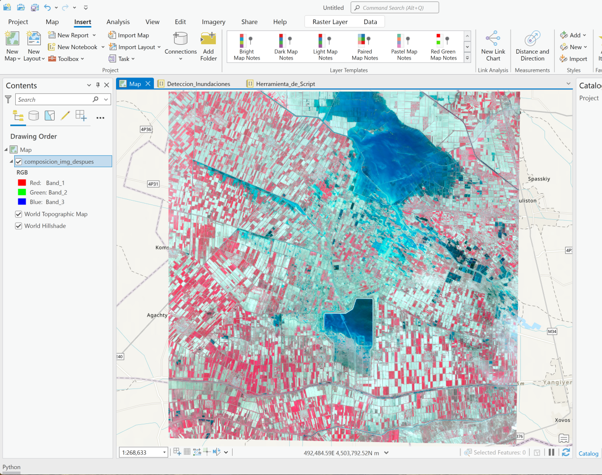
</p>

5. En el panel **Contents**, haga clic con el botón derecho del ratón en **composicion_img_despues** y haga clic en **Zoom To Layer**.  

Verá la imagen infrarroja en falso color que representa la zona después de la inundación. Las áreas con vegetación aparecen en rojo y el agua en azul vibrante.

### Crear funciones de índice espectral

Para identificar el agua en las imágenes, utilizará índices espectrales. Un índice espectral aplica un cálculo matemático para calcular una relación entre diferentes bandas para cada píxel de las imágenes, con el objetivo de resaltar un fenómeno específico. Se utilizarán dos índices, ambos diseñados para la identificación del agua:  [Sentinel-2 Water Index](https://www.mdpi.com/2073-4441/13/12/1647/htm) y el [Normalized Difference Water Index](https://pro.arcgis.com/en/pro-app/2.8/arcpy/spatial-analyst/ndwi.htm) (NDWI).

- El SWI se basa en las bandas Red Edge 1 y SWIR2. La fórmula de este índice es `SWI = (Red_Edge1 - SWIR2) / (Red_Edge1 + SWIR2)`

- El NDWI utiliza las bandas verde e infrarroja cercana (NIR). La fórmula de este índice es `NDWI = (Verde - NIR) / (Verde + NIR)`

La estrategia general para su análisis consistirá en hacer lo siguiente:

- Aplicar SWI para encontrar los píxeles de las imágenes que están cubiertos de agua. 

- Aplicar NDWI para encontrar los píxeles de las imágenes que están cubiertos de agua. 

- Buscar los píxeles en los que se ha detectado agua tanto para SWI como para NDWI.  

Este enfoque garantiza unos resultados de detección más sólidos que el uso de un único índice.  
**Nota**: Aunque sólo utilizará dos índices para este ejercicio, incluir más índices en este proceso puede aumentar la precisión del análisis.  

Utilizarás el módulo `arcpy.sa` para hacer [Álgebra de Mapas](https://pro.arcgis.com/en/pro-app/latest/arcpy/spatial-analyst/an-overview-of-the-map-algebra-operators.htm) para calcular los valores de las celdas. También hay una serie de índices espectrales incorporados [funciones raster](https://pro.arcgis.com/en/pro-app/latest/arcpy/image-analyst/an-overview-of-the-image-analyst-functions.htm) disponibles en el [módulo de Análisis de Imagen](https://pro.arcgis.com/en/pro-app/latest/arcpy/image-analyst/what-is-the-image-analyst-module.htm).

1. Ejecute la celda siguiente para definir la función calcular_swi.

```python
# crea la función para calcular SWI
def calcular_swi(red_edge1_band, swir2_band):
    """Crear una función que calcule el SWI para la imagen de entrada dada."""
    
    arcpy.AddMessage("\nInicio del cálculo SWI...")
    
    # Calcular el SWI - Índice de Agua de Sentinel-2
    # Fórmula SWI = (Red_Edge1 - SWIR2) / (Red_Edge1 + SWIR2)
    
    # Crear una variable para almacenar el cálculo del numerador
    # usando la herramienta Float de arcpy spatial analyst para crear un raster con valores de celda en coma flotante
    Numerador = arcpy.sa.Float(Raster(red_edge1_band) - Raster(swir2_band))
    
    # Crear una variable para almacenar el cálculo del denominador
    # usando la herramienta Float del analista espacial arcpy para crear un raster con valores de celda en coma flotante
    Denominador = arcpy.sa.Float(Raster(red_edge1_band) + Raster(swir2_band))
    
    # Usa la herramienta Divide del analista espacial arcpy para dividir el numerador y el denominador 
    SWI = arcpy.sa.Divide(Numerador, Denominador)

    # devuelve los resultados
    return SWI
    
    arcpy.AddMessage("SWI Generado Exitosamente")
```

A continuación, creará otra función para el índice NDWI. Utilizará el mismo flujo de trabajo y proceso básicos que la función SWI, pero en su lugar utilizará la fórmula NDWI y las bandas necesarias.

2. Ejecute la celda siguiente para definir la función calcular_ndwi.

```python
# crea la función para calcular NDWI
def calcular_ndwi(green_band, nir_band):
    """Crear una función que calcule el NDWI para la imagen de entrada dada."""

    arcpy.AddMessage("\nInicio del cálculo NDWI...")
    
    # Calcular el NDWI - Índice Normalizado de Diferencia de Agua
    # Fórmula NDWI = (Verde - NIR) / (Verde + NIR)

    # Crear una variable para almacenar el cálculo para el numerador
    # usando la herramienta Float del analista espacial arcpy para crear un raster con valores de celda en coma flotante
    Num = arcpy.sa.Float(Raster(green_band) - Raster(nir_band))
    
    # Crear una variable para almacenar el cálculo del denominador
    # usando la herramienta Float del analista espacial arcpy para crear un raster con valores de celda en coma flotante
    Denom = arcpy.sa.Float(Raster(green_band) + Raster(nir_band))
    
    # Usa la herramienta Divide del analista espacial arcpy para dividir el numerador y el denominador 
    NDWI = arcpy.sa.Divide(Num, Denom)
    
    # devuelve los resultados
    return NDWI
    
    arcpy.AddMessage("NDWI Generado Exitosamente")
```

Ahora que las dos funciones están definidas, las ejecutarás en la imagen y verás los resultados en el mapa.  

3. Ejecute la celda de abajo para calcular los índices SWI y NDWI para la imagen después de la inundación.

```python
# Procesar SWI 
# Crear el raster SWI
swi_despues = calcular_swi(red_edge1_band=despues_Red_Edge_1,
                               swir2_band=despues_SWIR2)

# Crear ruta para el archivo SWI de salida
swi_despues_raster = r"memory\swi_despues_raster"

# Guardar el resultado
swi_despues.save(swi_despues_raster)


# Procesar NDWI 
# Crear el raster NDWI
ndwi_despues = calcular_ndwi(green_band=despues_Green,
                                 nir_band=despues_NIR)

# Crear ruta para el archivo NDWI de salida
ndwi_despues_raster = r"memory\ndwi_despues_raster"

# Guardar el resultado
ndwi_despues.save(ndwi_despues_raster)
```

Ahora que ha añadido los índices rasterizados al mapa, puede inspeccionar las imágenes.  

4. Haga clic en la pestaña **Map** para ver los resultados.  

<p align="center">
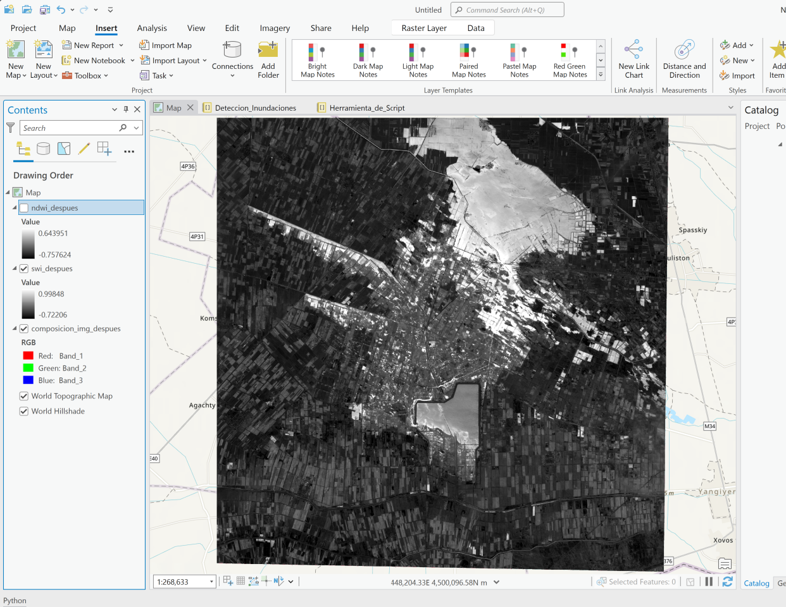
</p>

<p align="center">
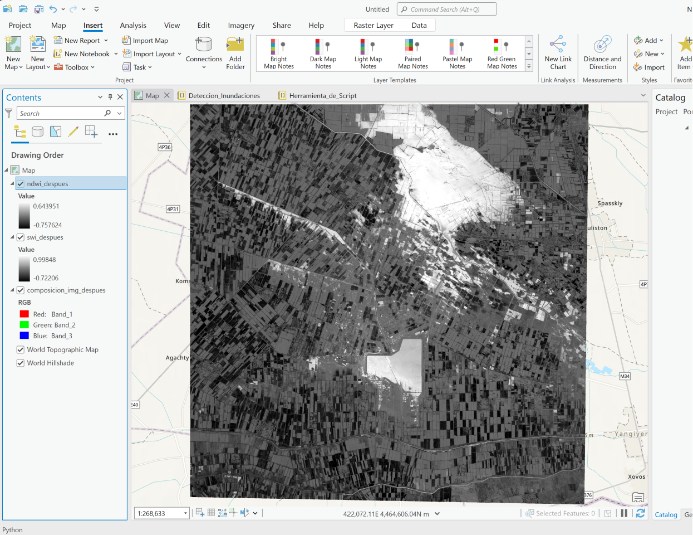
</p>

Las áreas con valores de píxel más altos corresponden al agua y están simbolizadas en blanco.  

¿Puede ver las áreas que corresponden al agua?

### Crear una función de umbralización

Ahora que ha creado las funciones para calcular los índices, debe determinar cómo separar el agua de lo que no lo es en los rásters SWI y NDWI resultantes. Una forma habitual de abordar este problema es utilizar el umbral de histograma. Esta técnica intenta determinar un único valor umbral que categorice y divida los valores de los píxeles del raster. Esto clasifica todos los píxeles como no agua o agua, expresado como 0 o 1. 

Esto se hace a menudo por ensayo y error manual, donde el analista interpreta visualmente un histograma y elige lo que cree que es el mejor valor umbral. Otras técnicas utilizan diversas pruebas estadísticas y matemáticas para determinar un valor umbral. El módulo ArcPy Spatial Analyst contiene la función [Threshold](https://pro.arcgis.com/en/pro-app/2.8/arcpy/spatial-analyst/threshold.htm), que utiliza el método [Otsu](https://pro.arcgis.com/en/pro-app/2.8/help/analysis/raster-functions/binary-thresholding-function.htm) para determinar automáticamente el valor umbral óptimo para una clasificación binaria de un conjunto de datos ráster.

Para procesar los umbrales, se creará otra función. Dentro de la función, la función `arcpy.sa.Threshold()` se ejecuta en el raster de índice de entrada.

1. Ejecute la celda siguiente para definir la función crear_umbral_raster.

```python
def crear_umbral_raster(raster_entrada):
    """Crea una función que umbraliza el raster de entrada y luego la devuelve."""
    
    # Ejecute la función de umbralización de Ostu en el raster de entrada
    calc_umbral = arcpy.sa.Threshold(raster_entrada)
    
    # Devuelve el resultado
    return calc_umbral
```

Ahora que la función está definida, la utilizará para generar los umbrales de los rásters NDWI y SWI.

2. Ejecute la celda siguiente para aplicar la función crear_umbral_raster a los dos rásteres de índice.

```python
# Procesar NDWI 
# Utilizar la función threshold_raster para procesar el raster NDWI
ndwi_despues_umbral_calc = crear_umbral_raster(raster_entrada=ndwi_despues_raster)

# Crear una ruta para el archivo NDWI de salida
ndwi_despues_umbral_raster = r"memory\ndwi_despues_umbral"

# Guardar el raster NDWI umbral
ndwi_despues_umbral_calc.save(ndwi_despues_umbral_raster)

# Crear una capa de trama para el archivo de umbral NDWI para que pueda visualizarse en la pestaña de mapa de resultados
capa_ndwi_despues_umbral = arcpy.MakeRasterLayer_management(ndwi_despues_umbral_raster, 'ndwi_despues_umbral')


# Procesar SWI 
# Usa la función threshold_raster para procesar el raster SWI
swi_despues_umbral_calc = crear_umbral_raster(raster_entrada=swi_despues_raster)

# Crear una ruta para el archivo SWI de salida
swi_despues_umbral_raster = r"memory\swi_despues_umbral"

# Guardar el raster SWI umbral
swi_despues_umbral_calc.save(swi_despues_umbral_raster)

# Crear una capa de trama para el archivo de umbral SWI para que pueda visualizarse en la pestaña de mapa de resultados
capa_swi_despues_umbral = arcpy.MakeRasterLayer_management(swi_despues_umbral_raster, 'swi_despues_umbral')
```

Ahora que ha ejecutado la función crear_umbral_raster en los rásters índice, puede inspeccionar los dos rásters umbralizados.  

3. Haga clic en la pestaña **Map** para ver los resultados.  

<p align="center">
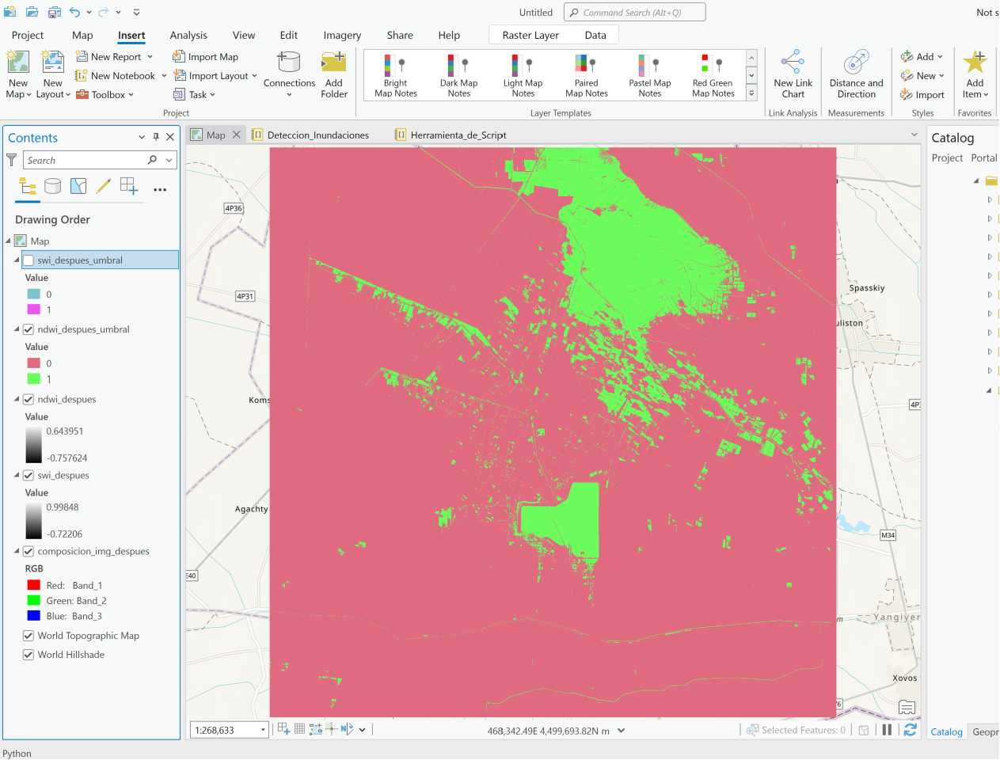
</p>

<p align="center">
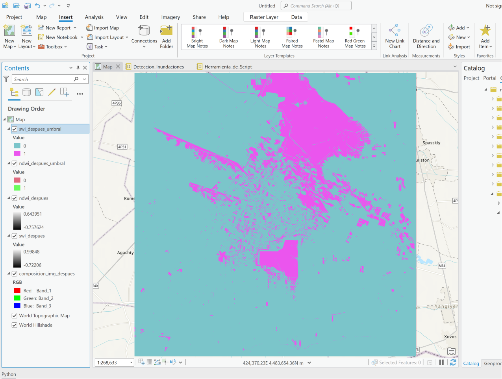
</p>

Las áreas con valores de píxel de 1 se clasifican como agua. Las áreas con valores de 0 no son agua.

¿Puede ver las áreas clasificadas como agua? ¿En qué se diferencian estas zonas en las dos capas de salida umbralizadas?

A los valores más altos del ráster de índice se les asignó un valor umbral de 1. Esto es conveniente en este análisis, porque los valores de índice correspondientes al agua estaban más cerca de 1. Sin embargo, puede que tenga que tener cuidado si añade otros índices o utiliza este enfoque para identificar diferentes tipos de características. No todos los índices clasifican las características de interés como valores de píxel altos.  

**Nota**: Siempre que se añada una capa al mapa, se simbolizará con un color aleatorio o una rampa de color. Los colores seleccionados al azar no son siempre la mejor opción para la interpretación visual. Puede establecer su propio color para la capa desde el panel Contenido. Haga clic con el botón derecho del ratón en el cuadrado de color bajo la capa y elija un color diferente. Puede hacer esto para cualquier capa que se añada al mapa.

### Extraer las áreas de agua y crear un raster de confianza.

Sumará los rásters de umbral para comparar los resultados de los pasos de umbralización. El raster resultante tendrá tres valores posibles:

| Valor del píxel | Descripción
| ----------- | ----------- |
| 0 | Píxeles en los que ninguno de los índices identificó agua.
| 1 | Píxeles en los que sólo uno de los índices identificó agua.
| 2 | Píxeles en los que ambos índices identificaron agua.

El resultado puede considerarse como una trama de confianza. Si ambos índices indican que un píxel es agua, se tiene más confianza en el resultado que si sólo un índice lo clasificara como agua.  

Para sumar los dos raster, debe crear [objetos raster](https://pro.arcgis.com/en/pro-app/latest/arcpy/classes/raster-object.htm) utilizando `Raster()` de los archivos de umbral y luego sumarlos con el operador +. Guardará este proceso en una función que podrá volver a llamar más tarde.

1. Ejecute la celda siguiente para definir la función crear_raster_confianza_agua.

```python
def crear_raster_confianza_agua(ndwi_umbral_raster, swi_umbral_raster):
    """Cree una función que calcule la suma de dos rásters."""
    
    # Añada los dos rásteres de umbral creando objetos ráster de cada uno y combinándolos mediante el operador de suma +.
    raster_confianza_agua = Raster(ndwi_umbral_raster) + Raster(swi_umbral_raster)

    # Devuelve el resultado
    return raster_confianza_agua
```

Ahora que ha definido la función crear_raster_confianza_agua, la utilizará para crear el raster de confianza.  

2. Ejecute la celda de abajo para crear el raster de confianza.

```python
# Llame a la función create_water_confidence_raster
raster_agua_confianza_despues = crear_raster_confianza_agua(ndwi_umbral_raster=ndwi_despues_umbral_raster, 
                                                         swi_umbral_raster=swi_despues_umbral_raster)

# Crear una ruta para el archivo raster de confianza del agua de salida
ruta_raster_agua_confianza_despues = r"memory\raster_agua_confianza_despues"

# Guardar la trama de confianza del agua en un archivo de la memoria
raster_agua_confianza_despues.save(ruta_raster_agua_confianza_despues)
```

Ahora que la capa de la matriz de confianza se ha añadido al mapa, puede explorar los resultados.  

3. Haga clic en la pestaña **Map** para ver los resultados.  

<p align="center">
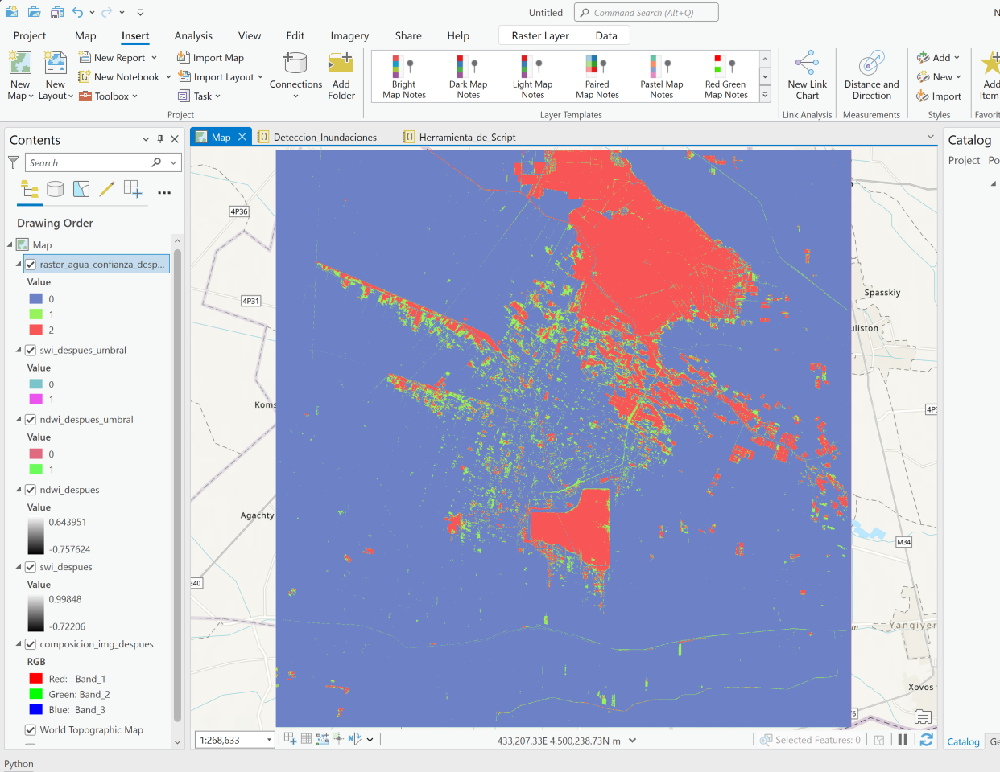
</p>

Las áreas con valores de píxel de 2 fueron clasificadas como agua por ambos índices.  
Las áreas con valores de 1 fueron clasificadas como agua sólo por uno de los índices.  
Las áreas con valores de píxel de 0 fueron clasificadas como agua por ninguno de los índices.  

Puede activar y desactivar las capas y comparar la trama de confianza con las tramas de índice y con la imagen compuesta.

### Extraer los valores de alta confianza  

El último paso en el proceso de extracción del agua consiste en reclasificar el ráster de confianza para poner a 0 todos los píxeles que no tengan valores de confianza alta (2). Los valores de píxel de 1, áreas de confianza sólo moderada, se restablecerán a 0 valores.

Utilizará la herramienta de geoprocesamiento [Reclassify](https://pro.arcgis.com/en/pro-app/latest/tool-reference/spatial-analyst/reclassify.htm) de la caja de herramientas de Spatial Analyst. 

En primer lugar, definirá los [remap values](https://pro.arcgis.com/en/pro-app/latest/arcpy/spatial-analyst/remapvalue-class.htm). La herramienta Reclasificar utiliza los valores de reasignación para determinar qué valores desea cambiar y a qué cambiarlos.  

A veces querrás cambiar un rango de valores a un nuevo valor. En estos casos, puede utilizar [Remap range](https://pro.arcgis.com/en/pro-app/latest/arcpy/spatial-analyst/an-overview-of-transformation-classes.htm) para cambiar rangos de valores.

1. Ejecute la celda siguiente para crear los valores de reasignación y reclasificar el raster de confianza.

```python
# Crear los valores de reasignación para establecer cualquier píxel con el valor de 1 a 0.
remap_value = RemapValue([[1, 0]])

# Reclasificar la máscara de agua
mascara_agua_despues_reclas = Reclassify(in_raster=ruta_raster_agua_confianza_despues, 
                                      reclass_field="value", 
                                      remap=remap_value)

# Crear una ruta para el archivo de máscara de agua de salida
mascara_agua_despues_reclas_raster = r"memory\mascara_agua_despues_alta_confianza"

# Guardar la máscara de agua
mascara_agua_despues_reclas.save(mascara_agua_despues_reclas_raster)
```

2. Haga clic en la pestaña **Map** para ver los resultados.  

<p align="center">
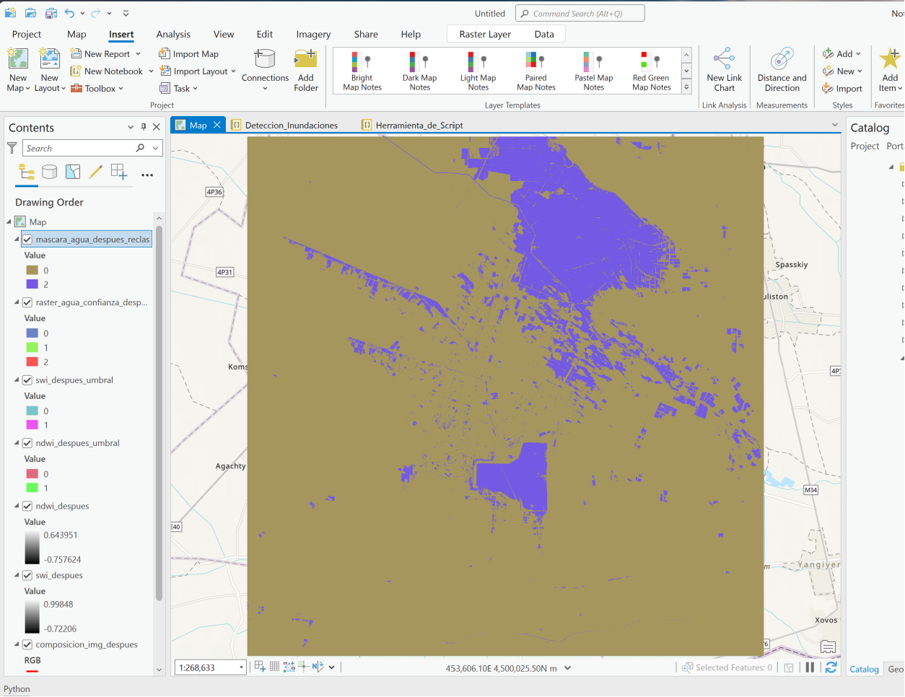
</p>

Las zonas en las que ambos índices coincidieron en que había agua (valor del píxel = 2) contrastan con las zonas en las que discreparon, o coincidieron en que no había agua (valores = 0).

### Procesar la imagen antes

Ahora que todas las funciones para su proceso han sido creadas, y ejecutadas en la imagen post-inundación, usted reutilizará esas funciones para la imagen pre-inundación.  
Como ya conoce los pasos a seguir, puede poner el código en un bloque y ejecutarlo todo al mismo tiempo.

La ruta de la carpeta de la imagen anterior se estableció al principio del cuaderno y se almacenó como la variable `carpeta_img_antes`.

1. Ejecute la celda siguiente para ejecutar todos los pasos de procesamiento en la imagen "antes". 

```python
# Paso 1: crear las variables de banda 
antes_Blue, antes_Green, antes_Red, antes_Red_Edge_1, antes_NIR, antes_SWIR2 = crear_sen2_variables_bandas(carpeta_img_antes)


# Paso 2: Crear una imagen compuesta infrarroja en falso color 
# crear una imagen compuesta, almacenando el resultado en memoria
arcpy.CompositeBands_management(in_rasters=f"{antes_NIR};{antes_Red};{antes_Green}",
                                out_raster=r"memory\composicion_img_antes")

# Paso 3: crear índices 
# crear el raster SWI
swi_antes = calcular_swi(red_edge1_band=antes_Red_Edge_1,
                                swir2_band=antes_SWIR2)

# Crear ruta para guardar archivo SWI antes
swi_antes_raster = r"memory\swi_antes_raster"

# Guardar el resultado en un archivo
swi_antes.save(swi_antes_raster)

# crear una capa ráster para el archivo de umbral SWI para que pueda visualizarse en la pestaña de mapa de resultados.
capa_swi_antes = arcpy.MakeRasterLayer_management(swi_antes_raster, 'swi_antes')

# crear el raster NDWI
ndwi_antes = calcular_ndwi(green_band=antes_Green,
                                  nir_band=antes_NIR)

# Crear ruta para guardar archivo NDWI antes
ndwi_antes_raster = r"memory\ndwi_antes_raster"

# Guardar el resultado en un archivo
ndwi_antes.save(ndwi_antes_raster)

# crear una capa ráster para el archivo de umbral NDWI para que pueda visualizarse en la pestaña de mapa de resultados.
capa_ndwi_antes = arcpy.MakeRasterLayer_management(ndwi_antes_raster, 'ndwi_antes')


# Paso 4: índices de umbral 
# Umbral para NDWI
ndwi_antes_umbral_calc = crear_umbral_raster(raster_entrada=ndwi_antes_raster)

# crear ruta para archivo NDWI de salida
ndwi_antes_umbral_raster = r"memory\ndwi_antes_umbral"

# guardar el raster de umbrales NDWI
ndwi_antes_umbral_calc.save(ndwi_antes_umbral_raster)

# crear una capa raster para el archivo de umbral NDWI para que se pueda ver en la pestaña de mapa de resultados.
capa_ndwi_antes_umbral = arcpy.MakeRasterLayer_management(ndwi_antes_umbral_raster, 'ndwi_antes_umbral')

# Umbral para SWI
swi_antes_umbral_calc = crear_umbral_raster(raster_entrada=swi_antes_raster)

# crear ruta para archivo SWI de salida
swi_antes_umbral_raster = r"memory\swi_antes_umbral"

# guardar el raster de umbrales SWI
swi_antes_umbral_calc.save(swi_antes_umbral_raster)

# crear una capa raster para el archivo de umbral SWI para que se pueda ver en la pestaña de mapa de resultados.
capa_swi_antes_umbral = arcpy.MakeRasterLayer_management(swi_antes_umbral_raster, 'swi_antes_umbral')


# Paso 5: calcular el raster de confianza 
# crear raster de confianza de agua
raster_agua_confianza_antes = crear_raster_confianza_agua(ndwi_umbral_raster=ndwi_antes_umbral_raster, 
                                                         swi_umbral_raster=swi_antes_umbral_raster)

# Crear una ruta para el archivo raster de confianza del agua de salida
ruta_raster_agua_confianza_antes = r"memory\raster_agua_confianza_antes"

# Guardar el raster de confianza del agua en un archivo de la memoria
raster_agua_confianza_antes.save(ruta_raster_agua_confianza_antes)

# Paso 6: extraer los pixeles de agua 
# crear el valor remap para establecer cualquier pixel con el valor de 1 a 0.
remap_value = RemapValue([[1, 0]])

# reclasificar la máscara de agua
mascara_agua_antes_reclas = Reclassify(in_raster=ruta_raster_agua_confianza_antes, 
                                      reclass_field="value", 
                                      remap=remap_value)

# Crear una ruta para el archivo de máscara de agua de salida
mascara_agua_antes_reclas_raster = r"memory\mascara_agua_antes_alta_confianza"

# Guardar la máscara de agua
mascara_agua_antes_reclas.save(mascara_agua_antes_reclas_raster)
```

2. Haga clic en la pestaña **Map** para ver los resultados.  

<p align="center">
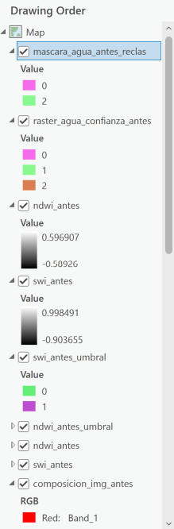
</p>

La capa mascara_agua_antes_reclass muestra las zonas que estaban cubiertas de agua antes de la inundación.

3. Pulse la tecla _Ctrl_ mientras hace clic en la casilla situada junto a la capa mascara_agua_antes_reclass para desactivar todas las capas.  
4. Marque la casilla de la capa composicion_img_antes para activar la capa. 
5. Marque la casilla de la capa composicion_img_despues para activar la capa.  

Puede comparar visualmente las dos imágenes compuestas para ver el cambio que se ha producido al activar y desactivar la capa superior, composicion_img_antes.

### Analice el cambio entre las zonas de agua antes y después.  

Ahora determinará qué zonas de la imagen del después son aguas de inundación y no masas de agua preexistentes. Esto se denomina análisis del cambio. Para ello, calculará la diferencia entre las dos máscaras de agua, restando la máscara de agua anterior a la inundación de la máscara de agua posterior a la inundación.

1. Ejecute la celda siguiente para restar la máscara de agua anterior a la inundación de la máscara de agua posterior a la inundación, y reclasifique los resultados.

```python
# Usando objetos raster, resta la máscara de agua antes de la máscara de agua despues
area_inundada_calc = Raster(mascara_agua_despues_reclas) - Raster(mascara_agua_antes_reclas)

# Crear una ruta para área_inundada_calc
raster_area_inundada_calc = r"memory\area_inundada_calc"

# Guardar el raster area_inundada_calc
area_inundada_calc.save(raster_area_inundada_calc)
```

El raster resultante contiene tres valores de píxel:

| Valor del píxel | Descripción | Importancia
| ----------- | ----------- | ---------- |
| 2 | Donde sólo había agua en la imagen despues | **Importante** |
| 0 | Donde había agua antes y después, o donde no había agua en ninguna de las dos | No importa |
| -2 | Donde no había agua en la imagen despues, y sí en la anterior | No importante | No importa |

Los píxeles con un valor de 2 son las zonas recién inundadas y que no contenían agua en las imágenes anteriores a la inundación. Sólo estos valores son de interés, por lo que puede reclasificar este ráster para establecer todos los demás píxeles como "NoData".

<p align="center">
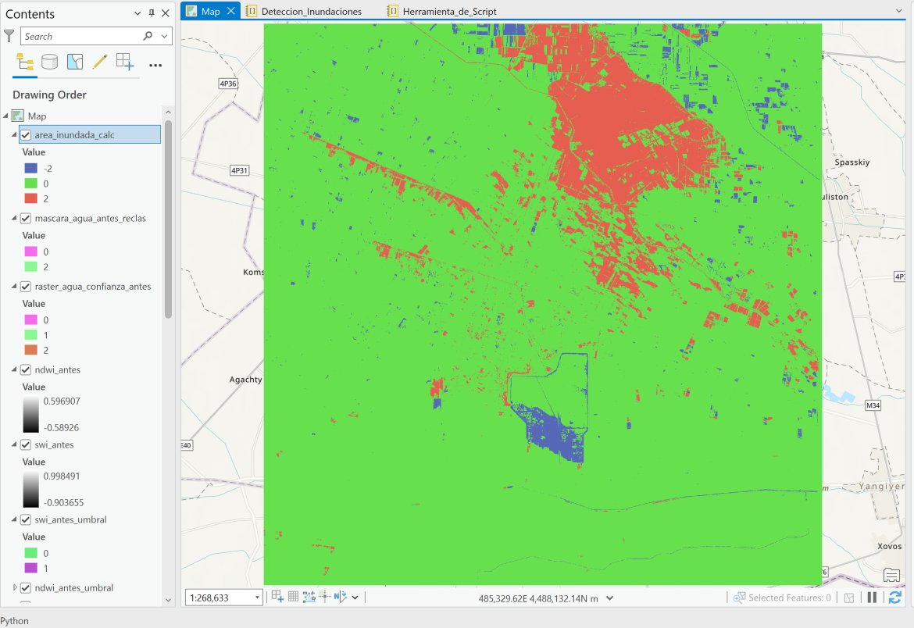
</p>

2. Ejecute la celda siguiente para reclasificar el ráster de modo que sólo muestre las zonas recientemente inundadas.

```python
# Reclasificar el área de inundación final 

# Crear las listas de valores remap
valor_remap_final = RemapValue([[-2, "NoData"], [0, "NoData"]])

# Reclasificar la máscara de agua
area_inundada_final = Reclassify(in_raster=area_inundada_calc, 
                                reclass_field="value", 
                                remap=valor_remap_final)
```

3. Haga clic en la pestaña **Map** para ver los resultados. 

<p align="center">
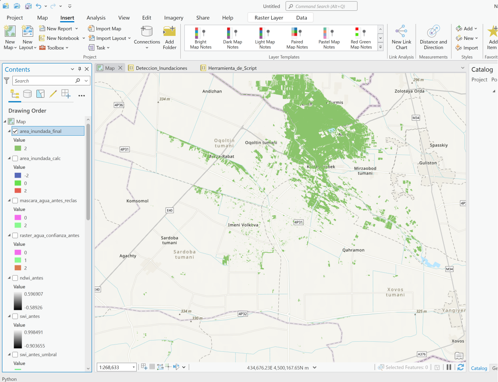
</p>

4. Desmarque la capa `area_inundada_calc`.  
5. Compare la capa `area_inundada_final` con las dos imágenes compuestas.

### Guardar los resultados del análisis  

Ahora que ha encontrado las nuevas zonas inundadas, puede guardarlas para utilizarlas más adelante.  

Todos los resultados obtenidos hasta ahora se han guardado en un espacio de trabajo de memoria temporal que se eliminará cuando cierre ArcGIS Pro. Sin embargo, querrá estos resultados finales para un informe y un análisis posterior. Guardará el ráster resultante y una clase de característica de polígono en la `carpeta_salida_final` que se almacenó como variable al principio de esta lección.

1. Ejecute la celda siguiente para guardar el ráster area_inundada_final como archivo .tif en la carpeta carpeta_salida_final.

```python
# Crear ruta para el archivo tif de salida del área inundada
area_inundada_final_raster = os.path.join(carpeta_salida_final, "Area_Inundada_Final_Raster.tif")

# Guardar el área inundada final en un archivo tif
area_inundada_final.save(area_inundada_final_raster)
```

Utilizará la herramienta [Raster to Polygon](https://pro.arcgis.com/en/pro-app/2.8/tool-reference/conversion/raster-to-polygon.htm) para guardar una copia de los resultados como shapefile.  
2. Ejecute la celda de abajo para convertir el raster a un shapefile de polígono en la carpeta carpeta_salida_final.

```python
# Crear ruta para salida de archivo de polígono de área inundada
area_inundada_final_poly = os.path.join(carpeta_salida_final, "Area_Inundada_Final_Poly.shp")

# Convertir para poligono
arcpy.RasterToPolygon_conversion(in_raster=area_inundada_final, 
                                 out_polygon_features=area_inundada_final_poly, 
                                 simplify="NO_SIMPLIFY", 
                                 raster_field="Value")
```

<p align="center">
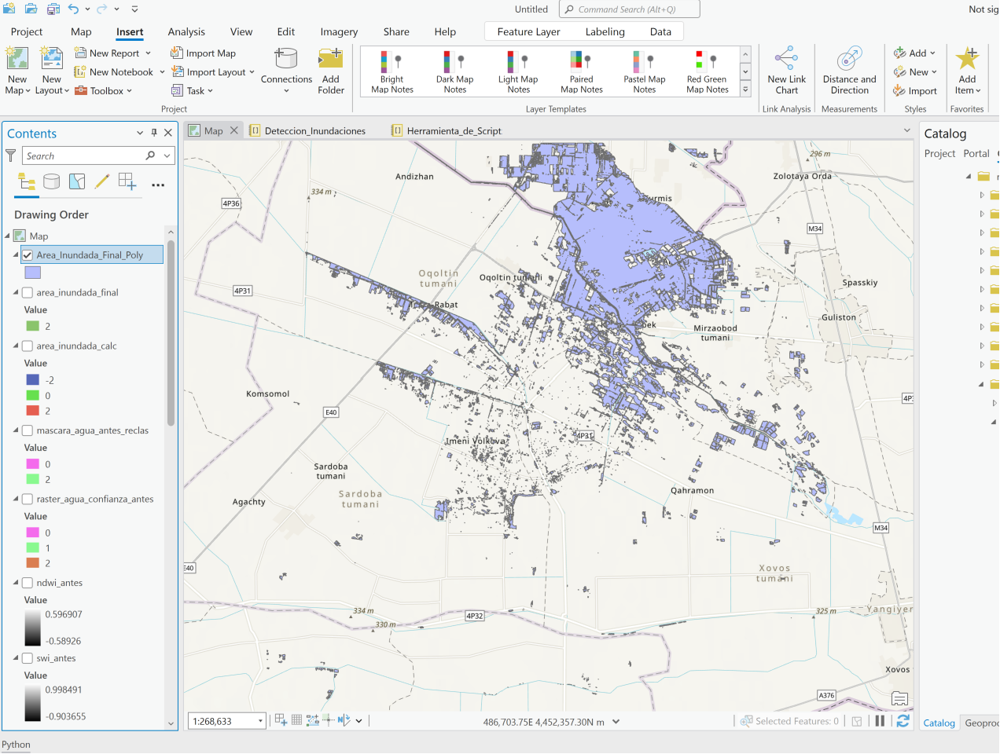
</p>

Ha completado el análisis. Las zonas inundadas se almacenan en un archivo de imagen y un archivo shapefile en su disco duro, listos para su uso en un informe o un análisis posterior.

# Crea una herramienta de script a partir de tu código  

Ahora que ha terminado el análisis, creará una herramienta de script a partir de su código, para que otros puedan utilizarla. Abre y sigue las instrucciones del archivo **Herramienta_de_Script.ipynb** para crear una herramienta de script.

# Limpiar capas temporales

Puesto que no necesita las capas temporales, puede eliminarlas del mapa. Una forma de hacerlo es manualmente, haciendo clic con el botón derecho en capas individuales y pulsando **Remove**. También puedes eliminar todas las capas temporales utilizando código Python.

1. Ejecute la siguiente celda para eliminar las capas temporales del mapa.

```python
# Obtener el proyecto ArcGIS Pro actualmente abierto
aprx = arcpy.mp.ArcGISProject("current")
# Obtener el Mapa
m = aprx.listMaps("Map")[0]
# Obtener una lista de las capas del mapa
capas = m.listLayers()
# Comprueba cada capa para determinar si es una capa temporal, en memoria, 
# y eliminar la capa si lo es.
for capa in capas:
    print(capa.dataSource)
    if "INSTANCE_ID=GPProMemoryWorkspace" in capa.dataSource:
        print("Removing: ", capa.name )
        m.removeLayer(capa)
```

<p align="center">
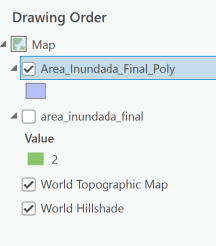
</p>
