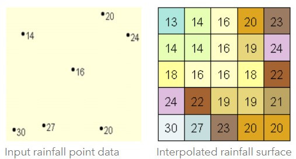
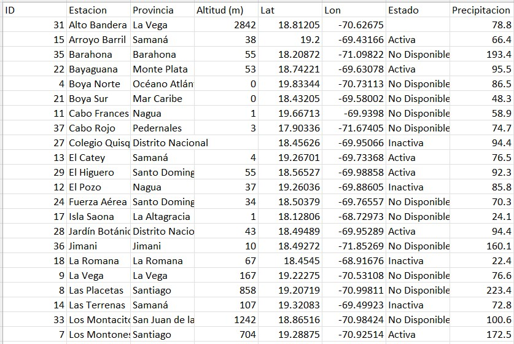

# Interpolaciones Espaciales

Este material de enseñanza está basado en ArcGIS Pro 3.1.

La interpolación es un método que ayuda a predecir valores de píxel (ráster) entre un número limitado de puntos. Es un método muy útil para predecir valores desconocidos de algún parámetro dentro de una zona geográfica entre puntos de muestreo, por ejemplo datos de elevación, precipitación, concentraciones químicas, niveles de ruido, entre otros.

Hay una variedad de formas de predecir datos espaciales, cada método es conocido como un *modelo*. Para cada modelo existen diferentes presunciones de acuerdo al tipo de datos; por ejemplo un modelo puede estimar la variación local mejor que otro. Cada modelo produce predicciones usando diferentes cálculos. Las herramientas de interpolación estan divididas en métodos determinísticos y geoestadísticos.

* Los métodos determinísticos asignan valores (predecidos) alrededor de los valores medidos y en fórmulas matemáticas específicas que determinan la suavidad de la capa resultante. Entre estos se encuentran los métodos IDW (Inverse Distance Weighting - Distancia Inversa Ponderada), Natural Neighbor, Trend, y Spline.
* Los métodos geoestadísticos predicen valores basados en modelos estadísticos como la autocorrelación espacial (relación estadística entre puntos medidos). Debido a esto las técnicas geoestadísticas no solo tienen la capacidad de producir una capa o superficie de predicción, sino que también produce algunas medidas de precisión de las predicciones. Entre estos podemos encontrar el método Kriging.

Los métodos de interpolación disponibles en la herramienta Spatial Analysis de ArcGIS Pro son:

|   Método             |                       Descripción                                                                  |
|:--------------------:|:--------------------------------------------------------------------------------------------------:|
| IDW                  | El IDW estima valores de celda (o píxel) promediando los valores de muestra cercanos a cada celda a predecir. |
| Kriging              | Este es un método geoestadístico avanzado que produce interpolaciones basadas en valores o mediciones de un conjunto de puntos dispersos espacialmente. Adicionalmente, esta herramiento ofrece diversos modelos de semi-variogramas a usar: esférico, circular, gaussiano, lineal. Es importante conocer el 'comportamiento' u origen de los datos para seleccionar el método a usar.  |
| Natural Neighbor     | Este método toma el conjunto de datos o puntos más cercanos al punto a predecir y pondera esos valores.  |
| Spline               | Este método estima valores usando una función matemática que suaviza la interpolación entre los puntos de muestreo.  |
| Spline with Barriers | Similar al método Spline, pero puede usar tanto los valores de muestreo como barreras entre estos que genera cierta discontinuidad.  |
| Topo to Raster       | Este método es específico para crear una interpolación que represente una cuenca natural y que preserve mejor los contornos de los datos.  |
| Trend                | Esta es una interpolación polinómica global que suaviza los datos aplicando una función polinómica a las muestras. Esta interpolación ayuda a capturar patrones en escalas grandes o no tan finas.  |

## Práctica

### Interpolaciones con datos de precipitación

#### Material
* Datos Tabulares de Precipitación Junio 2023 (*precipitacion_jun2023.csv*)
* Datos Ráster de Precipitación Junio 2023 (*Precipitacion_Jun2023_CHIRPS.tif*)
* Polígono Republica Dominicana (*DOM_amd0.shp*)
* Datos Ráster de Elevación (*DOM_alt.vrt*)

Tiempo estimado: 45 min

Descarga de archivos [AQUÍ](https://drive.google.com/drive/u/1/folders/1x6qXRMHdH3iVh2Fc1znJyarl101YlDvC).

Se usará un conjunto de datos de 37 estaciones metereológicas con medidas de precipitación (mm) para el mes de Junio de 2023 y elevación (m). Las coordenadas, nombres, y elevación de cada una de las estaciones metereológicas fueron tomadas del [ONAMET](https://onamet.gob.do/index.php/publicaciones/estaciones-automaticas). Los datos de precipitación no pudieron ser tomados del ONAMET. Sin embargo, fueron tomados de la colección [CHIRPS](https://developers.google.com/earth-engine/datasets/catalog/UCSB-CHG_CHIRPS_DAILY?hl=en) disponible en Google Earth Engine para el mes de Junio de 2023 en República Dominicana.

Los datos de precipitación se encuentran en el archivo *precipitacion_jun2023.csv* y cuentan con la siguiente estructura:

## 1. Importar datos

1.1. Crear nuevo proyecto y renombrar adecuadamente para esta práctica. Renombrar mapa como *Precipitacion*. Para renombrar haga click derecho en el elemento **Map** del panel **Contents** y vaya a **Properties**. En esta nueva ventana que aparece, luego en la pestaña **General** proceda a cambiar el nombre del mapa en el campo **Name**.

1.2. Ahora importaremos los datos tabulares de precipitación del archivo *precipitacion_jun2023.csv*. En la pestaña **Map** de la barra de herramientas, haga click en **Add Data** y seleccione la opción **XY Point Data**. Esta es la opción para cargar datos tabulares con coordenadas organizadas en columnas de latitud y longitud. Se abrirá el panel **Geoprocessing**, allí seleccionamos el archivo a cargar en el campo **Input Table**, ponemos un nombre a la capa que se cargará en el mapa en **Output Feature Class**, seleccionar la columna de longitud en **X Field**, seleccionar la columna de latitud en **Y Field**, seleccionar la columna con los datos de precipitación en **Z Field**, y por ultimo se puede especificar un sistema de coordenadas en **Coordinate System**. Luego de tener todos los campos llenos hacecmos click en el botón **Run** localizado abajo a la derecha del panel.

1.3. Aquí podremos cargar datos o capas adicionales, por ejemplo el polígono de República Dominicana (archivo *DOM_adm0.shp*).

## 2. Visualizar puntos

2.1. Podremos poner etiquetas de las estaciones en cada punto si deseamos. Para esto seleccionamos el elemento o capa de precipitación en el panel **Contents**, luego en la barra de herramientas hacer click en la pestaña **Labeling**, dentro del grupo **Label Class**, seleccionar la columna *Estacion* en la opción **Field**. Posteriormente, dar click en el botón **Label** para activar las etiquetas.

2.2. También existe la posibilidad de visualizar los puntos con un gradiente de color de acuerdo a los valores de precipitación en cada estación. Seleccionamos la capa de precipitación y hacemos click en la pestaña **Feature Layer** de la barra de herramientas y seleccionamos la opción **Symbology**. En el panel **Symbology** seleccionamos la opción **Graduated Colors** en el desplegable de **Primary symbology**. En el campo **Field** seleccionamos la columna con los datos de precipitación. En el campo **Method** podemos escoger la mejor forma de visualizar o dividir las clases de datos. En este caso dejaremos este y los otros campos con sus valores predeterminados: **Normalization** : *None*, **Method**: *Natural Breaks (Jenks)*, y **Classes**: *5*. En **Color scheme** seleccionamos un gradiente de color. En la ventana inferior podremos visualizar las clases. También podremos invertir el gradiente de color desde la pestaña **Classes**, desplegable **More**, y opción **Reverse values**.

2.3. Adicionalmente, podremos cambiar el tamaño de los puntos a 6 pts para mejorar su visualización en el mapa.

## 3. Interpolación

3.1. Vamos a probar diferentes métodos de interpolación y compararemos los resultados. Las herramientas de interpolación están disponibles en dentro del paquete **Spatial Analyst Tools**. Para visualizar las diferentes herramientas seleccionamos la pestaña **Analysis** en la barra de herramientas, y seleccionamos el botón **Tools**. Se abrirá el panel **Geoprocessing**. En la pestaña **Toolboxes** de este panel, seleccionamos y desplegamos **Spatial Analyst Tools**, luego desplegamos la opción **Interpolation**. Allí se visualizará una lista de los diferentes tipos de interpolación disponibles en ArcGIS Pro.

3.2. **[IDW](https://pro.arcgis.com/en/pro-app/latest/tool-reference/spatial-analyst/idw.htm)**: seleccionamos la capa con los datos en **Input point features** y la columna de precipitación en **Z value field**. Los demas campos los dejaremos predeterminados. 

3.3. **[Kriging](https://pro.arcgis.com/en/pro-app/latest/tool-reference/spatial-analyst/kriging.htm)**: Los campos de selección son similares a los usados en el **IDW**. Las propiedades de semivariograma son variadas, pero en este caso usaremos el método **Ordinary** en **Kriging method**, y el modelo **Spherical** en **Semi-variogram model**. 

3.4. **[Natural Neighbor](https://pro.arcgis.com/en/pro-app/latest/tool-reference/spatial-analyst/natural-neighbor.htm)**: Este método no tiene variables adicionales para aplicar. Cargamos los datos con las opciones predeterminadas y ejecutamos el método. La capa resultante mostrará datos válidos entre los vértices o puntos más extremos de los datos.

3.5. **[Spline](https://pro.arcgis.com/en/pro-app/latest/tool-reference/spatial-analyst/spline.htm)**: Cargamos los datos de manera similar a los anteriores métodos. La opción **Regularized** en **Spline type**, tiende a producer interpolaciones más suaves que la opción **Tension**. Los valores de **Weight** típicamente usados en el tipo **Regularized** son 0, 0.001, 0.01, y 0.5. Mientras que los valores típicos para el tipo **Tension** son 0, 1, 5, y 10. El número de puntos en **Number of points** es 12, predeterminadamente. Un mayor número de puntos puede incrementar la complejidad o variabilidad de la interpolación entre estaciones. En este caso usaremos los valores predeterminados. 

3.6. **[Spline with Barriers](https://pro.arcgis.com/en/pro-app/latest/tool-reference/spatial-analyst/spline-with-barriers.htm)**: Este método es similar a **Spline**, sin embargo se pueden añadir datos en forma de polígonos o líneas que pueden significar barreras geográficas, físicas, químicas, entre otras. En este caso cargaremos el polígono de República Dominicana como barrera. El resultado es interesante porque incluso extrapola los valores hasta los bordes del territorio representado en el polígono. Note que las pequeñas islas son enmascaradas, ya que allí no hay datos.

3.7. **[Topo to Raster](https://pro.arcgis.com/en/pro-app/latest/tool-reference/spatial-analyst/topo-to-raster.htm)**: Este método tiene muchas más variables que los anteriores y esta hecho para interpolar datos hidrólogicos, asumiendo que hay muchas formas geográficas y paisajes que pueden alterar la interpolación. La forma de cargar los datos es diferente también. Cargamos los puntos en el campo **Feature layer**, selccionamos la columna de precipitación en **Field**, y el tipo de datos es **Point elevation**. Las demás variables las dejaremos como predeterminadas. Sin embargo, puede intentar cambiar la opción **Drainage enforcement** de **Enforce** a **Do not enforce** o **Enforce with sink**. Los resultados de interpolación van a variar.

3.8. **[Trend](https://pro.arcgis.com/en/pro-app/latest/tool-reference/spatial-analyst/trend.htm)**: Este método de interpolación es líneal y puede implementar funciones polinómicas de diferentes órdenes para producir interpolaciones. En este caso usaremos un tipo de regresión **Lineal** y orden polinómico de **7**. Puede intentar diferentes órdenes polinómicos para ver las diferencias. Algunos valores de interpolación pueden llegar a ser negativos.

## 4. Comparar con datos de referencia

4.1. Con el objetivo de tener una aproxímación de cual método de interpolación se acerca a la realidad vamos a importar los datos de precipitación obtenidos de la colección de CHIRPS en GEE. Vamos a importar el archivo raster llamado *Precipitacion_Jun2023_CHIRPS.tif*. Posteriormente, agregamos el gradiente de color correspondiente. 

4.2. Ahora, debido a que las capas poseen extensiones diferentes vamos a recortarlas usando el polígono de República Dominicana. Para esto usaremos la herramienta **Clip Raster**, que se puede encontrar en la pestaña **Analysis** de la barra de herramientas, el botón **Tools**, pestaña **Toolboxes** del panel **Geoprocessing**. En la barra de búsqueda de este panel podemos escribir *Clip Raster* y encontraremos la herramienta, la cual pertence a la extension de **Data Management Tools** y puede encontrarse ahí directamente también. Se abrirá un nuevo panel donde podremos seleccionar la capa ráster a recortar en **Input Raster**; la capa vectorial sobre la cual remos a recortar en **Output Extent**, la cual será la capa del polígono de República Dominicana *DOM_adm0*. Nos aseguramos de que la opción **Use Input Features for Clipping Geometry** esté activada. En **Output Raster Dataset** se puede cambiar el nombre de la capa resultante. Las demás opciones podemos dejarlas con sus valores predeterminados. Cuando estemos listos solo debemos dar click en el botón **Run**.

4.3. Hacemos este recorte para cada capa ráster y comparamos los resultados.

## 5. Exportar ráster

Las capas o elementos ráster producidos en este proyecto de ArcGIS Pro se guardan automáticamente dentro del *Geodatabase* del proyecto, disponible desde el panel **Catalog**, pestaña **Databases**. Estos archivos pueden encontrarse dentro de ese directorio, sin embargo muchos pueden no tener formato o extensiones.

Otra opción para exportar o mover estos archivos de un directorio a otro es exportarlo como otro formato, lo cual generará una copia del archivo sin eliminarlo del *Geodatabase*. Para esto hacemos click derecho sobre el archivo deseado a exportar desde el *Geodatabase* del proyecto en el panel **Catalog**, seleccionamos **Export** y luego escogemos **Export to Different Format**. Se abrirá un nuevo panel de **Geoprocessing** de la herramienta **Copy Raster**. En este panel selccionamos el ráster a exportar en **Input Raster** y escogemos el directorio y nombre con el que se guardará este nuevo archivo ráster en **Output Raster Dataset**. El formato puede ser seleccionado en **Format**, el cual puede ser **TIFF**. El tipo de pixel en este caso es *32 bit float*, ya que contamos con valores decimales en el ráster. Los demas campos los podemos dejar en blanco o como predeterminados. Luego presionar el botón **Run** y el archivo será exportado.

## Ejercicio Extra:

Este es un ejercicio extra de práctica que se puede desarrollar en su tiempo libre. El archivo que contiene los datos de precipitación también incluye una columna indicando la elevación de la estación respectiva, la cual también puede ser interpolada para producir un modelo de elevación. Adicionalmente, hay un archivo de referencia (*DOM_alt.vrt*) que puede usarse para comparar los modelos interpolados de elevación y ver cual se acerca más a la realidad. El poco número de puntos de elevación puede dificultar la obtención de un modelo satisfactorio. Se recomienda insertar un nuevo mapa para trabajar con los correspondientes datos.

