# Calculadora Ráster

Este material de enseñanza está basado en ArcGIS Pro 3.1.

La calculadora ráster es una herramienta que nos ayuda a aplicar expresiones matemáticas a datos ráster. Sin embargo, si todas las entradas son números, el resultado será número. Los operadores qeu se encuentran en la calculadora ráster son:

|   Operador             |                       Descripción                      |   Ilustración     |
|:----------------------:|:------------------------------------------------------|:-----------------:|
| +                      | [Adición](https://pro.arcgis.com/es/pro-app/latest/arcpy/image-analyst/arithmetic-plus-operator.htm): Suma los valores de dos rásters pixel por pixel  | 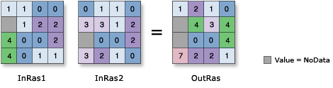 |
| -                      | [Substracción](https://pro.arcgis.com/es/pro-app/latest/arcpy/image-analyst/arithmetic-minus-operator.htm) o [Negativo](https://pro.arcgis.com/es/pro-app/latest/arcpy/image-analyst/arithmetic-negate-operator.htm): Resta el valor del segundo ráster al primer ráster  | 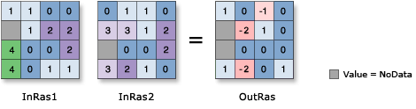 |
| *                      | [Multiplicación](https://pro.arcgis.com/es/pro-app/latest/arcpy/image-analyst/arithmetic-times-operator.htm): Multiplica los valores de dos ráster  | 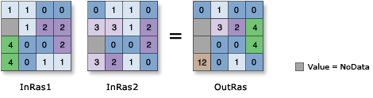 |
| /                      | [División](https://pro.arcgis.com/es/pro-app/latest/arcpy/image-analyst/arithmetic-divide-operator.htm): Divide los valores de dos ráster  | 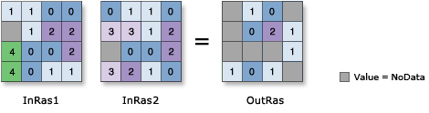 |
| ==                     | [Igual a](https://pro.arcgis.com/es/pro-app/latest/arcpy/image-analyst/relational-equal-to-operator.htm): Retorna píxeles con valor a 1 cuando el valor del primer y segundo ráster son iguales. Este es 0 cuando no son iguales. | 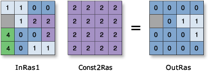 |
| >                      | [Mayor a](https://pro.arcgis.com/es/pro-app/latest/arcpy/image-analyst/relational-greater-than-operator.htm): Retorna píxeles con valor a 1 cuando el valor del primer ráster es mayor al del segundo. Este es 0 cuando no es mayor. | 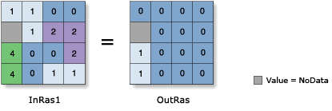 |
| <                      | [Menor a](https://pro.arcgis.com/es/pro-app/latest/arcpy/image-analyst/relational-less-than-operator.htm): Retorna píxeles con valor a 1 cuando el valor del primer ráster es menor al del segundo. Este es 0 cuando no es menor. | 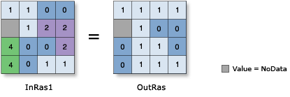 |
| <=                     | [Menor o igual a](https://pro.arcgis.com/es/pro-app/latest/arcpy/image-analyst/relational-less-than-equal-operator.htm): Retorna píxeles con valor a 1 cuando el valor del primer ráster es menor o igual al del segundo. Este es 0 cuando no es menor o igual. | 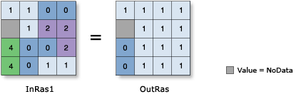 |
| >=                     | [Mayor o igual a](https://pro.arcgis.com/es/pro-app/latest/arcpy/image-analyst/relational-greater-than-equal-operator.htm): Retorna píxeles con valor a 1 cuando el valor del primer ráster es mayor o igual al del segundo. Este es 0 cuando no es mayor o igual. | 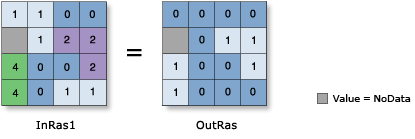 |
| !=                     | [No es igual a](https://pro.arcgis.com/es/pro-app/latest/arcpy/image-analyst/relational-not-equal-operator.htm): Retorna píxeles con valor a 1 cuando el valor del primer y segundo ráster no son iguales. Este es 0 cuando son iguales. | 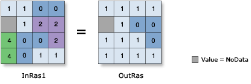 |
| &                      | Y booleano  |
| 
&VerticalLine;
  | O booleano  |
| ^                      | O exclusión booleano  |
| ~                      | No booleano  |

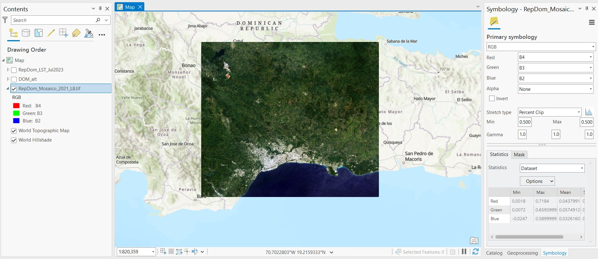

