# Operaciones, Funciones, y Estadísticas

Este material de enseñanza está basado en ArcGIS Pro 3.1.

En esta sección exploraremos las diferentes formas de trabajar con los valores numericos de los datos ráster. Estos datos, como cualquier otro tipo de dato, pueden ser procesados para hacer cálculos, aplicar funciones, y obtener estadísticas para hacer análisis espaciales más avanzados.

## Calculadora Ráster

La calculadora ráster es una herramienta que nos ayuda a aplicar expresiones matemáticas a datos ráster. Sin embargo, si todas las entradas son números, el resultado será número. Los operadores que se encuentran en la calculadora ráster son:

|   Operador             |                       Descripción                      |   Ilustración     |
|:----------------------:|:------------------------------------------------------|:-----------------:|
| +                      | [Adición](https://pro.arcgis.com/es/pro-app/latest/arcpy/image-analyst/arithmetic-plus-operator.htm): Suma los valores de dos rásters pixel por pixel  | 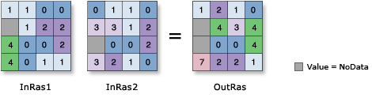 |
| -                      | [Substracción](https://pro.arcgis.com/es/pro-app/latest/arcpy/image-analyst/arithmetic-minus-operator.htm) o [Negativo](https://pro.arcgis.com/es/pro-app/latest/arcpy/image-analyst/arithmetic-negate-operator.htm): Resta el valor del segundo ráster al primer ráster  |  |
| *                      | [Multiplicación](https://pro.arcgis.com/es/pro-app/latest/arcpy/image-analyst/arithmetic-times-operator.htm): Multiplica los valores de dos ráster  |  |
| /                      | [División](https://pro.arcgis.com/es/pro-app/latest/arcpy/image-analyst/arithmetic-divide-operator.htm): Divide los valores de dos ráster  | 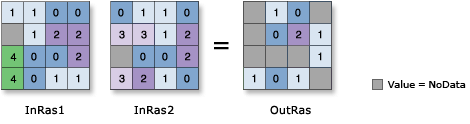 |
| ==                     | [Igual a](https://pro.arcgis.com/es/pro-app/latest/arcpy/image-analyst/relational-equal-to-operator.htm): Retorna píxeles con valor a 1 cuando el valor del primer y segundo ráster son iguales. Este es 0 cuando no son iguales. |  |
| >                      | [Mayor a](https://pro.arcgis.com/es/pro-app/latest/arcpy/image-analyst/relational-greater-than-operator.htm): Retorna píxeles con valor a 1 cuando el valor del primer ráster es mayor al del segundo. Este es 0 cuando no es mayor. |  |
| <                      | [Menor a](https://pro.arcgis.com/es/pro-app/latest/arcpy/image-analyst/relational-less-than-operator.htm): Retorna píxeles con valor a 1 cuando el valor del primer ráster es menor al del segundo. Este es 0 cuando no es menor. | 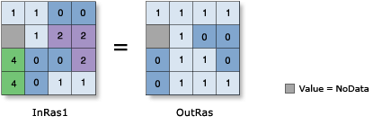 |
| <=                     | [Menor o igual a](https://pro.arcgis.com/es/pro-app/latest/arcpy/image-analyst/relational-less-than-equal-operator.htm): Retorna píxeles con valor a 1 cuando el valor del primer ráster es menor o igual al del segundo. Este es 0 cuando no es menor o igual. | 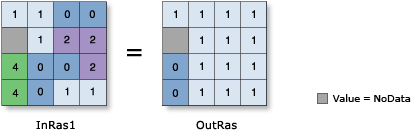 |
| >=                     | [Mayor o igual a](https://pro.arcgis.com/es/pro-app/latest/arcpy/image-analyst/relational-greater-than-equal-operator.htm): Retorna píxeles con valor a 1 cuando el valor del primer ráster es mayor o igual al del segundo. Este es 0 cuando no es mayor o igual. |  |
| !=                     | [No es igual a](https://pro.arcgis.com/es/pro-app/latest/arcpy/image-analyst/relational-not-equal-operator.htm): Retorna píxeles con valor a 1 cuando el valor del primer y segundo ráster no son iguales. Este es 0 cuando son iguales. | 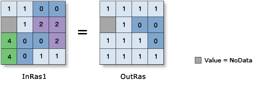 |
| &                      | [Y booleano](https://pro.arcgis.com/es/pro-app/latest/arcpy/image-analyst/boolean-and-operator.htm): Realiza una operación Y booleana en los valores de dos rásters. | 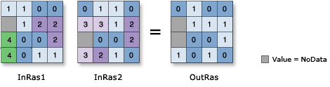 |
| 
&VerticalLine;
  | [O booleano](https://pro.arcgis.com/es/pro-app/latest/arcpy/image-analyst/boolean-or-operator.htm): Realiza una operación O booleana en los valores de dos rásters. | 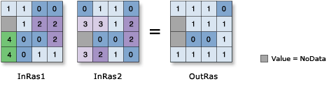 |
| ^                      | [O exclusión booleano](https://pro.arcgis.com/es/pro-app/latest/arcpy/image-analyst/boolean-xor-operator.htm): Realiza una operación O booleana de exclusión en los valores de dos rásters. | 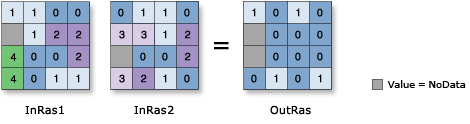 |
| ~                      | [No booleano](https://pro.arcgis.com/es/pro-app/latest/arcpy/image-analyst/boolean-not-operator.htm): Realiza una operación No booleana en los valores de dos rásters. | 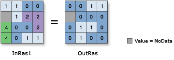 |

## Funciones Ráster

Las funciones ráster permite trabajar con datos ráster y sus diferentes bandas. Estas están disponibles al seleccionar una capa ráster, pestaña **Analysis** de la barra de herramientas, dentro del grupo **Raster**, se encuentra **Raster Functions**. Dentro del panel de **Raster Functions**, en la pestaña **System** encontamos una lista de aplicaciones para procesar datos ráster. En esta lista encontramos la opción desplegable **Math**, en la cual encontramos **Band Arithmetic**.

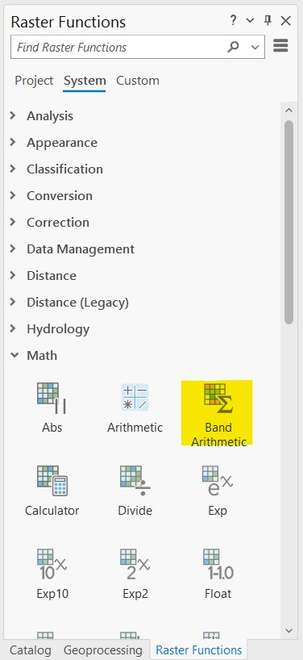

En el panel de **Band Arithmetic Properties**, en la pestaña **Parameters**, se puede seleccionar la capa ráster a procesar, en el campo **Method** hay algunas funciones comunes disponibles, y en el campo **Band Indexes** se puede introducir la expresión o las bandas correspondientes para aplicar una función. Algunos de los métodos o formas de introducir funciones con bandas se puede encontrar [aquí](https://pro.arcgis.com/en/pro-app/latest/help/analysis/raster-functions/band-arithmetic-function.htm).

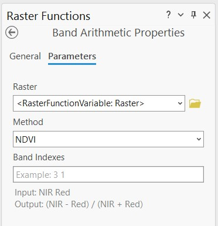

## Estadísticas Ráster

Estadística descriptiva de datos ráster o vectoriales se puede obtener tanto de manera tabular como espacial. En esta lección vamos a usar herramientas que nos ayudarán a obtener estadísticas exploratorias de datos ráster. Para esto existen herramientas en ArcGIS Pro como **Zonal Statistics** dentro de la extensión **Spatial Analyst Tools**. También se pueden obtener datos de forma gráfica con la herramienta **Create Chart**, dentro de la pestaña **Data** en la barra de herramientas. Se pueden obtener gráficos de área por bandas, ya sean histogramas, scatter plots, perfiles, entre otros.

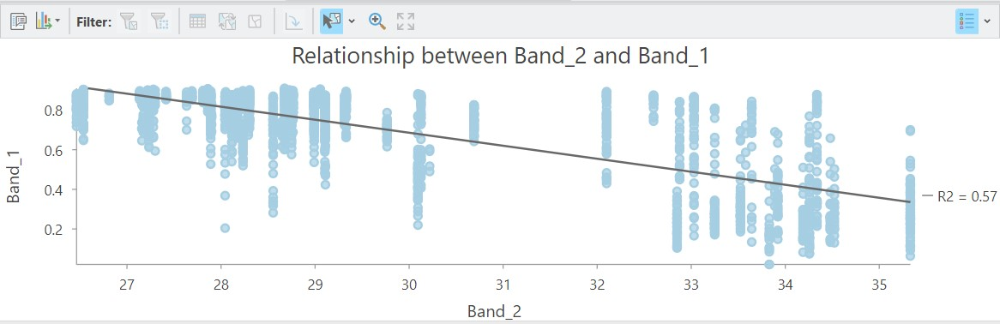

## Práctica

### Aplicaciones de calculadora ráster

Tiempo estimado: 35 min.

Datos: Elevación, Temperatura, Multiespectral.

## 1. Importar datos

Importaremos las tres capas ráster: elevación (*DOM_alt*), temperatura (*RepDom_LST_Jul2023.tif*), y mosaico multiespectral (*RepDom_Mosaico_2021_L8*). El mosaico se compone de varias bandas multiespectrales las cuales deben ser combinadas correctamente para visualizar en color real o RGB. La combinación RGB será en este caso R: B4, G: B3, B: B2.

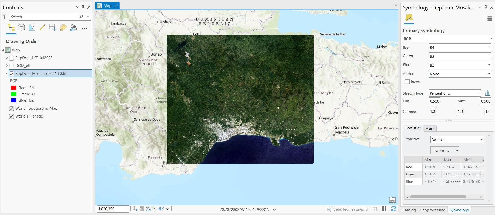

## 2. Seleccionar pixeles específicos

Usaremos la calculadora ráster para seleccionar áreas menores a 100 m de altitud de la capa *DOM_alt*. La calculadora ráster se puede encontrar desde la barra de herramientas en la pestaña **Analysis**, grupo **Geoprocessing**, opción **Tools**. Luego desde el panel **Geoprocessing**, pestaña **Toolboxes**, desplegamos la extensión de **Spatial Analyst Tools**, desplegamos **Map Algebra**, y hacemos click en **Raster Calculator**.

En el panel de **Raster Calculator** observaremos un cuadro con las capas ráster disponibles a un lado, y del otro lado un cuadro con los operadorooes disponibles. En el cuadro inferior escribiremos la operación que deseamos aplicar a un ráster específico. Escribiremos `"DOM_alt" <= 100`, lo cual significa que tomaremos todos los valores menores o iguales a 100 del ráster *DOM_alt*. El campo **Output raster** nos permite cambiar el nombre y la ruta de guardado de la nueva capa ráster que se producirá.

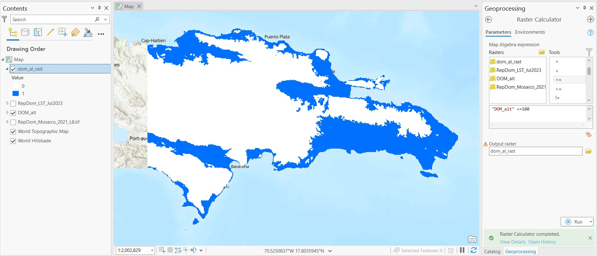

La nueva capa ráster producida será una máscara con valores igual a 1 en esos píxeles que cumplieron con la condición requerida, y valores de 0 en los pixeles que no la cumplieron. En la imagen de referencia observamos los áreas menores a 100 m en azul, y las áreas mayores a 100 m en blanco.

## 3. Aplicar máscara

La máscara de elevación la podemos usar para visualizar los datos de temperatura en solo las áreas menores a 100 m de altitud. Para esto escribiremos en la **Calculadora Ráster** la siguiente expresión: `"RepDom_LST_Jul2023" * "dom_al_rast"`, en donde multiplicamos la capa que contiene los datos temperatura con la máscara de elevación. Como resultado obtendremos una nueva capa ráster con valores de temperatura válidos en aquellas áreas menores a 100 m.

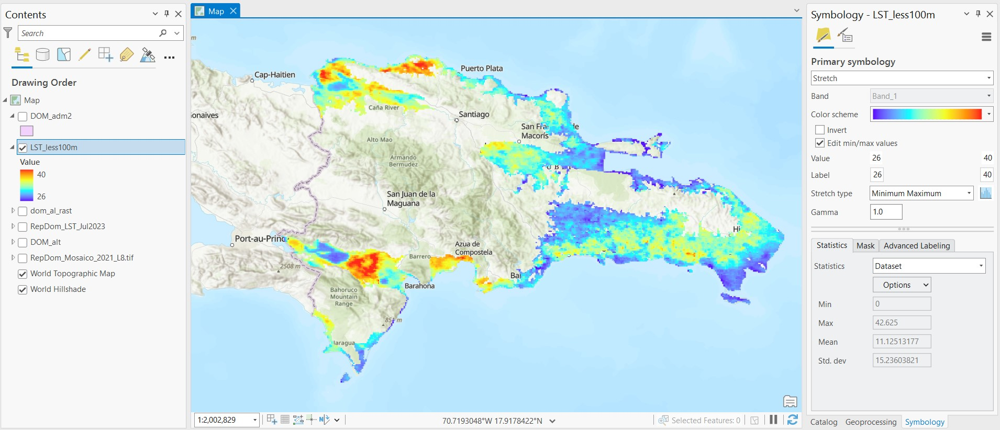

Se podrá observar que los valores de temperatura varían alrededor de 26-40 °C. Las zonas más calientes durante Julio de 2023 en áreas menores a 100 m de altitud se observaron en el lado occidente del país.

### Funciones ráster

## 4. Calcular NDVI

El índice de diferencia de vegetación normalizada (NDVI) tiene un rango de valores entre -1 a +1. Típicamente, cuando hay valores negativos existe alta probabilidad que se trate de un cuerpo de agua. Por otro lado, si los valores son cercanos a +1 es probable que se trate de vegetación muy densa. Cuando el NDVI es cercano a cero es probable que se trate de un área urbana.

Para calcular el NDVI usamos la siguiente fórmula:

$$\frac{(NIR-Rojo)}{(NIR+Rojo)}$$

La relación entre las bandas NIR (infrarrojo cercano o Near-Infrared) y Rojo van a proporcionar un índice de vegetación.

Ahora, aplicaremos la función NDVI al ráster *RepDom_Mosaico_2021_L8**. En el panel de **Band Arithmetic Properties** seleccionamos esta capa, en el campo **Method** escogemos **User Defined**, a pesar de que la función NDVI ya está disponible vamos a aplicarla desde cero. Este ráster tiene siete bandas nombradas como B1, B2, B3, etc, las cules corresponden a diferentes longitudes de onda del sensor satelital Landsat-8. Por lo tanto, en el campo **Band Indexes** escribimos la expresión: `(B5 - B4) / (B5 + B4)`, donde B5 es el NIR y B4 es el rojo. Hacemos click en **Create new layer**.

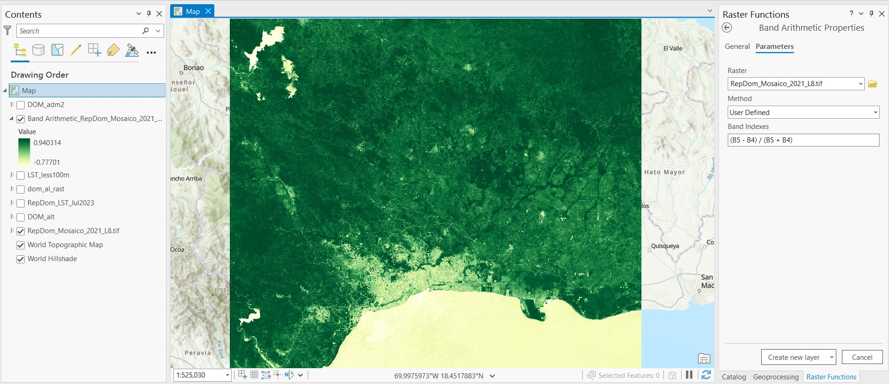

En la imagen de referencia observamos los valores más altos de NDVI en verde más oscuro, y los valores más bajos en verde más claro.

## 5. Estadisticas

Antes de empezar vamos a unir las capas de elevación, temperatura y NDVI en un solo ráster. El nuevo ráster contendra tres bandas diferentes. Para esto, buscamos la herramienta **Composite Bands** en la barra de búsqueda del panel **Toolboxes**. En el panel de **Composite Bands** seleccionamos las tres capas que deseamos en el campo **Input Rasters**. En el campo **Output Raster** seleccionamos la ubicación y nombre del nuevo ráster. Adicionalmente, cargaremos la capa de municipalidades *DOM_adm2*.

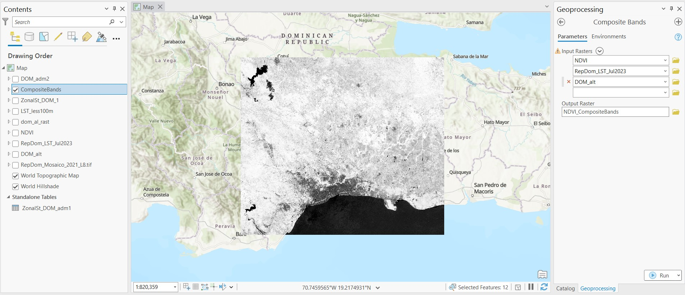

En el nuevo ráster, las bandas se renombraran predeterminadamente como Band_1, Band_2, y Band_3. Las bandas tendrán el mismo orden en que se seleccionaron las capas, en este caso el orden fue NDVI, Temperatura, y Elevación. También podrá observar que todas las bandas serán ajustadas a la capa con menor extensión, es decir NDVI, la cual se sobrelapa a las otras dos capas y tiene un área geográfica más pequeña.

Ahora, podremos usar la herramienta **Create Chart** para crear diferentes tipos de gráficos, por ejemplo un perfil de elevación dibujando un transecto, histograma de temperatura, o incluso relacionar dos bandas como elevación vs temperatura. Dentro del panel **Chart Properties** hay diferentes pestañas en las cuales se puede dar formato a la gráfica, como cambiar nombre de ejes y otros tipos de variables que dependen del tipo de gráfica.

Histograma de Temperatura:

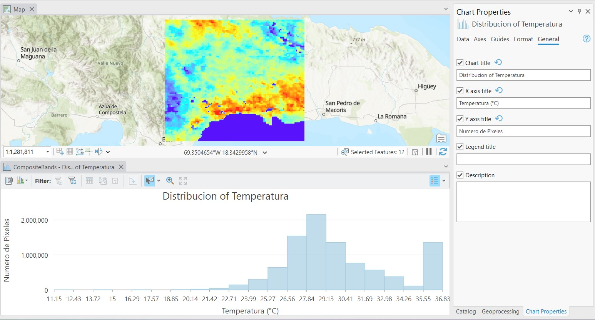

Scatter plot de Elevación, dibujando perfil (área de interés lineal):

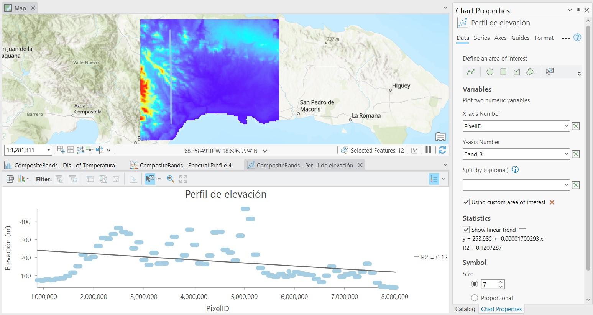

Scatter plot de Elevación vs Temperatura, dibujando perfil (área de interés lineal):

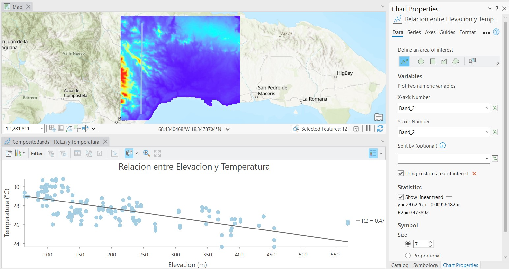

En este ultimo ejemplo seleccionaremos algunas municipalidades que tenga datos de NDVI completos. Usaremos la capa de NDVI, no el ráster compuesto de tres bandas. Luego vamos a la herramienta **Zonal Statistics** dentro de la extensión **Spatial Analyst Tools**. Selecionamos la capa administrativa (notaremos que habrá un mensaje advirtiendo que tenemos algunos objetos selecccionados), el campo **Zone Field** puede ser *NAME_2*, seleccionamos los datos NDVI en **Input Value Raster**, y el tipo de estadistica a usar será el promedio **Mean**. Esto retornará un nuevo ráster con valores promedio de NDVI al interior de las municipalidades seleccionadas. 

También existe la posibilidad de extraer estadisticas zonales en forma tabular usando la herramienta **Zonal Statistics as Table**. Se pueden seleccionar todas las estadisticas disponibles. El resultado será una tabla de atributos con los valores de cada estadistica por municipalidad.

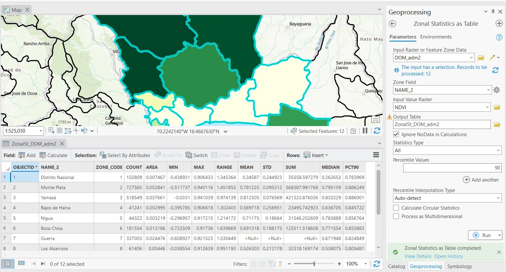

