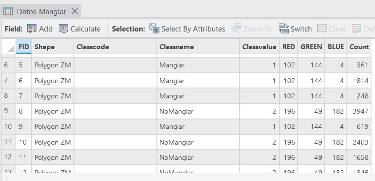
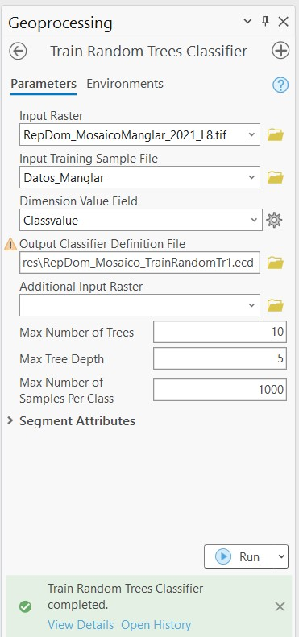
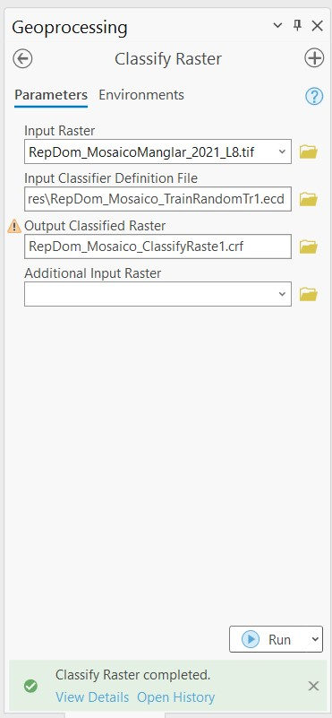
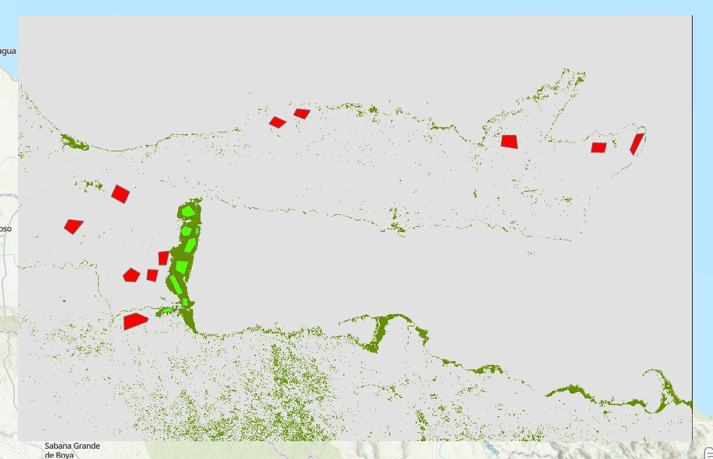
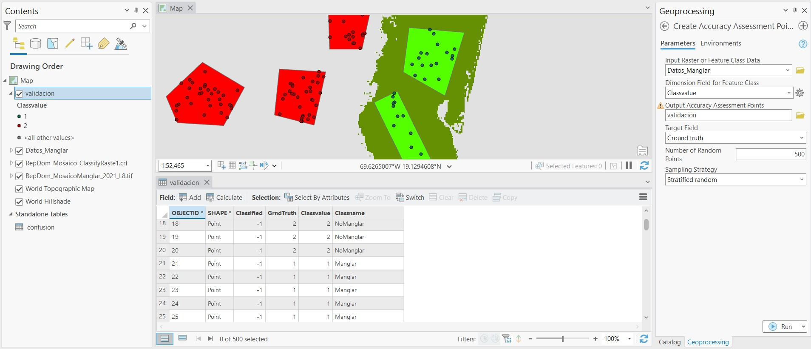
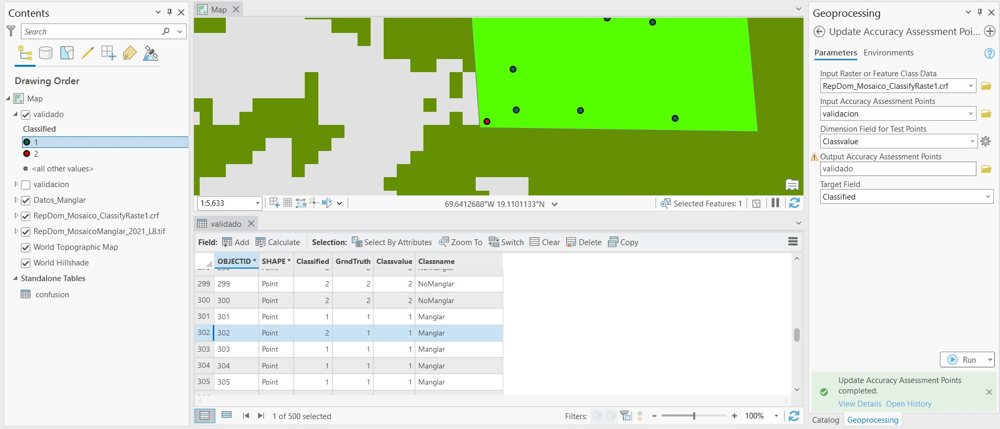
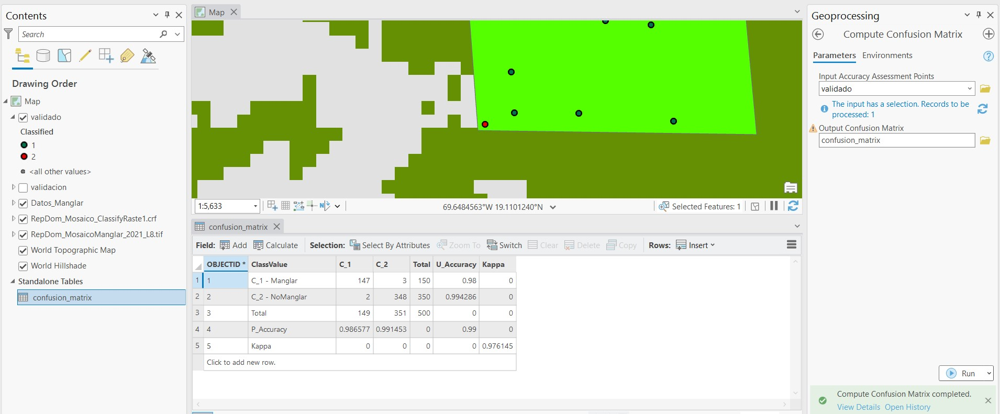

# Mapeo de Manglares

Este material de enseñanza está basado en ArcGIS Pro 3.1.

Este material de mapeo de manglares es una adaptación del [mapeo de manglares en GEE](https://github.com/SERVIR-Amazonia/republica-dominicana-taller/blob/main/gee-mapeo-manglares/gee-mapeo-manglares.md).

El material necesario para esta práctica es:

* Mosaico sin nubes de 2021 construido con la colección Landsat-8 (*RepDom_MosaicoManglar_2021_L8.tif*).
* Datos de entrenamiento (*Datos_Manglar.shp*).

Descargar material [AQUÍ](https://drive.google.com/drive/u/1/folders/1x6qXRMHdH3iVh2Fc1znJyarl101YlDvC).

## Pasos
1. Crear proyecto e importar datos.
2. Entrenamiento
3. Clasificación
4. Validación

## 1. Crear proyecto e importar datos

En un nuevo proyecto importamos los datos requeridos: la imagen de Landsdat-8 y los datos de entrenamiento. Los datos de entrenamiento son polígonos con una propiedad llamada *clase*, la cual puede ser de valor 1 o de valor 2, lo cual indicaría si son datos de Manglar o No Manglar, respectivamente.

## 2. Entrenamiento

Es importante que los datos de entrenamiento tengan una estructura indexada, es decir una columna indicando un nombre de clase (texto) y valor de clase (numerico).

Los poligonos de entrenamiento pueden editarse o crearse desde cero usando la herramienta **Training Samples Manager**. Este estás disponible seleccionando un elemento ráster, luego desde la pestaña **Imagery** de la barra de herramientas, seleccionar **Classification Tools** y ahí estará la herramienta **Training Samples Manager**. Allí se puede crear un nuevo esquema donde se pueden añadir el número de clases requeridas y se pueden dibujar los polígonos. Por el momento esto no será necesario.

Ahora, dentro del panel **Toolboxes**, vamos a la extensión de **Image Analyst Tools** (o también **Spatial Analysis Tools**), desplegamos la opción **Classification and Pattern Recognition** y seleccionamos **Train Random Trees Classifier**. En el nuevo panel que se abrirá ingresamos el ráster a clasificar en **Input Raster**, datos de entrenamiento en **Input Training Sample File**, seleccionamos la columna con las clases en **Dimension Value Field**, y seleccionamos el destino donde se guardará el archivo de entrenamiento en **Output Classifier Definition File**. La configuración para el modelo es 10 **Max Number of Trees**, 5 **Max Tree Depth**, y 1000 **Max Number of Samples Per Class**. Hacer click en **Run**. Se guardará un archivo en formato **.ecd**.

## 3. Clasificación

Ahora procedemos a clasificar la imagen. Dentro del panel **Toolboxes**, vamos a la extensión de **Image Analyst Tools** (o también **Spatial Analysis Tools**), desplegamos la opción **Classification and Pattern Recognition** y seleccionamos **Classify Raster**. En el panel que se abrirá seleccionamos la imagen a clasificar en **Input Raster**, cargamos el archivo **.ecd** de entrenamiento en **Input Classifier Definition File**, y ponemos un nombre al archivo que se producirá en **Output Classified Raster**. Hacer click en **Run**. El proceso puede tardar unos segundos en terminar.

La imagen clasificada va a lucir como esta:

## 4. Validación

Podemos crear un conjunto de puntos para validar o estimar la precisión de la clasiicación. En este caso serán puntos derivados de los polígonos usado para el entrenamiento. Dentro del panel **Toolboxes**, vamos a la extensión de **Image Analyst Tools** (o también **Spatial Analysis Tools**), desplegamos la opción **Classification and Pattern Recognition** y seleccionamos **Create Accuracy Assessment Points**. En el nuevo panel que se abrirá seleccionamos los polígonos de entrenamiento en **Input Raster or Feature Class Data**, la columna de valores por clase en **Dimension Field for Feature Class**, ponemos un nombre al archivo resultante en **Output Accuracy Assessment Points**, escogemos Ground truth* en **Target Field**, el número de puntos puede ser 500, y la estrategia de muestreo puede ser **Stratified random**. Esto generaá un archivo de puntos, y la tabla de atributos tendrá dos nuevas columnas: *Classified* y *GrndTruth*. Veremos que la columna *GrndTruth* ha sido correctamente llenada usando como referencia los polígonos de entrenamiento, pero la columna *Classified* solo muestra valores de -1, es decir que aún nos falta completarla con los datos clasificados, que serán comparados para calcular la precisión.

Dentro del panel **Toolboxes**, vamos a la extensión de **Image Analyst Tools** (o también **Spatial Analysis Tools**), desplegamos la opción **Classification and Pattern Recognition** y seleccionamos **Update Accuracy Assessment Points**. En el nuevo panel que se abrirá seleccionamos la imagen clasificada en **Input Raster or Feature Class Data**, los datos creados de validación en **Input Accuracy Assessment Points**, seleccionamos la columna *Classvalue* en **Dimension Field for Test Points**, ponemos un nombre para el archivo nuevo, y por último seleccionamos *Classified* en **Target Field**. Hacer click en **Run**.

La estructura del nuevo archivo mostrará las dos columnas *Classified* y *GrndTruth** completas, de acuerdo a los datos de referencia (o entrenamiento) y los datos clasificados. Por ejemplo, en la imagen de arriba podemos notar que el punto 302 fue clasificado como *No Manglar*, pero de acuerdo a los datos de referencia debería corresponder a *Manglar*. Por lo tanto, el siguiente paso es cuantificar la precisión de la clasificación de acuerdo a estos datos generados.

Dentro del panel **Toolboxes**, vamos a la extensión de **Image Analyst Tools** (o también **Spatial Analysis Tools**), desplegamos la opción **Classification and Pattern Recognition** y seleccionamos **Compute Confusion Matrix**. En el nuevo panel que se abrirá seleccionamos los puntos validados en **Input Accuracy Assessment Points** y ponemos un nombre la tabla que se producirá en **Output Confusion Matrix**. En el panel **Contents** observamos la tabla generada, si la abrimos podremos observar la precisión de la clasificación. Las columnas C_1 y C_2 son las clases Manglar y No Manglar de referencia, mientras que las filas C_1 y C_2 son las clases correspondientes de la imagen clasificada.

La precisión general de la clasificación es de 99% y el estadístico Kappa es de 0.97. Las precisiones de usuario y productor indican las precisiones por clase, las cuales son mas altas del 98%.

## Conclusiones
* La clasificación de manglares puede ser un proceso más complejo de lo aprendido aquí, especialmente debido a los datos de referencia que se deben obtener.
* Estas clasificaciones por lo general no son perfectas, pueden observarse píxeles clasificados erroneamente, pero técnicas para mejorar el resultado pueden usarse. Por ejemplo usar máscaras de zona o datos complementarios para mejorar la clasificación.
* Agregar más clases podría mejorar o refinar un poco el resultado. Aunque en algunas ocasiones más clases no es mejor.
* El estimación de la precisión es solo un valor numérico, el cual puede no reflejarse en la calidad cualitativa del resultado.
