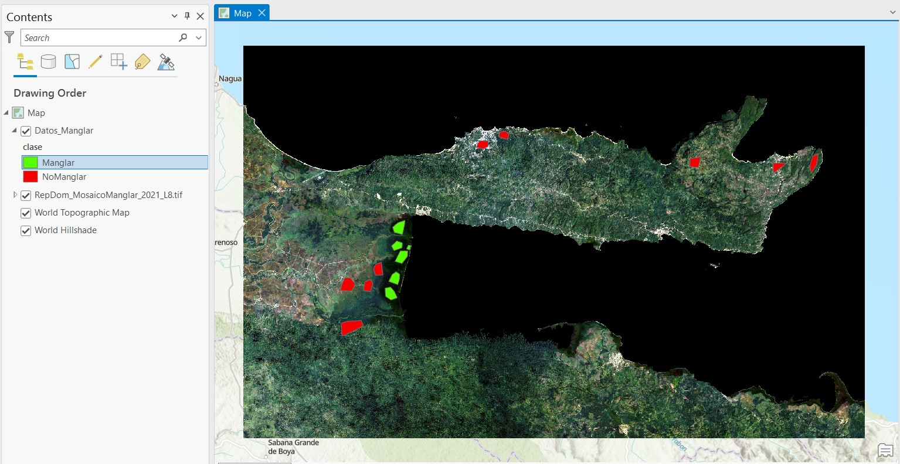

# Mapeo de Manglares

Este material de enseñanza está basado en ArcGIS Pro 3.1.

Este material de mapeo de manglares es una adaptación del [mapeo de manglares en GEE](https://github.com/SERVIR-Amazonia/republica-dominicana-taller/blob/main/gee-mapeo-manglares/gee-mapeo-manglares.md).

El material necesario para esta práctica es:

* Imagen sin nubes construida con la colección Landsat-8 (*RepDom_MosaicoManglar_2021_L8.tif*).
* Datos de entrenamiento (*Datos_Manglar.shp*).

## Pasos
1. Crear proyecto e importar datos.
2. Entrenamiento
3. Clasificación
4. Validación

