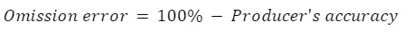

# Introducción

¡Bienvenido a Mapeo de manglares usando imágenes satelitales! Este taller demostrará un flujo de trabajo de mapeo de clasificación de Random Forest. Cubriremos el filtrado de la colección de imágenes, la fusión, los pasos de preprocesamiento y, finalmente, el entrenamiento del modelo Random Forest, la clasificación y la evaluación de la precisión.. Mucho del contenido está basado en el libro [EEFA](https://eefabook.org).

## Configuración prévia

1. Crear una [cuenta de Google Earth Engine](https://code.earthengine.google.com/register). Necesitas una [cuenta Google](https://accounts.google.com/signup). Crear una cuenta GEE para fines no comerciales.
2. Haga clic en este enlace para aceptar el repositorio de GEE de la Republica Dominicana: [https://code.earthengine.google.com/?accept_repo=users/an-sig/republica-dominicana](https://code.earthengine.google.com/?accept_repo=users/an-sig/republica-dominicana). Una vez en esta página, verás este repositório bajo `Reader` en la pestaña `Scripts` de GEE.
3. Cree un nuevo script en su propio repositorio; asígnele el nombre que desee. Esta será su copia del script 'Clasificación de manglares' del repositorio de scripts arriba.
4. Opcional: Agregar imágenes Planet NICFI al GEE. Seguir los pasos de: [https://developers.planet.com/docs/integrations/gee/nicfi/](https://developers.planet.com/docs/integrations/gee/nicfi/)

    

    1. Hacer un clic en el link "[NICFI Satellite Data Program](https://planet.com/nicfi)" en punto 1.
    2. Verás la página de Norway's International Climate and Forests Initiative Satellite Data Program (NICFI). Crear una cuenta hacendo un clic en "Sign Up".
    
    

    3. Poner sus informaciones.
        1. Escribir su correo electrónico (preferencialmente que utilizas en Google Earth Engine) en "Email Address".
        2. Para "What would you be using the data for?" puedes elegir "LULC" (coberturas y usos de la tierra).
        3. Para "Can you describe the application of data from NICFI program in a brief?" puedes escribir "Use during a SERVIR capacity building workshop about Google Earth Engine and Earth Observations".
        4. Para "Please provide a link to your organization/lab/university that you might be working with:" ponga el sitio web de su instituición.
        5. Seleccione el tipo de su instituición en "Organization Type" (e.g. Education and Research).
        6. Seleccionar el box "By submitting this form with my contact information, I agree the information may be used to receive occasional communications from Planet about its products and services. I may unsubscribe at anytime."
        7. Hacer un click en "Submit" al final.
        
    4. Una vez creada su cuenta, haga su login en [https://www.planet.com/](https://www.planet.com/).
    5. En "[Account Settings](https://planet.com/account#/user-settings)", en la parte de "Access NICFI Data in Google Earth Engine", haga un clic en "Add to Earth Engine."
    6. En el cuadro de diálogo EE Image Collection, ingrese el correo electrónico asociado con su cuenta GEE.
    7. Seleccione los mapas bases de interés (todos).
    
    8. Haga la prueba correndo este código: [https://code.earthengine.google.com/?scriptPath=Examples%3ADatasets%2Fprojects_planet-nicfi_assets_basemaps_americas](https://code.earthengine.google.com/?scriptPath=Examples%3ADatasets%2Fprojects_planet-nicfi_assets_basemaps_americas).

## Objetivos

1. Comprender el proceso general para filtrar colecciones de imágenes, crear compuestos e índices y entrenar un modelo de clasificación utilizando los datos recopilados.
2. Comprender el proceso general para entrenar y aplicar un modelo en Google Earth Engine sobre datos satelitales
3. Adapte el flujo de trabajo proporcionado para un área de interés y un período de tiempo diferentes
4. Experimente con diferentes formas de mejorar la precisión de su clasificación

## Teoría

La clasificación se aborda en una amplia gama de campos, como las matemáticas, la estadística, la minería de datos y el aprendizaje automático, entre otros. Para un tratamiento más profundo de la clasificación, los lectores interesados pueden consultar algunas de las siguientes sugerencias: Witten et al. (2011), Hastie et al. (2009), Goodfellow et al. (2016), Gareth et al. (2013), Géron (2019), Müller et al. (2016), o Witten et al. (2005). A diferencia de la regresión, que predice variables continuas, la clasificación predice variables categóricas o discretas, es decir, variables con un número finito de categorías (por ejemplo, rango de edad).

En teledetección, la clasificación de imágenes es un intento de clasificar todos los píxeles de una imagen en un número finito de clases etiquetadas de cobertura y/o uso del suelo. La imagen clasificada resultante es un mapa temático simplificado derivado de la imagen original (Figura abajo). La información sobre la cobertura y el uso del suelo es esencial para muchas aplicaciones medioambientales y socioeconómicas, como la gestión de los recursos naturales, la planificación urbana, la conservación de la biodiversidad, el seguimiento agrícola y la contabilidad del carbono.

Las técnicas de clasificación de imágenes para generar información sobre la cobertura y el uso del suelo se utilizan desde la década de 1980 (Li et al. 2014). Aquí cubriremos los conceptos de clasificación supervisada.

La clasificación supervisada utiliza un conjunto de datos de entrenamiento con etiquetas conocidas y que representan las características espectrales de cada clase de cubierta terrestre de interés para "supervisar" la clasificación. El enfoque general de una clasificación supervisada en Earth Engine se resume como sigue:

1. Obtener una imagen.
2. Recoger datos de entrenamiento.
3. Seleccionar y entrenar un clasificador utilizando los datos de entrenamiento.
4. Clasificar la imagen utilizando el clasificador seleccionado.

Una importante distinción es la distinción entre conceptos de usos y coberturas de suelo. El término "cobertura de suelo" se refiere a la descripción del material físico en la superficie de la Tierra, diferenciándose así del término "uso de suelo", el cual está definido por las asignaciones derivadas de la actividad humana en un territorio. Sin embargo, ambos están estrechamente relacionados, razón por la que muchos proyectos combinan el mapeo de uso y la cobertura de suelo.

Cualquier mapa o producto de teledetección es una generalización o modelo que tendrá errores inherentes. Los productos derivados de datos de teledetección utilizados con fines científicos y para la formulación de políticas requieren una medida cuantitativa de la precisión para reforzar la confianza en la información generada (Foody 2002, Strahler et al. 2006, Olofsson et al. 2014). La evaluación de la exactitud es una parte crucial de cualquier proyecto de clasificación, ya que mide el grado en que la clasificación concuerda con otra fuente de datos que se considera exacta, datos reales (es decir, la "realidad"). 

La historia de la evaluación de la precisión revela un creciente detalle y rigor en el análisis, pasando de una valoración visual básica del mapa derivado (Congalton 1994, Foody 2002) a la definición de las mejores prácticas para los diseños de muestreo y respuesta y el cálculo de las métricas de precisión (Foody 2002, Stehman 2013, Olofsson et al. 2014, Stehman y Foody 2019). La matriz de confusión (también denominada "matriz de error") (Stehman 1997) resume las principales métricas de precisión utilizadas para evaluar los productos derivados de los datos obtenidos por teledetección.

Una matriz de confusión describe la calidad de una clasificación comparando los valores previstos con los valores reales. Un ejemplo de matriz de confusión para dos clases está abajo:

Las columnas representan los valores reales (la verdad), mientras que las filas representan las predicciones (la clasificación). "Verdadero positivo" (TP) y "verdadero negativo" (TN) significan que la clasificación de un píxel coincide con la verdad (por ejemplo, un píxel de agua clasificado correctamente como agua). "Falso positivo" (FP) y "falso negativo" (FN) significan que la clasificación de un píxel no coincide con la verdad (por ejemplo, un píxel no agua clasificado incorrectamente como agua).

- TP: clasificado como positivo y la clase real es positiva
- FP: clasificado como positivo y la clase real es negativa
- FN: clasificado como negativo y la clase real es positiva
- TN: clasificado como negativo y la clase real es negativa

Podemos extraer cierta información estadística de una matriz de confusión. La tabla arriba es una matriz de confusión para una muestra de 1.000 píxeles para un clasificador que identifica si un píxel es bosque (positivo) o no bosque (negativo), una clasificación binaria.

En este caso, el clasificador identificó correctamente 307 píxeles forestales, clasificó erróneamente como forestales 18 píxeles no forestales, identificó correctamente 661 píxeles no forestales y clasificó erróneamente como no forestales 14 píxeles forestales. Por tanto, el clasificador acertó 968 veces y se equivocó 32 veces. Calculemos las principales métricas de precisión para este ejemplo.

La precisión global nos indica qué proporción de los datos de referencia se clasificó correctamente, y se calcula como el número total de píxeles identificados correctamente dividido por el número total de píxeles de la muestra.

En este caso, la precisión global es del 96,8%, calculada utilizando (307 + 661) / 1000. 

Otras dos métricas de precisión importantes son la precisión del productor y la precisión del usuario, también denominadas "recuerdo" y "precisión", respectivamente. Estas métricas cuantifican aspectos importantes de la precisión por clase.

La exactitud del productor es la exactitud del mapa desde el punto de vista del creador del mapa (el "productor"), y se calcula como el número de píxeles correctamente identificados de una clase determinada dividido por el número total de píxeles que realmente pertenecen a esa clase. La precisión del productor para una clase determinada nos indica la proporción de píxeles de esa clase que se clasificaron correctamente.

En este caso, la precisión del productor para la clase forestal es del 95,6%, calculada utilizando 307 / (307 + 14). La precisión del productor para la clase no forestal es del 97,3%, calculada a partir de 661 / (661 + 18).

La precisión del usuario (también denominada "precisión del consumidor") es la precisión del mapa desde el punto de vista de un usuario del mapa, y se calcula como el número de píxeles correctamente identificados de una clase determinada dividido por el número total de píxeles que se afirma que pertenecen a esa clase. La precisión del usuario para una clase determinada nos indica la proporción de píxeles identificados en el mapa como pertenecientes a esa clase que se encuentran realmente en esa clase sobre el terreno.

En este caso, la precisión del usuario para la clase forestal es del 94,5%, calculada utilizando 307 / (307 + 18). La precisión del usuario para la clase no forestal es del 97,9%, calculada a partir de 661 / (661 + 14).

La figura abajo ayuda a visualizar las filas y columnas utilizadas para calcular cada precisión.

Es muy común hablar de dos tipos de error cuando se aborda la precisión de la clasificación por teledetección: errores de omisión y errores de comisión. Los errores de omisión se refieren a los píxeles de referencia que quedaron fuera (omitidos) de la clase correcta en el mapa clasificado. En un sistema de dos clases, un error de omisión en una clase se contará como un error de comisión en otra clase. Los errores de omisión son complementarios a la precisión del productor.

Los errores de comisión se refieren a los píxeles de clase que se clasificaron erróneamente en el mapa y son complementarios a la precisión del usuario. 

