# Clasificación supervisada

En este flujo de trabajo, crearemos un compuesto de imágenes Landsat 8, filtrando el archivo de imágenes hasta un período de tiempo de interés deseado y, a continuación, utilizaremos los datos para clasificar la presencia de manglares utilizando un modelo de clasificación Random Forest. Crearemos los datos de entrenamiento manualmente para practicar la recogida de datos.

## Área de interés

El área de interés (AOI) puede cargarse desde un shapefile local, dibujarse en el mapa o derivarse de un conjunto de datos preexistente en el catálogo de Earth Engine. En este caso, utilizaremos el conjunto de datos Global Administrative Units Layer (GAUL) de la Organización de las Naciones Unidas para la Agricultura y la Alimentación (FAO) para derivar nuestra AOI. En la parte superior del editor de código, escriba en la barra de búsqueda "FAO GAUL Global First". Vemos que se trata de una `FeatureCollection` que contiene los límites administrativos a nivel mundial.

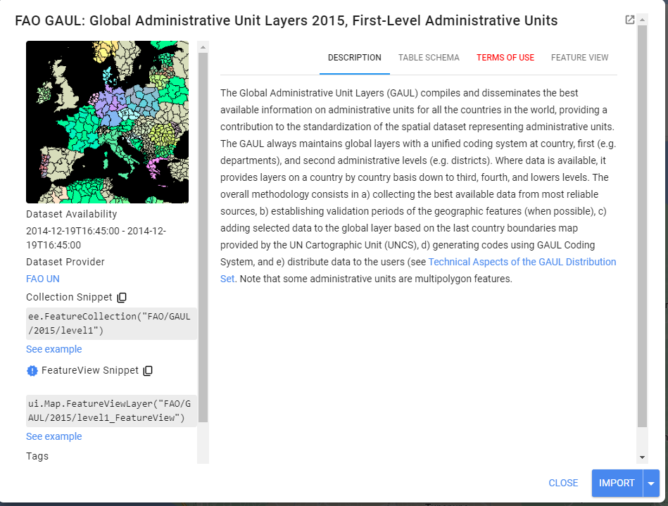

Haga clic en la pestaña "Table Schema". Observamos que hay un campo útil llamado 'ADM1_NAME'. Utilizaremos esta propiedad para derivar nuestro AOI. Nos centraremos en la zona de Samaná.

```javascript
//--------------------------------------------------------------
// Definir área de interés (datos vectoriales)
//--------------------------------------------------------------

// Vamos trabajar con la provincia de Samaná

var gaul = ee.FeatureCollection('FAO/GAUL/2015/level1');
var area = gaul.filter(ee.Filter.eq('ADM1_NAME', 'Samana'));
Map.centerObject(area, 11);
Map.addLayer(area, {}, 'Área de interés', false);
```

## Preprocesamiento de imágenes y creación de un compuesto

Siempre queremos aplicar filtros a ImageCollections lo antes posible en nuestro flujo de trabajo para reducir la cantidad de esfuerzo que requerirán los servidores GEE. Ya sabemos el área de la que queremos obtener datos (nuestro AOI), y que queremos relativamente pocas nubes en nuestras imágenes, así que aplicaremos un filtro de límites y otro de cobertura de nubes.

```javascript
//--------------------------------------------------------------
// Definir dato raster
//--------------------------------------------------------------

// Trabajaremos con datos Landsat 8.
// Busque en la barra de búsqueda 'Landsat 8, level 2, collection 2, tier 1'.
// Colección 2 -> Nivel de procesamiento más avanzado.
// https://www.usgs.gov/landsat-missions/landsat-collection-2
// Level 2 -> Datos de reflectancia superficial.
// Tier 1 -> Datos de la más alta calidad.

var landsat8 = ee.ImageCollection('LANDSAT/LC08/C02/T1_L2');

var coleccion = landsat8
    .filterDate('2020-01-01', '2022-01-01')
    .filterBounds(area)
    .filter(ee.Filter.lt('CLOUD_COVER', 10));

Map.addLayer(coleccion, {bands: ['SR_B4', 'SR_B3', 'SR_B2'], min: 7000, max: 12000}, 'Coleccion Landsat 8', false);

print(coleccion);
```

Vemos en el `Console` que nuestra colección tiene 19 imágenes entre 2020 y 2021. En el mapa, vemos las imágenes agregadas - las que aparecen arriba son las primeras de la colección.

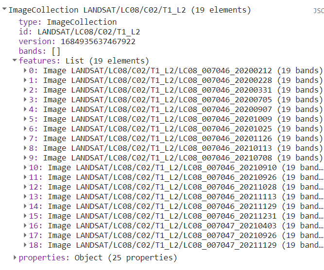

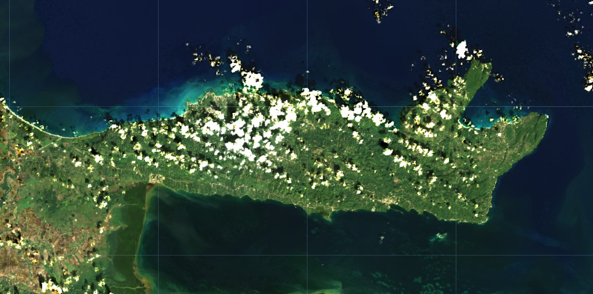

A continuación, definimos y aplicamos tres funciones de preprocesamiento a las imágenes. La primera es para aplicar una escala a los valores de los píxeles, como [sugiere el USGS](https://www.usgs.gov/faqs/how-do-i-use-scale-factor-landsat-level-2-science-products). La segunda para enmascarar las nubes. Enmascararemos las nubes y las sombras de las nubes utilizando la banda `QA_PIXEL` y para saturación radiométrica utilizamos `QA_RADSAT`, que se incluyen en cada escena Landsat. La bandas son una máscara de bits generada en el centro de procesamiento de Landsat antes de ser distribuida al usuario final. Contienen mucha información útil (figura abajo `QA_PIXEL`). La tercera función es para calcular diferentes indices espectrales. Utilizamos la función `normalizedDifference()` que calcula la diferencia normalizada entre bandas. Este tipo de ecuación, una diferencia de variables dividida por su suma, se denomina ecuación de diferencia normalizada. El valor resultante siempre estará comprendido entre -1 y 1.

Al final, renombramos las bandas utilizando la función `select()`.

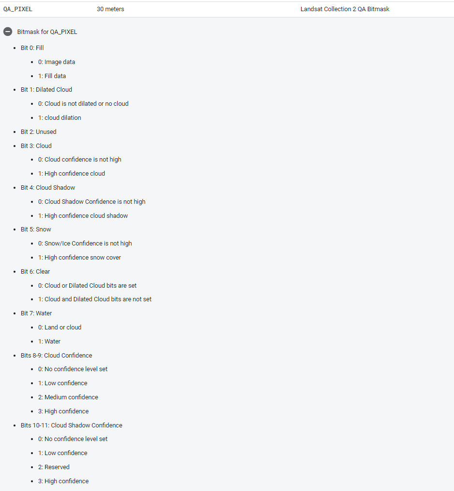

```javascript
//--------------------------------------------------------------
// Preprocesamiento de series temporales
// (Escalonamiento y Enmascaramiento de nubes)
//--------------------------------------------------------------

// Preprocesamiento de series de tiempo usando funciones que se aplican
// a todas y cada una de las imágenes de la colección.

// Función para aplicar factores de escala.
// Para obtener valores de reflectancia superficial entre 0 y 1
// (fracción de la radiación solar de entrada), necesitamos usar
// factores de escala proporcionados por NASA/USGS.
function escalonamiento(imagen) {
  var bandasOpticas = imagen.select('SR_B.').multiply(0.0000275).add(-0.2);
  var bandasTermicas = imagen.select('ST_B.*').multiply(0.00341802).add(149.0);
  return imagen.addBands(bandasOpticas, null, true)
               .addBands(bandasTermicas, null, true);
}

// Función de enmascaramiento de nubes.
// La banda de calidad 'QA_PIXEL' proporciona información sobre la aparición de nubes
// y otros aspectos de calidad de imagen.
// La información se almacena en bits y usamos la función 'bitWiseAnd'
// para extraerlo.
// La banda de calidad 'QA_RADSAT' proporciona información de calidad sobre
// saturación radiométrica.
function mascaraNubesL8(image) {
    // Bit 0 - Llenar
    // Bit 1 - Nubes dilatadas
    // Bit 2 - Cirrus
    // Bit 3 - Nubes
    // Bit 4 - Sombra de la nubes
    var mascaraQA = image.select('QA_PIXEL').bitwiseAnd(parseInt('11111',
        2)).eq(0);
    var mascaraSat = image.select('QA_RADSAT').eq(0);

    return image.updateMask(mascaraQA)
                .updateMask(mascaraSat);
}
// Porque estamos tratando con bits, en la función mascaraNubesL8
// utilizamos las funciones bitwiseAnd y parseInt.
// Estas son funciones que sirven para desempaquetar
// la información de bits. Un bitwise AND es una operación binaria
// que toma dos representaciones binarias de igual longitud y
// realiza la operación AND lógica en cada par de
// bits correspondientes. Por lo tanto, si ambos bits en el comparador
// las posiciones tienen el valor 1, el bit en el resultado
// la representación binaria es 1 (1 × 1 = 1); de lo contrario,
// el resultado es 0 (1 × 0 = 0 y 0 × 0 = 0). El parseInt
// la función analiza un argumento de cadena (en nuestro caso, de cinco caracteres
// cadena '11111') y devuelve un entero del especificado
// sistema de numeración, base 2.

// Función para calcular indices.
// NDVI: (NIR-Rojo)/(NIR+Rojo)
// LSWI: (NIR-SWIR1)/(NIR+SWIR1)
// NDMI: (SWIR2-Rojo)/(SWIR2+Rojo)
// MNDWI: (Verde-SWIR2)/(Verde+SWIR2)
// Utilizamos la función GEE normalizedDifference, expresada como (b1-b2)/(b1+b2).
function calcularIndices(img){
  var ndvi = img.normalizedDifference(['SR_B5', 'SR_B4']).rename('ndvi');
  var lswi = img.normalizedDifference(['SR_B5', 'SR_B6']).rename('lswi');
  var ndmi = img.normalizedDifference(['SR_B7', 'SR_B4']).rename('ndmi');
  var mndwi = img.normalizedDifference(['SR_B3', 'SR_B7']).rename('mndwi');
  var indices = img.addBands(ndvi).addBands(lswi).addBands(ndmi).addBands(mndwi);
  return indices;
}

var bandas = ['SR_B1', 'SR_B2', 'SR_B3', 'SR_B4',
              'SR_B5', 'SR_B6', 'SR_B7', 'ndvi',
              'lswi', 'ndmi', 'mndwi'];

// Aplicar funciones a las imágenes en la colección.
var preProcesado = coleccion.map(escalonamiento)
                            .map(mascaraNubesL8)
                            .map(calcularIndices)
                            .select(bandas);
```

Si quieres, puedes agregar la primera imagen de la colección antes y después del preprocesamiento para ver el efecto.

```javascript
///---------------------------------------------------------------
// Visualizar las primeras imágenes no procesadas y preprocesadas
//---------------------------------------------------------------

// Seleccionar la primera imagen no procesada.
var primeraNoProcesada = coleccion.first();

// Definir parametros de visualización.
var paramVisNoProcesada = {
  bands: ['SR_B4', 'SR_B3', 'SR_B2'],
  min: 4380,
  max: 22300
};

// Agregar imagen al mapa.
Map.addLayer(primeraNoProcesada, 
             paramVisNoProcesada, 
             'Primera Imagen No Procesada',
             false);


// Seleccionar la primera imagen preprocesada.
var primeraPreProcesada = preProcesado.first();

var paramVisPreProcesada = {
  bands: ['SR_B4', 'SR_B3', 'SR_B2'],
  min: 0,
  max: 0.15
};


// Agregar imagen al mapa.
Map.addLayer(primeraPreProcesada, 
             paramVisPreProcesada, 
             'Primera Imagen Preprocesada',
             false);
```

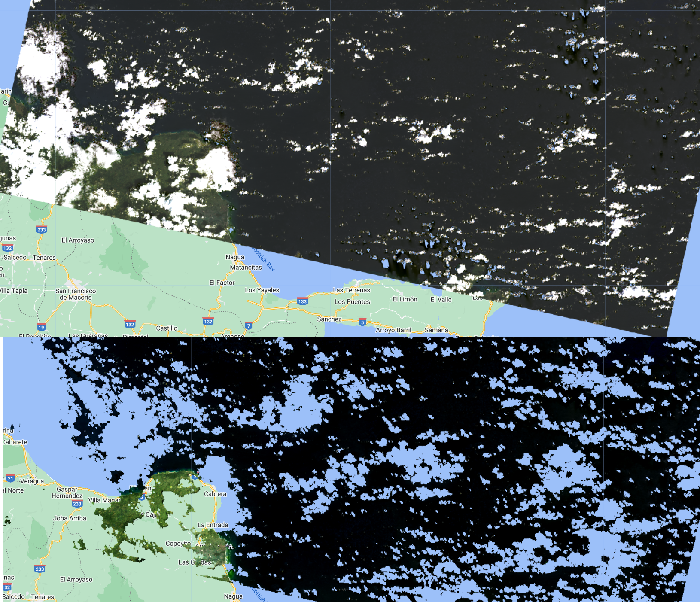

Ahora, podemos crear un compuesto mediano.

```javascript
//--------------------------------------------------------------
// Crear una composición
//--------------------------------------------------------------
// Utilice las siguientes funciones para comparar diferentes agregaciones:
// .min(); .max(); .mean(); .median()

// Trabajaremos con el compuesto Median.
var composicion = preProcesado.median().clip(area);

// Agregar composición al mapa.
Map.addLayer(composicion, paramVisPreProcesada, 'Composición Preprocesada');
```

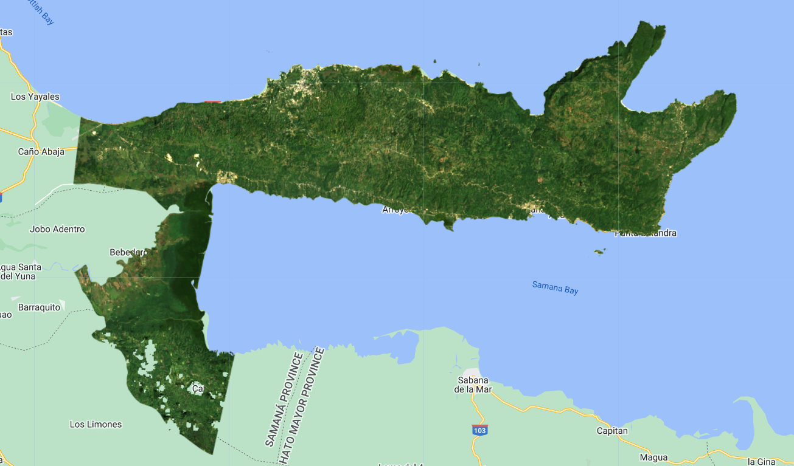

## Datos de entrenamiento

El próximo paso es crear datos de entrenamiento. Empezaremos creando datos de entrenamiento manualmente, basándonos en nuestro compuesto, pero también es posible utilizar datos existentes, si los tiene.

Utilizando las Herramientas de Geometría (`Geometry Tools`), crearemos puntos en la imagen Landsat que representen clases de cobertura del suelo de interés para utilizarlos como nuestros datos de entrenamiento. Haremos la clasificación solamente con dos clases: Manglar y No Manglar Tendremos que hacer dos cosas: (1) identificar dónde se encuentra cada cobertura del suelo y (2) etiquetar los poligonos con el número de clase adecuado. Para este ejercicio, utilizaremos las clases y códigos: 1- `manglar`, 2- `noManglar`.

En las Herramientas de geometría, haga clic en la opción de polígono. Esto creará una geometría que se mostrará como una importación llamada "geometry". Haga clic en el icono de engranaje para configurar esta importación.

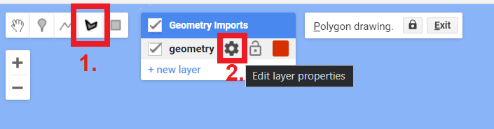

Vamos a empezar por la recogida de puntos de manglar, renombre la importación `geometry` como `manglar`. Impórtelo como una `FeatureCollection`, y luego haga clic en `+ Property`. Nombre la nueva propiedad "clase" y dele un valor de 0. También podemos elegir un color para representar esta clase. Para una clase manglar, es natural elegir un color verde. Puede elegir el color que prefiera haciendo clic sobre él o, para mayor control, puede utilizar un valor hexadecimal (#06d630). Haga clic en OK tras finalizar la configuración.

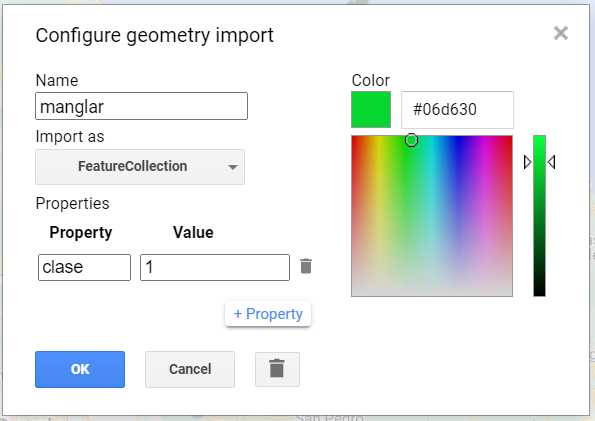

Ahora, en el `Geometry Imports`, veremos que la importación ha sido renombrada como `manglar`. Haga clic en él para activar el modo de dibujo para empezar a recoger polígonos de manglar.

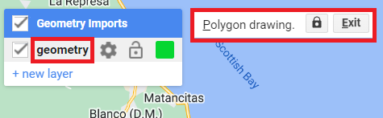

Ahora, comience a recoger polígonos sobre áreas de manglar. Acerque y aleje el zoom según sea necesario. Puede utilizar el mapa base del satélite como ayuda, pero la base de su recolección debe ser la composición Landsat. Recuerde que cuantos más polígonos recoja, más aprenderá el clasificador de la información que usted le proporcione. Por ahora, fijémonos el objetivo de recoger 6 polígonos de manglar. Haga clic en `Exit` junto a `Polygon drawing` cuando haya terminado.

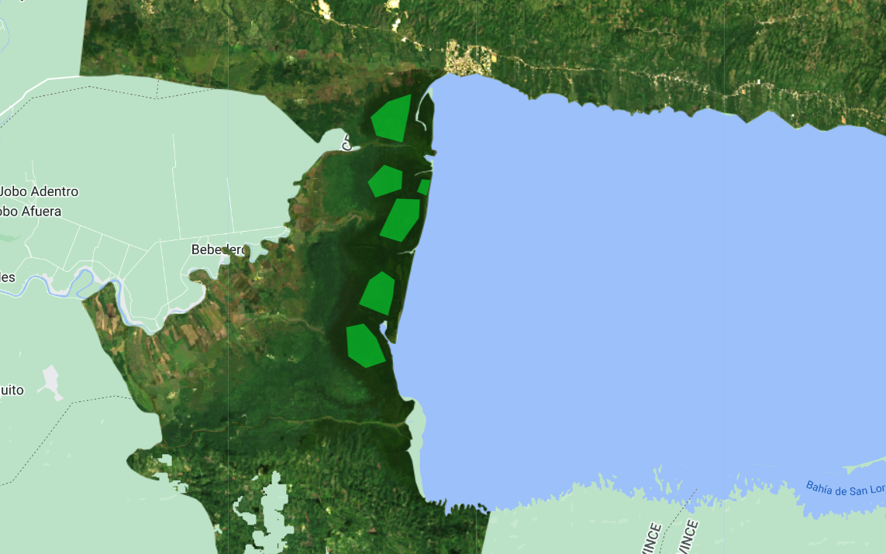

Repita el mismo proceso para la clase `noManglar`. 

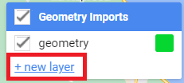

No olvide importar utilizando la opción `FeatureCollection` como se mencionó anteriormente. Recuerde establecer la propiedad "clase" para esa clase como 2. Es importante recoger polígonos en zonas urbanas, cuerpos de agua, zonas boscosas que no son manglares, y otros tipos de coberturas terrestres. Puedes utilizar el código hexadecimal #ff2c01 para la clase `noManglar` si quieres.

El siguiente paso es combinar todas las `FeatureCollections` en una sola. Aquí, usamos la función `merge()` para combinar todas las `Features` (polígonos) de cada colección en una única `FeatureCollection`. En la `FeatureCollection` combinada, cada `Feature` debe tener una propiedad llamada "clase". Los valores de clase son 1 o 2 (puede comprobar que esto es cierto chequeando las propiedades de `poligonosRecopilados` en el `Console`).

```javascript
// Combinar los poligonos en una Collección de Features unica.
var poligonosRecopilados = manglar.merge(noManglar);
print('Polígonos Recopilados', poligonosRecopilados);
```

Ahora que tenemos nuestros polígonos de entrenamiento, extraemos la información de las bandas para cada clase en cada localización de polígonos. Utilizamos la función `sampleRegions` para muestrear la información de la composición en cada polígono (todos los píxeles dentro de los polígonos). Este método requiere información sobre la `FeatureCollection` (nuestros puntos de referencia), la propiedad a extraer ("clase") y la escala de píxeles (en metros). Como son muchos píxeles dentro de los polígonos y para utilizar menos memória de procesamiento, utilizamos un método de 3 etapas para limitar el número de puntos de información para 750. 1) Aplicamos la función `randomColumn()` para crear una columna aleatoria de valores entre 0 y 1, 2) ordenamos esa columna para barajar los puntos utilizando la función `sort()`, ya que en `poligonosRecopilados` tenemos puntos de manglar primero e de no manglar después, 3) utilizamos la función `limit()` para limitar los puntos a 750, y no más.

```javascript
// Extrair puntos con informacion espectral en cada pixel en las áreas de los polígonos.
var pts = composicion
    .sampleRegions({
      collection: poligonosRecopilados, 
      properties: ['clase'], 
      scale: 30,
      geometries:true
    }).randomColumn() // crear una columna aleatoria de valores 0-1.
      .sort('random') // barajar los puntos utilizando la función ordenar.
      .limit(750); // seleccionar la cantidad de puntos.
```

Para ver cuantos puntos tenemos para cada clase podemos filtrar la colección de puntos por clase y imprimir la cantidad utilizando la función `size()`.

```javascript
var ptsManglar = pts.filter(ee.Filter.eq('clase', 1));
var ptsNoManglar = pts.filter(ee.Filter.eq('clase', 2));
// print('Puntos Manglar', ptsManglar.limit(5)); // para verificar la propriedad clase y las informaciones espectrales
// print('Puntos No Manglar', ptsNoManglar.limit(5)); // para verificar la propriedad clase y las informaciones espectrales

print('Cantidad total de puntos', pts.size());
print('Cantidad de puntos de manglar', ptsManglar.size());
print('Cantidad de puntos de no manglar', ptsNoManglar.size());
```

También podemos ver como es la señal espectral de los puntos en las dos coberturas terrestres.

```javascript
// Visualizar gráficos espectrales.
var graficoManglar = ui.Chart.image.regions({
    image: composicion,
    regions: ptsManglar,
    scale: 30
}).setOptions({
  title: 'Gráfico Manglar'
});
print(graficoManglar);

var graficoNoManglar = ui.Chart.image.regions({
    image: composicion,
    regions: ptsNoManglar,
    scale: 30
}).setOptions({
  title: 'Gráfico No Manglar'
});
print(graficoNoManglar);
```

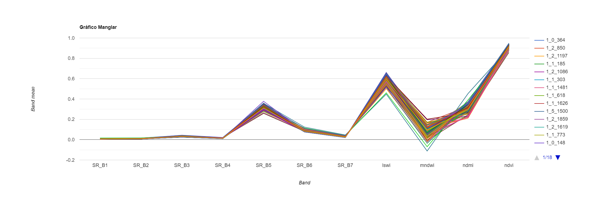

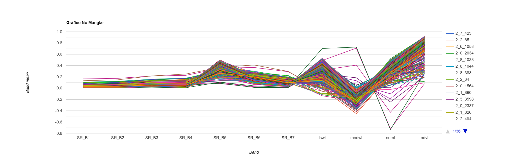

Ahora dividimos ese conjunto de puntos de reference en conjuntos de entrenamiento y de prueba para que el clasificador pueda predecir sobre algo que no se le ha mostrado antes (el conjunto de prueba), imitando datos no vistos que el modelo podría ver en el futuro. Añadimos una columna de números aleatorios a nuestra `FeatureCollection` utilizando más una vez la función `randomColumn()`. A continuación, filtramos las características en un 80% para el entrenamiento y un 20% para las pruebas utilizando `ee.Filter`.

```javascript
// Dividir el conjunto de datos en grupos de entrenamiento y prueba.

// Crear columna aleatoria.
var pts = pts.randomColumn();
// Divida el 80% de los datos para el entrenamiento.
var datosEntrenamiento = pts.filter(ee.Filter.lessThan('random', 0.8));
print('Cantidad puntos entrenamiento', datosEntrenamiento.size());
var datosPrueba = pts.filter(ee.Filter.greaterThanOrEquals('random', 0.8));
print('Cantidad puntos prueba', datosPrueba.size());
```

## Entrenamiento, clasificación y prueba

Ahora, podemos elegir el clasificador Random Forest y entrenarlo. El algoritmo Random Forest (Breiman 2001, Pal 2005) se basa en el concepto de los árboles de decisión, pero añade estrategias para hacerlos más potentes. Se denomina "Forest (bosque)" porque funciona construyendo una multitud de árboles de decisión. Un árbol de decisión crea las reglas que se utilizan para tomar decisiones. Un Bosque Aleatorio elegirá aleatoriamente características y hará observaciones, construirá un bosque de árboles de decisión y luego utilizará el conjunto completo de árboles para estimar la clase. Es una gran opción cuando no se tiene mucha información sobre los datos de entrenamiento.

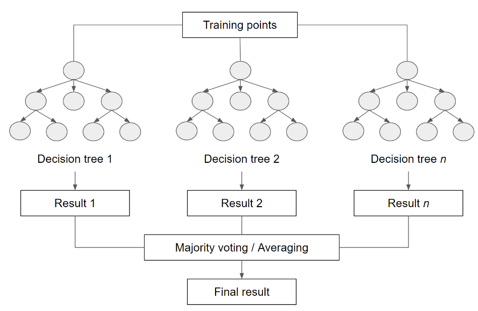

Haremos con 10 árboles de decisiones y especificando los `datosEntrenamiento` como datos de entrenamiento, la propriedad `clase` para diferenciar las clases y `bandas` como las bandas de predición (información para entrenar el modelo).

```javascript
// Entrene al clasificador solo con datos de entrenamiento.
var clasificadorRF = ee.Classifier.smileRandomForest(10).train({
  features: datosEntrenamiento, 
  classProperty: 'clase',
  inputProperties: bandas
});
```

Podemos imprimir en el `Console` lai información sobre el clasificador entrenado utilizando la función `explain()`. Así, podemos ver cuales árboles de decisiones fueran definidas para la clasificación.

```javascript
// Imprima la información de los árboles de decisiones.
print('Información clasificador RF:', clasificadorRF.explain());
```

Ahora, podemos hacer dos clasificaciones: 1) clasificar la composición `composicion`, 2) clasificar los datos de prueba `datosPrueba` para estimar la precisión. Hacemos la clasificación utilizando la función de classifier `classify()`. También agregamos la composición clasificada al mapa. Acá, estamos definindo áreas de manglares con el color verde y áreas de no manglares con el color gris. `min` y `max` tienen valores 1 y 2, respectivamente, ya que las clases `manglar` y `noManglar` tienen esos valores.

```javascript
// Ahora pruebe la clasificación (precisión del modelo) con los datos de prueba.
var clasificacionPrueba = datosPrueba.classify(clasificadorRF);

// Clasificar la imagen.
var clasificacionRF = composicion.classify(clasificadorRF);
Map.addLayer(clasificacionRF, {min: 1, max: 2, palette: ['24964a', 'c8ccc9']}, 'Clasificacion RF');
```

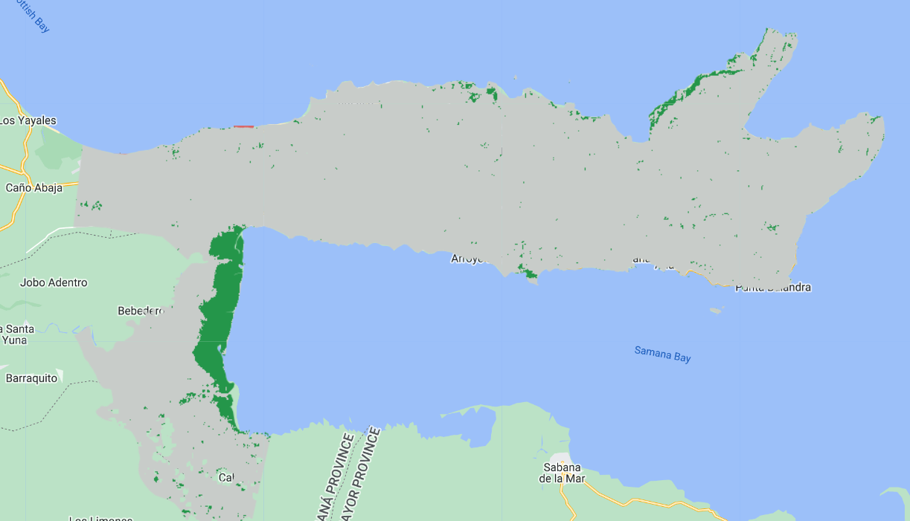

¿Qué les parece esa clasificación? ¿Las áreas de manglares están correctamente clasificadas? ¿Hay errores? ¿Donde occuren los errores? POdemos tener una ideia prévia sobre la precisión del modelo utilizando la clasificación de los datos de prueba.

## Validación prévia

Earth Engine tiene una función para clasificar una matriz de confusión automaticamente.Tomamos la `clasificacionPrueba` y aplicamos la función `errorMatrix()`. Recuerde que `clasificacionPrueba` no es una imagen, pero una tabla con propriedades. Cuando aplicamos la función `classify()` para clasificar los puntos de prueba, automaticamente una propriedad llamada `classification` fue creada contenendo los valores de clasificación. Para argumentos de `errorMatrix()`, definimos:

- Los valores reales (`actual`): propriedad `'clase'`
- Los valores clasificados (`prediction`): propriedad `'classification'`
- Órden de los valores de las clases (`order`): 1 y 2 en formato de lista `[1, 2]`.

Con eso, podemos imprimir la matriz de confusión y las principais métricas utilizadas: Precisión general, Precisión del produtor y Precisión del usuário.

```javascript
//--------------------------------------------------------------
// Validación previa
//--------------------------------------------------------------

// Crear matriz de confusión.
var matrizConfusion = clasificacionPrueba.errorMatrix({
  actual: 'clase', 
  predicted: 'classification',
  order: [1,2]
});

print('Matriz de Confusión:', matrizConfusion);
print('Precisión General:', matrizConfusion.accuracy());
print('Precisión del Produtor:', matrizConfusion.producersAccuracy());
print('Precisión del Usuario:', matrizConfusion.consumersAccuracy());
```

¿Cuál es la precisión de la clasificación? ¿Qué clase tiene mayor precisión? ¿Se te ocurre alguna razón?

## Testeando diferentes números de árboles

También podemos evaluar cómo afecta el número de árboles del clasificador Random Forest a la precisión de la clasificación. Copie y pegue el código siguiente para crear una función que muestre la precisión global en función del número de árboles utilizados. El código prueba de 5 a 100 árboles en incrementos de 5

## Código Completo

Script "`1 Clasificación Manglares - Landsat`" del repositorio y la carpeta `T3` o link directo:
[https://code.earthengine.google.com/d3fd68fc492674a5ab6c4f872666adef](https://code.earthengine.google.com/d3fd68fc492674a5ab6c4f872666adef).

Con algunos cambios, podemos hacer lo mismo con datos de Sentinel-2, Planet NICFI y Sentinel-1 (radar):

Script "`2 Clasificación Manglares - Sentinel-2`" del repositorio y la carpeta `T3` o link directo:
[https://code.earthengine.google.com/c2a81a9e53d396f245ee24a049889645](https://code.earthengine.google.com/c2a81a9e53d396f245ee24a049889645).

Script "`3 Clasificación Manglares - NICFI`" del repositorio y la carpeta `T3` o link directo:
[https://code.earthengine.google.com/55c8afc2bf6ca26105f1781057f8557d](https://code.earthengine.google.com/55c8afc2bf6ca26105f1781057f8557d).

Script "`4 Clasificación Manglares - Sentinel-1`" del repositorio y la carpeta `T3` o link directo:
[https://code.earthengine.google.com/43966492f7140e61a56460398d36305a](https://code.earthengine.google.com/43966492f7140e61a56460398d36305a).